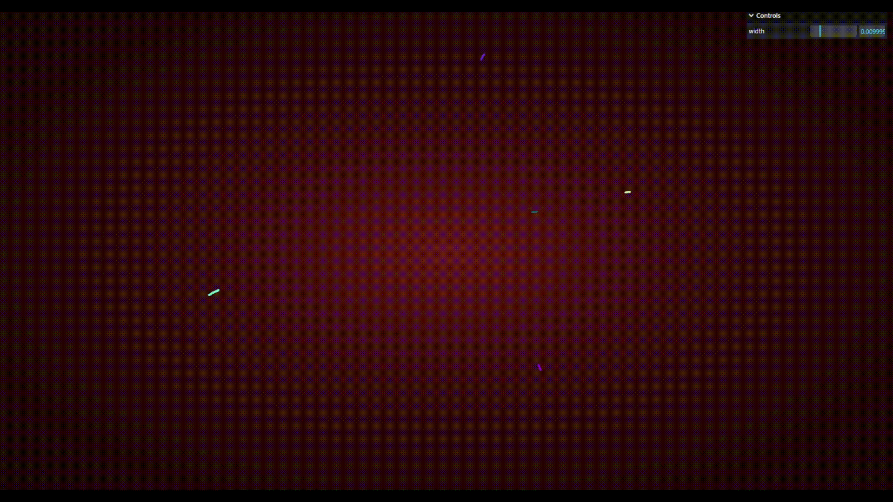

# 3D Line Rendering

**Keywords:** 3D Graphics, Lines, WebGL2, Perspective

This demo demonstrates 3D line rendering with perspective projection in WebGL2. It extends basic line rendering into three dimensions, showing how to apply camera transformations and perspective matrices.

This example introduces fundamental 3D graphics concepts including model-view-projection matrices, depth testing, and 3D coordinate systems. It serves as a building block for understanding more complex 3D rendering pipelines.

**[How to run](../how_to_run.md)**

**References:**

* [Instanced Line Rendering Part I]
* [Instanced Line Rendering Part II: Alpha blending]
* [Three.js line example]

[Instanced Line Rendering Part I]: https://wwwtyro.net/2019/11/18/instanced-lines.html
[Instanced Line Rendering Part II: Alpha blending]: https://wwwtyro.net/2021/10/01/instanced-lines-part-2.html
[Three.js line example]: https://threejs.org/examples/?q=Line#webgl_lines_fat_raycasting
