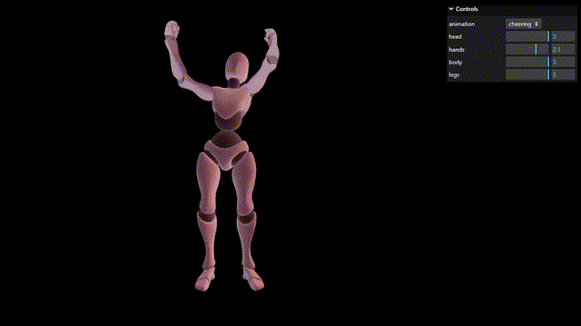

# Animation Amplitude Change

**Keywords:** Animation, Skeletal Animation, glTF, WebGL2, Skinning, Amplitude Scaling, Interactive UI

This demo showcases advanced skeletal animation control in WebGL2, allowing real-time manipulation of animation amplitude for different body parts. Users can select from multiple animation sequences and independently scale the rotation amplitude for grouped skeleton nodes (head, hands, body, legs), providing fine-grained control over character movement intensity. The implementation demonstrates skeleton grouping, quaternion-based rotation scaling, and dynamic keyframe modification.

Animation amplitude control is essential for procedural animation blending, character behavior customization, and adaptive animation systems in games. This example provides a complete implementation of per-bone-group amplitude scaling through quaternion interpolation, enabling developers to create more expressive character animations by emphasizing or dampening specific body movements while maintaining smooth animation playback.

**[How to run](../how_to_run.md)**

**References:**

* [WebGL Skinning] - Comprehensive guide to skeletal animation in WebGL
* [glTF 2.0 Reference Guide] - Official glTF specification and format details
* [ThreeJS Additive Blending] - Similar animation blending example
* [Mixamo] - Character animation library and assets
* [Quaternion Interpolation] - Mathematical foundation for rotation scaling

[WebGL Skinning]: https://webglfundamentals.org/webgl/lessons/webgl-skinning.html
[glTF 2.0 Reference Guide]: https://www.khronos.org/files/gltf20-reference-guide.pdf
[ThreeJS Additive Blending]: https://threejs.org/examples/#webgl_animation_skinning_additive_blending
[Mixamo]: https://www.mixamo.com/#/?page=1&type=Motion%2CMotionPack
[Quaternion Interpolation]: https://en.wikipedia.org/wiki/Slerp
