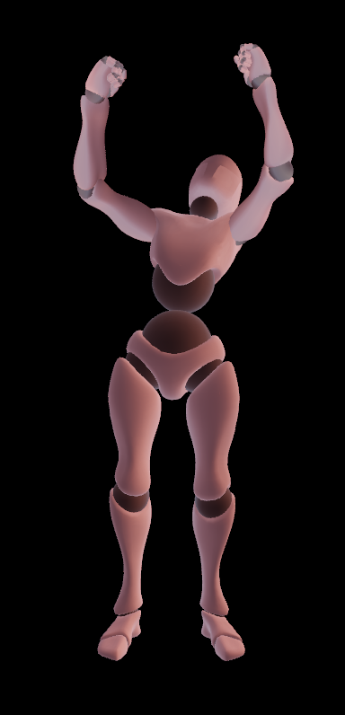

# Animation amplitude change

This example demonstrates how to use a renderer crate for playing animations, changing animations amplitude, setup separated groups of skeleton nodes. Example gives user posibility to choose animation and change rotation amplitude scale factor for separated groups of skeleton nodes like head, hands, body, legs.



## How it is useful

This example showcases several useful techniques and concepts for WebGL2 development:

  * How split skeleton to meaningful groups of nodes like hands, legs etc.

  * How scale amplitude of different parts of choosen animation.

  * How link UI with animation modificators.

## How it works

For discovering how skeletal animation works under the hood check this example description: [skeletal_animation](../skeletal_animation/readme.md).

Skeletal animation modifications based on trait `AnimatableComposition`, structure `Animation` and crate [animation](../../../module/helper/animation/readme.md).

### `AnimatableComposition` trait

Trait `AnimatableComposition` contains method for update underlying animatable object state, setup nodes transforms ([base.rs](../../../module/helper/renderer/src/webgl/animation/base.rs)):

```rust
pub trait AnimatableComposition : clone_dyn_types::CloneDyn
{
  /// Updates all underlying [`animation::AnimatablePlayer`]'s
  fn update( &mut self, delta_time : f64 );

  /// Sets all simple 3D transformations for every
  /// [`Node`] related to this [`AnimatableComposition`]
  fn set( &self, nodes : &HashMap< Box< str >, Rc< RefCell< Node > > > );

  /// Returns a type-erased reference to the underlying value.
  fn as_any( &self ) -> &dyn core::any::Any;

  /// Returns a type-erased mutable reference to the underlying value.
  fn as_any_mut( &mut self ) -> &mut dyn core::any::Any;
}
```

### `Animation` trait

Struct `Animation` uses underlying `AnimatableComposition` object for updating animations and setting related nodes tranformations using `Animation::nodes` field:

```rust
/// Contains data for animating [`crate::webgl::Mesh`]
pub struct Animation
{
  /// Animation name
  pub name : Option< Box< str > >,
  /// Animation behavior
  pub animation : Box< dyn AnimatableComposition >,
  /// Related animated [`Node`]'s
  pub nodes : HashMap< Box< str >, Rc< RefCell< Node > > >
}
```

### `animation` crate

Implementors of `AnimatableComposition` trait use primitives from `animation` crate to create certain behavior of related nodes modification and related animations convertation. Main primitives is `Sequencer`, `Sequence`, `Tween` that used for storing animations keyframe and interpolation information.

### `scaling` module

For example `Scaler` struct of module [scaling](../../../module/helper/renderer/src/webgl/animation/scaling.rs) uses one `Sequencer` that represent skeletal animation to modify its rotations in such way that amplitude of nodes movement can be increased or decreased in method `AnimatableComposition::set`.

Scaler stores scaling factors for every named group of modified nodes. Then this factors used for changing quaternion angle distance between all keyframes every frame. This adds to animation more variability.

Every keyframe depends from previous keyframe. Each frame modified relatively to previous from start to end ([<Scaler as AnimatableComposition>::set](../../../module/helper/renderer/src/webgl/animation/scaling.rs)):

```rust
if let Some( rotation ) = self.animation.get::< Sequence< Tween< QuatF64 > > >
(
  &format!( "{}{}", name, ROTATION_PREFIX )
)
{
  let s = scales.y();
  let mut players = rotation.players_get();

  let current = rotation.current_id_get();

  for i in 0..( ( current + 1 ).min( players.len() ) )
  {
    if s < 1.0 && i > 0
    {
      players[ i ].start_value = players[ i - 1 ].end_value;
    }
    let prev = players[ i ].start_value;
    let curr = players[ i ].end_value;

    let delta = prev.conjugate() * curr;

    let w = delta.0[ 3 ].clamp( -1.0, 1.0 );
    let angle = 2.0 * w.acos();
    let sin_half = ( 1.0 - w * w ).sqrt();

    let axis = if sin_half.abs() > std::f32::EPSILON as f64
    {
      F64x3::new
      (
        delta.0[ 0 ] / sin_half,
        delta.0[ 1 ] / sin_half,
        delta.0[ 2 ] / sin_half,
      )
    }
    else
    {
      F64x3::new( 1.0, 0.0, 0.0 )
    };

    let angle_scaled = angle * s;
    let delta_scaled = QuatF64::from_axis_angle( axis, angle_scaled );
    let new_end = prev * delta_scaled;
    players[ i ].end_value = new_end.normalize();
  }

  players[ 0 ].start_value = players.last().unwrap().end_value;

  let mut sequence = Sequence::new( players ).unwrap();
  sequence.update( rotation.time() );
  if let Some( tween ) = sequence.current_get()
  {
    let rotation = tween.value_get();
    let rotation = QuatF32::from( rotation.0.map( | v | v as f32 ) );
    node.borrow_mut().set_rotation( rotation );
  }
}
```

## Running
Ensure you have all the necessary dependencies installed. This example uses trunk for building and serving the WebAssembly application.

To run the example:

Navigate to the example's directory in your terminal.

Run the command:

```bash
  trunk serve
```

Open your web browser to the address provided by trunk (usually http://127.0.0.1:8080).

The application will load the GLTF model, skeletons, animations and start the rendering loop, displaying animated 3D objects. You can select different animations that contained in GLTF file using the provided UI controls. Also you can scale skeleton joints rotation amplitude for hands, legs, head and body.

Feel free to replace `multi_animation.glb` with your own 3D model and animations by modifying path to file in the main.rs file and loading own assets into [folder](../../../assets/gltf/animated/). Your skeleton must be compatible with Mixamo skeleton ( consist of similar tree of nodes and with similar names ) for working properly. But you can change UI layout and split skeleton in [main.rs](./src/main.rs) how you want. It can give you opportunity to run properly skeletons with another structure.

## 📚 References

### Similar example on another engines or libraries
- [ThreeJS]

### Assets
- [Mixamo]

[ThreeJS]: https://threejs.org/examples/#webgl_animation_skinning_additive_blending
[Mixamo]: https://www.mixamo.com/#/?page=1&type=Motion%2CMotionPack

