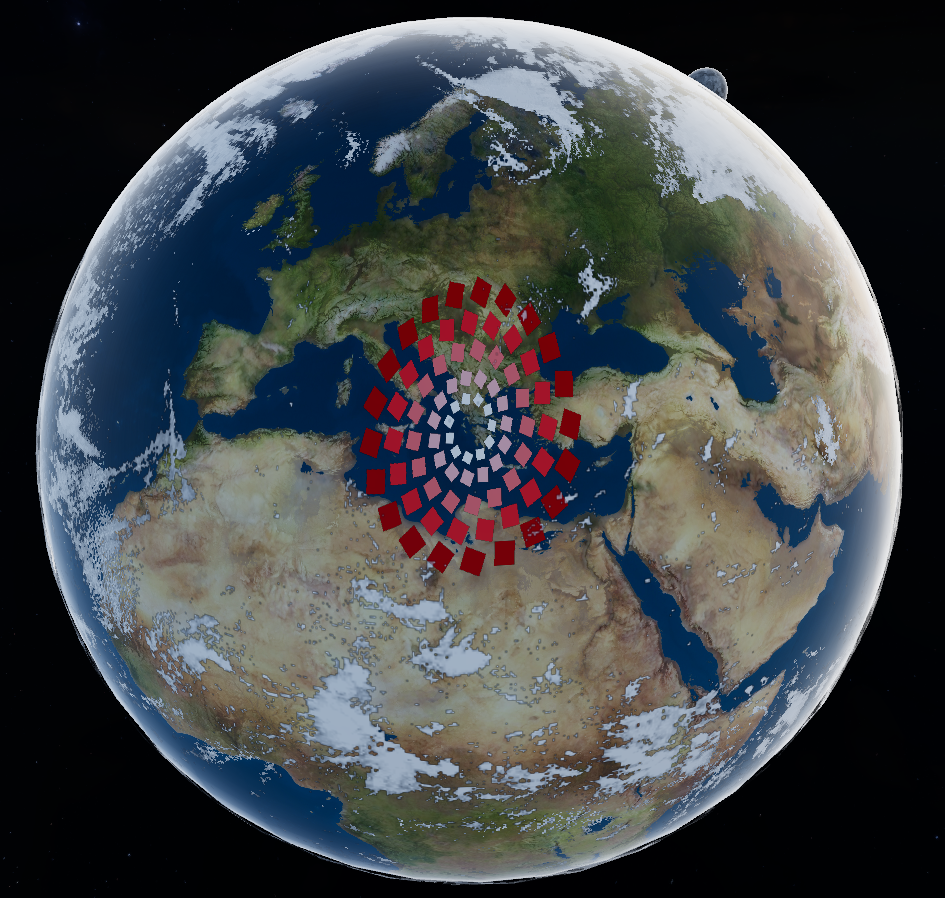

# Animated Surface Rendering

**Keywords:** Animation, Surfaces, WebGL2, Time-based

This demo demonstrates how to render animated scenes on any object surface as texture. First camera captures one scene to texture then another camera renders this texture on surface some object at another scene.

This technique is useful for creating water effects, in-game screens or textures with procedurally animated geometry.

**[How to run](../how_to_run.md)**
