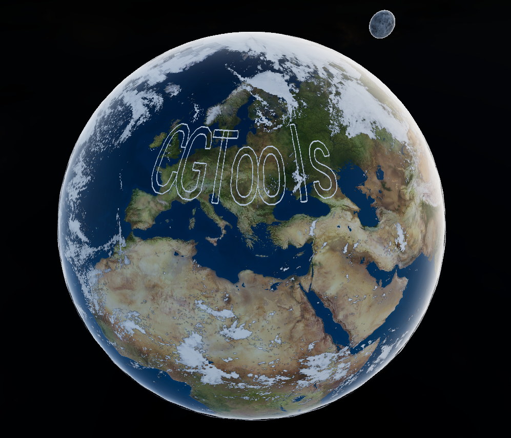

# Curve Surface Rendering

**Keywords:** Line, Texture Rendering, WebGL2

This demo demonstrates how to render 2D shapes from lines data as texture on objects surface in WebGL2. It uses UFO font format to get glyphs shape data and then uses it for creating filled with color 2D glyphs on objects surface.

**[How to run](../how_to_run.md)**

**References:**

* [WebGL Rendering to a Texture]
* [Unified Font Object]

[WebGL Rendering to a Texture]: https://webglfundamentals.org/webgl/lessons/webgl-render-to-texture.html
[Unified Font Object]: https://unifiedfontobject.org/
