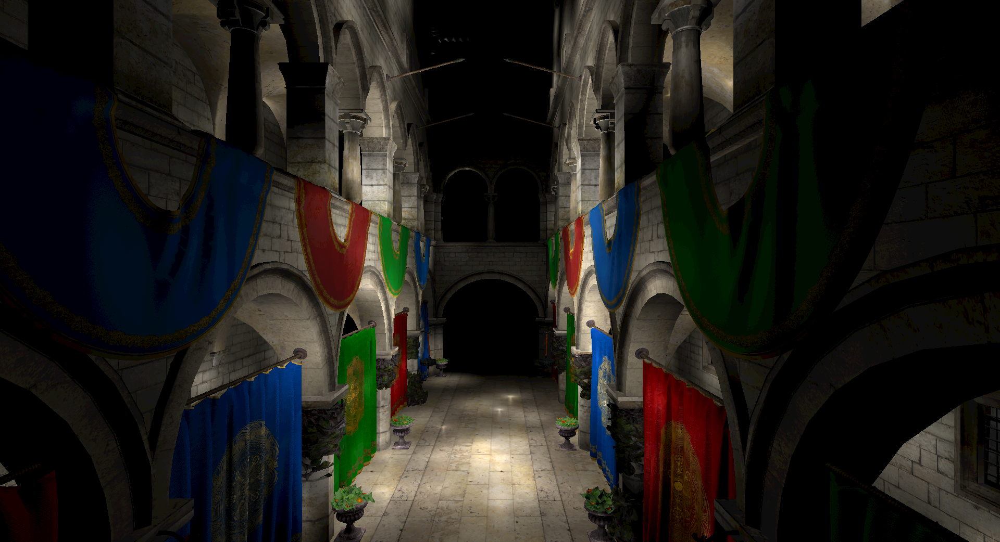

# Deferred Shading

**Keywords:** Deferred Rendering, G-Buffer, WebGL2, Lighting

An advanced WebGL rendering demo showcasing deferred shading techniques with volumetric light optimization. Features real-time lighting of complex scenes with numerous dynamic light sources while maintaining smooth 60fps performance.

This technique is essential for modern game engines and complex lighting scenarios. The example showcases G-buffer setup, light volume rendering, and accumulation passes for realistic multi-light scenes.

**[How to run](../how_to_run.md)**

**References:**

* [Real-Time Rendering 4th Edition] - Comprehensive graphics programming
* [GPU Gems 2 - Deferred Shading] - Original deferred shading techniques
* [Epic Games Lighting] - Modern game engine lighting
* [Light Attenuation] - Physically accurate falloff models

[Real-Time Rendering 4th Edition]: http://www.realtimerendering.com/
[GPU Gems 2 - Deferred Shading]: https://developer.nvidia.com/gpugems/gpugems2/part-ii-shading-lighting-and-shadows/chapter-9-deferred-shading-tabula-rasa
[Epic Games Lighting]: https://blog.selfshadow.com/publications/s2013-shading-course/
[Light Attenuation]: https://lisyarus.github.io/blog/posts/point-light-attenuation.html
