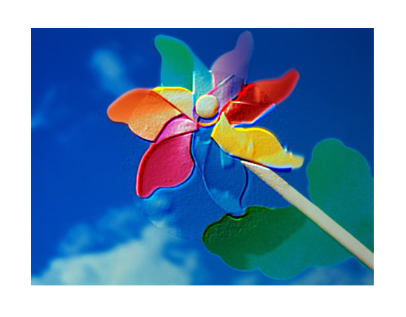

# Image Filter

**Keywords:** Post-Processing, Filters, WebGL2, Shaders

This demo demonstrates real-time image filtering in WebGL2. It shows how to apply various shader-based filters to images or rendered scenes, including blur, sharpen, edge detection, and color grading.

Image filters are essential for post-processing pipelines, allowing artistic control and visual enhancement of rendered content. This example provides reusable filter implementations.

**[How to run](../how_to_run.md)**

**References:**

* [WebGL Image Processing]
* [WebGL2 Image Processing Continued]

[WebGL Image Processing]: https://webglfundamentals.org/webgl/lessons/webgl-image-processing.html
[WebGL2 Image Processing Continued]: https://webgl2fundamentals.org/webgl/lessons/webgl-image-processing-continued.html
