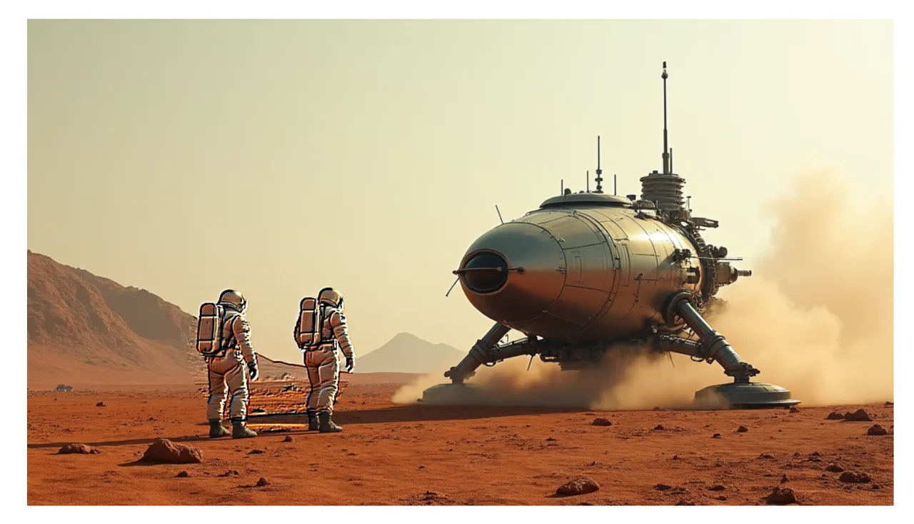

# Image Filter

**Keywords:** Post-Processing, Filters, WebGL2, Shaders

This demo demonstrates real-time image filtering in WebGL2. It applies a 3x3 convolution kernel
<!-- Fix(BUG-323): named several other post-processing filter categories this crate never
     implements — main.frag applies exactly one hardcoded convolution kernel (emboss).
     Root cause: aspirational wording never checked against the actual shader.
     Pitfall: a demo whose purpose IS showing a filter is exactly where a wrong named
     technique goes unnoticed, since the demo still visibly "works" either way. -->
(an emboss effect) to the image, revealed within a radius centered on the mouse cursor as you move the pointer.

Image filters are essential for post-processing pipelines, allowing artistic control and visual enhancement of rendered content. This example demonstrates the convolution-kernel technique that such filter implementations build on.

**[How to run](../../how_to_run.md)**

**References:**

* [WebGL Image Processing]
* [WebGL2 Image Processing Continued]

[WebGL Image Processing]: https://webglfundamentals.org/webgl/lessons/webgl-image-processing.html
[WebGL2 Image Processing Continued]: https://webgl2fundamentals.org/webgl/lessons/webgl-image-processing-continued.html
