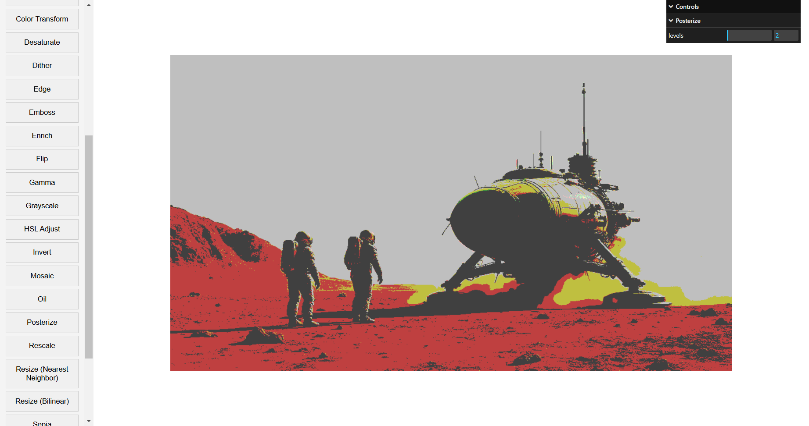

# Multiple Filters

**Keywords:** Post-Processing, Filter Chain, WebGL2, Effects

A comprehensive collection of image filters and post-processing effects implemented entirely on the GPU using WebGL 2.0. Explore various image processing techniques from basic convolution kernels to advanced multi-pass rendering algorithms, all running in real-time.

**[How to run](../how_to_run.md)**

## Features

### Image Loading
- **Drag & Drop**: Drop any image onto the canvas area to load it
- **Upload Button** (📁): Click to open file browser and select an image
- **Revert Button** (↻): Return to the original unfiltered image at any time

### Zoom & Pan Controls
Navigate and inspect filtered images with intuitive zoom and pan controls:

**Mouse Controls:**
- **Mouse Wheel**: Zoom in/out at cursor position
- **Click & Drag**: Pan the image around the canvas
- **Double Click**: Reset view to 100% zoom and center position

**UI Buttons:**
- **+** button: Zoom in
- **−** button: Zoom out
- **⊙** button: Reset view

**Keyboard Shortcuts:**
- `+` or `=`: Zoom in
- `-` or `_`: Zoom out
- `0`: Reset view to 100%
- `Arrow Keys`: Pan in the corresponding direction

**Touch Support:**
- Single touch drag to pan
- Pinch gesture to zoom

The current zoom level is displayed in the bottom-right corner (e.g., "100%").

### Sidebar Toggle
- Click the arrow button on the left edge to hide/show the filter selection panel
- Useful for maximizing canvas space when inspecting filtered images

### Filter Application
- **Filter Cards**: Click any filter thumbnail in the sidebar to preview it
- **Apply Button** (✓): Commit the current filter to the image
- **Cancel Button** (✗): Discard the current filter and return to previous state
- **Dynamic Controls**: Some filters expose adjustable parameters in the bottom control panel

### Save Image
- **Save Button** (💾): Download the current filtered image as a PNG file

**References:**

* [Digital Image Processing - Gonzalez] - Comprehensive textbook
* [Computer Vision: Algorithms and Applications] - Modern computer vision
* [OpenCV Tutorials] - Practical image processing
* [WebGL2 Fundamentals] - Complete WebGL guide
* [The Book of Shaders] - Creative shader programming
* [GPU Gems Series] - Advanced GPU techniques

[Digital Image Processing - Gonzalez]: https://www.pearson.com/us/higher-education/program/Gonzalez-Digital-Image-Processing-4th-Edition/PGM241446.html
[Computer Vision: Algorithms and Applications]: http://szeliski.org/Book/
[OpenCV Tutorials]: https://docs.opencv.org/master/d9/df8/tutorial_root.html
[WebGL2 Fundamentals]: https://webgl2fundamentals.org/
[The Book of Shaders]: https://thebookofshaders.com/
[GPU Gems Series]: https://developer.nvidia.com/gpugems/gpugems3/part-vi-gpu-computing
