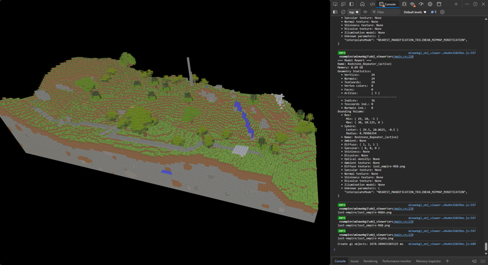

# glTF Viewer

**Keywords:** glTF, PBR, 3D Models, WebGL2

This demo is a comprehensive glTF 2.0 viewer implementing physically-based rendering (PBR) in WebGL2. It loads and displays 3D models with industry-standard materials, including metallic-roughness workflow, normal mapping, and image-based lighting.

glTF is the standard format for 3D content on the web. This example provides a production-ready viewer with full PBR material support, suitable for e-commerce, education, and 3D asset preview.

**[How to run](../how_to_run.md)**

**References:**

* [Real Shading in Unreal Engine 4] - Industry standard PBR implementation
* [Background: Physics and Math of Shading] - Mathematical foundations
* [Moving Frostbite to PBR 2.0] - Production pipeline insights
* [Understanding Masking-Shadowing] - Geometry function theory
* [GGX Importance Sampling Part 1] - Monte Carlo integration
* [GGX Importance Sampling Part 2] - Advanced sampling techniques
* [Sampling Microfacet BRDF] - Practical BRDF implementation
* [Normal Mapping Without Tangents] - Alternative normal mapping approach
* [Vulkan glTF PBR Reference] - Complete reference implementation

[Real Shading in Unreal Engine 4]: https://blog.selfshadow.com/publications/s2013-shading-course/karis/s2013_pbs_epic_notes_v2.pdf
[Background: Physics and Math of Shading]: https://blog.selfshadow.com/publications/s2013-shading-course/hoffman/s2013_pbs_physics_math_notes.pdf
[Moving Frostbite to PBR 2.0]: https://web.archive.org/web/20160702002225/http://www.frostbite.com/wp-content/uploads/2014/11/course_notes_moving_frostbite_to_pbr_v2.pdf
[Understanding Masking-Shadowing]: https://inria.hal.science/hal-00942452v1/document
[GGX Importance Sampling Part 1]: https://schuttejoe.github.io/post/ggximportancesamplingpart1/
[GGX Importance Sampling Part 2]: https://schuttejoe.github.io/post/ggximportancesamplingpart2/
[Sampling Microfacet BRDF]: https://agraphicsguynotes.com/posts/sample_microfacet_brdf/
[Normal Mapping Without Tangents]: http://www.thetenthplanet.de/archives/1180
[Vulkan glTF PBR Reference]: https://github.com/SaschaWillems/Vulkan-glTF-PBR
