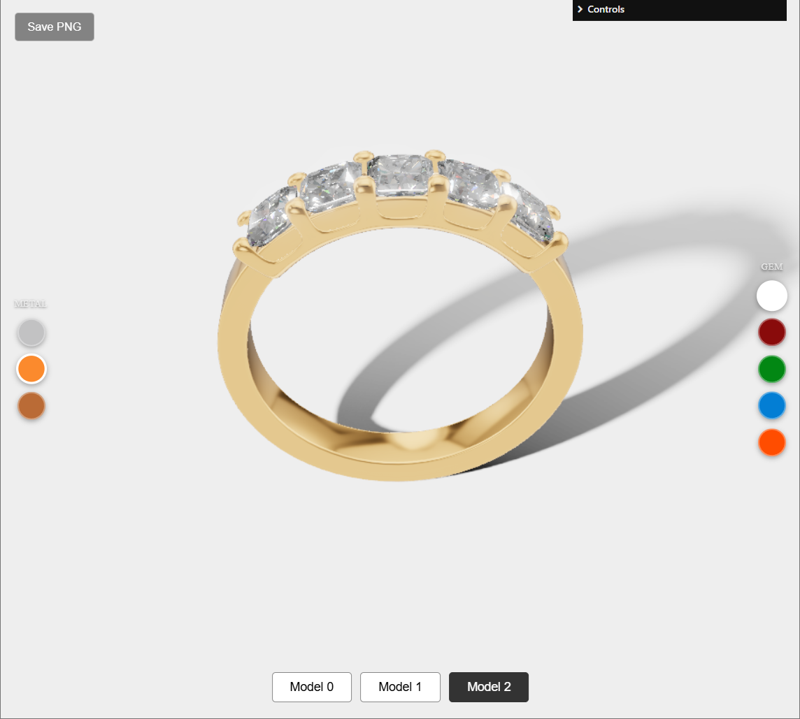

# Jewelry Configurator

**Keywords:** WebGL2, Jewelry, Configurator, PBR, Ray-tracing

Interactive scroll-driven jewelry product configurator with cinematic camera animation, real-time gem ray-tracing (multi-bounce refraction, chromatic dispersion, Fresnel), and live material customization. Users can switch between three ring models, pick gem and metal colors from swatch palettes, orbit the scene freely in configurator mode, and export transparent-background PNG screenshots. Built with Rust/WASM, GSAP ScrollTrigger, and a custom PBR renderer with IBL, PCSS soft shadows, bloom, and ACES tonemapping.

**[How to run](../how_to_run.md)**
