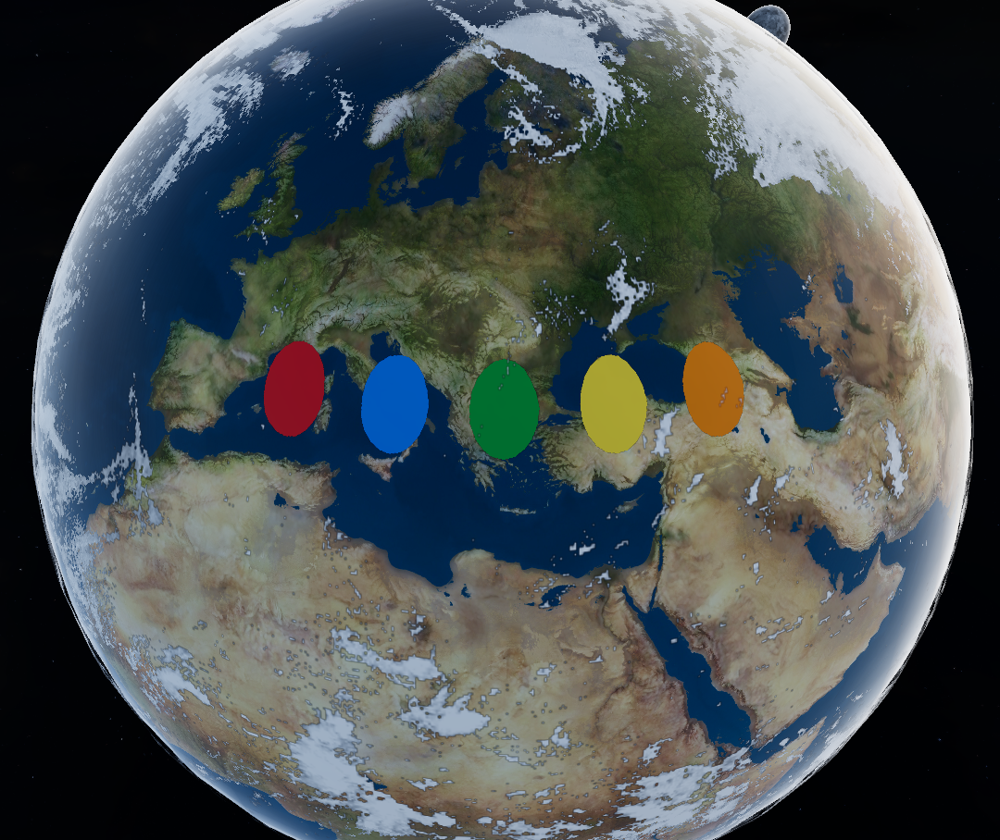

# Lottie Surface Rendering

**Keywords:** Animation, Lottie, Texture Rendering, WebGL2

This demo demonstrates how to render Lottie animations as textures on 3D object surfaces in WebGL2. It uses the velato library to parse and evaluate Lottie JSON files, converts vector paths to geometry, and renders animated frames onto surfaces using canvas rendering techniques.

**[How to run](../how_to_run.md)**

**References:**

* [Lottie Animation Format]
* [Velato - Lottie Parser]
* [WebGL Rendering to a Texture]

[Lottie Animation Format]: https://lottiefiles.github.io/lottie-docs/
[Velato - Lottie Parser]: https://github.com/linebender/velato
[WebGL Rendering to a Texture]: https://webglfundamentals.org/webgl/lessons/webgl-render-to-texture.html
