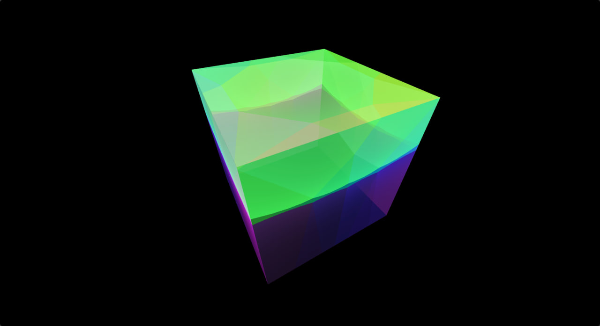

# Cube Map Generation

**Keywords:** Cube Maps, Environment Mapping, WebGL2, Skybox

This demo demonstrates cube map generation and usage in WebGL2. Cube maps are essential for environment reflections, skyboxes, and image-based lighting, providing 360-degree environmental information. It's fundamental for PBR workflows and atmospheric rendering.

This example shows how to create, load, and sample cube maps.

**[How to run](../how_to_run.md)**

**References:**

* [Cube Environment Mapping] - Mathematical foundation
* [OpenGL Cube Maps] - Implementation techniques
* [Environment Mapping] - Advanced applications

[Cube Environment Mapping]: https://en.wikipedia.org/wiki/Cube_mapping
[OpenGL Cube Maps]: https://learnopengl.com/Advanced-OpenGL/Cubemaps
[Environment Mapping]: https://developer.nvidia.com/gpugems/gpugems/part-i-natural-effects/chapter-7-environment-mapping-techniques
