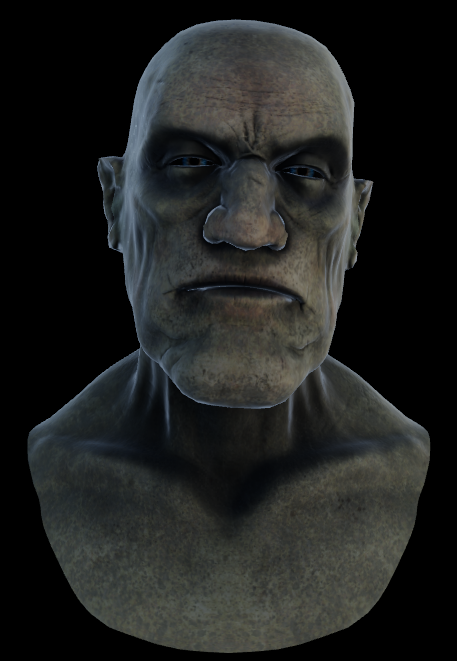

# Morph targets

This example demonstrates how to use a renderer crate for playing animations, update models morph targets. Example gives user posibility to choose animation and change its morph targets weights values using UI.

Morph targets (also called blend shapes) are a technique used in 3D graphics and animation to smoothly transform a mesh from one shape into another.

**[How to run](../how_to_run.md)**

**References:**

* [ThreeJS]
* [Sketchfab]
* [Morph Targets]

[ThreeJS]: https://threejs.org/examples/?q=morph#webgl_morphtargets_face
[Sketchfab]: https://sketchfab.com/3d-models/zophrac-9fea6ffd67b840cb970f5b4570794709
[Morph Targets]: https://github.khronos.org/glTF-Tutorials/gltfTutorial/gltfTutorial_018_MorphTargets.html

