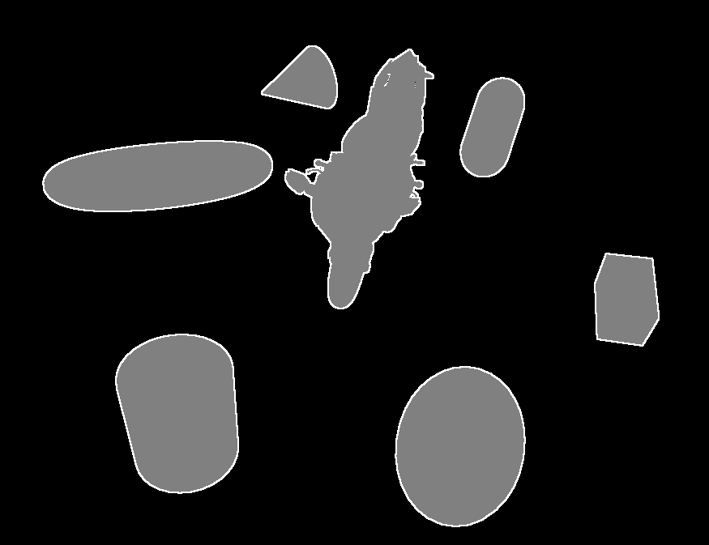

# Narrow Outline Rendering

**Keywords:** Outlines, Edge Detection, WebGL2, Post-Processing

This demo demonstrates narrow outline rendering in WebGL2. It shows techniques for drawing thin, consistent outlines around objects, useful for selection highlighting, stylized rendering, or UI elements.

Outline rendering enhances visual clarity and style. This example presents efficient methods for generating clean outlines without geometric expansion.

**[How to run](../how_to_run.md)**

**References:**

* [5 ways to draw an outline]
* [Post processing with WebGL]

[5 ways to draw an outline]: https://ameye.dev/notes/rendering-outlines/
[Post processing with WebGL]: https://medium.com/@nicolasgiannantonio/post-processing-effect-18b9c3be1c80
