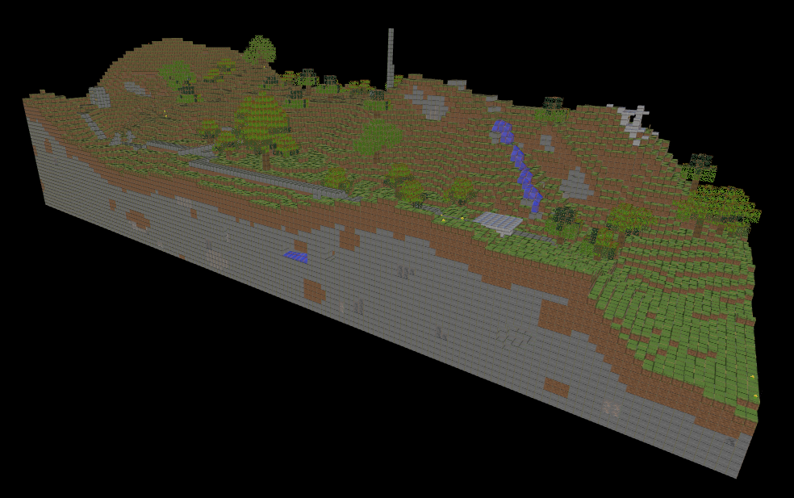

# OBJ Model Viewer

**Keywords:** OBJ Format, 3D Viewer, WebGL2, Interactive

This demo is a complete OBJ model viewer with interactive camera controls in WebGL2. Building on OBJ loading, it provides a full viewing experience with rotation, zoom, and lighting.

This example demonstrates practical 3D viewer implementation, suitable for asset inspection, education, or portfolio presentation of 3D models.

**[How to run](../how_to_run.md)**

**References:**

* [Wavefront OBJ]

[Wavefront OBJ]: https://uk.wikipedia.org/wiki/Wavefront_OBJ
