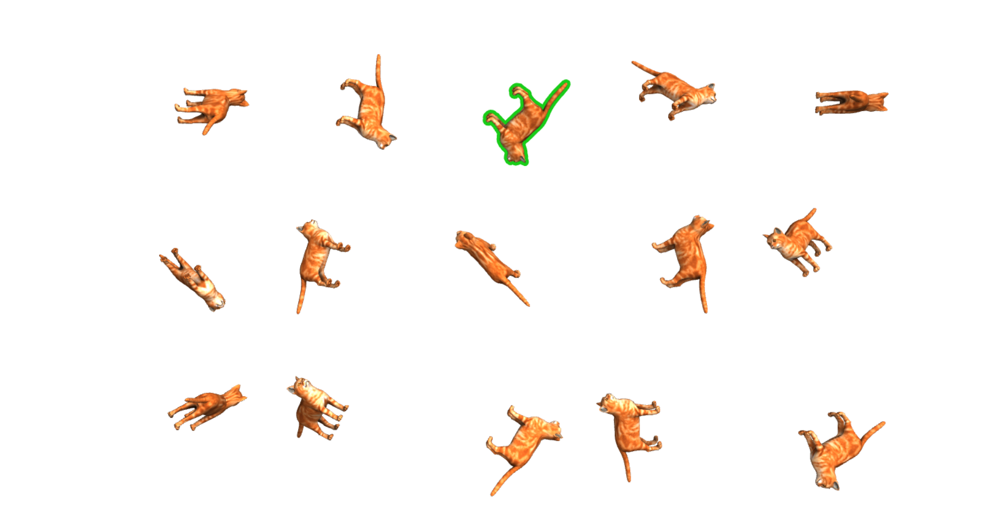

## Object picking

This exaple shows implementation of the object picking technique with GPU.
You can pick an object just by clicking on any pixel that represents this object.

### How it is useful

The demo describes rendering and reading arbitrary data into and from a texture.

### How to run

Make sure you have installed all the necessary [dependencies](../../../module/min/minwebgl/readme.md)
In order to run the example navigate to example's directory and run next command:
``` bash
trunk serve --release
```


