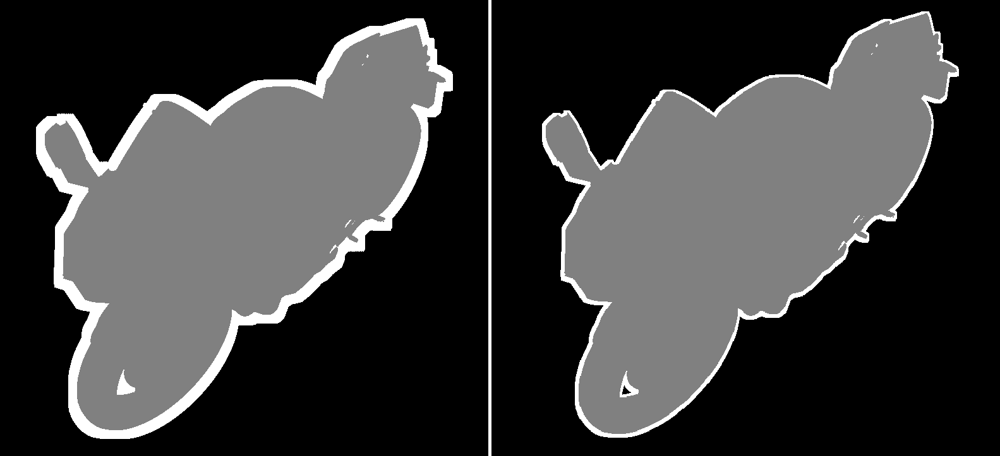

# Real-time Outline using Jump Flooding Algorithm (JFA) and WebGL2

This example demonstrates how to render a 3D object with a real-time outline effect implemented using the Jump Flooding Algorithm (JFA) and WebGL2, utilizing the `web_sys` and `minwebgl` crates.

The JFA is used as a post-processing technique to efficiently calculate the distance from every pixel to the nearest pixel belonging to the rendered object. This distance information is then used to draw an outline of a specified thickness.



## How it is useful

The example showcases several useful techniques and concepts:

*   Implementing a multi-pass rendering pipeline in WebGL2.
*   Rendering to offscreen framebuffers (`WebGlFramebuffer`) and using their color attachments (`WebGlTexture`) as inputs for subsequent passes.
*   Implementing a post-processing effect.
*   Understanding and implementing the Jump Flooding Algorithm (JFA) for approximate distance field generation.
*   Using a ping-pong rendering setup for iterative algorithms like JFA.
*   Loading and processing 3D models in GLTF format using the `gltf` crate.
*   Handling 3D transformations (Model, View, Projection matrices).
*   Basic animation (camera rotation, outline thickness).
*   Using `minwebgl` utilities for file loading, buffer uploads, program compilation, etc.
*   Interacting with WebGL2 via `web_sys`.
*   Using linear algebra crates like `ndarray-cg` and `glam`.

## How it works

The outline effect is achieved through a sequence of rendering passes, each writing to a texture (or the screen) that serves as input for the next pass:

1.  **Object Pass:**
    *   The 3D object (`model.glb`) is rendered to an offscreen framebuffer (`object_fb`).
    *   The `object.vert` and `object.frag` shaders are used.
    *   The `object.frag` shader simply outputs white for every fragment of the object. The background remains clear.
    *   The result is a silhouette of the object stored in the `object_fb_color` texture.

2.  **JFA Initialization Pass:**
    *   A fullscreen quad is rendered to the `jfa_init_fb`.
    *   The `fullscreen.vert` and `jfa_init.frag` shaders are used.
    *   The `jfa_init.frag` shader reads the `object_fb_color` texture.
    *   For pixels where the object was present (white in the silhouette), it stores their own normalized texture coordinates (`v_tex_coord`) in the output texture (`jfa_init_fb_color`). These are the "seeds".
    *   For background pixels, it stores a sentinel value (e.g., `(-1.0, -1.0)`) to indicate no seed has been found yet.

3.  **JFA Step Passes:**
    *   This is the core of the JFA. A series of fullscreen passes are performed.
    *   The `fullscreen.vert` and `jfa_step.frag` shaders are used.
    *   Rendering alternates between `jfa_step_fb_0` and `jfa_step_fb_1` (ping-pong).
    *   The `jfa_step.frag` shader reads the JFA texture from the *previous* step.
    *   For each pixel, it samples its neighbors at a specific `u_step_size` distance.
    *   It compares the distance from the current pixel to the seed coordinate stored at each sampled neighbor location.
    *   It updates the pixel's value in the output texture to the coordinate of the *nearest* seed found among its current value and the sampled neighbors.
    *   The `u_step_size` is halved in each subsequent pass (`log2( max( width, height ) )` passes are sufficient). This propagates the nearest seed coordinates outwards across the entire texture.

4.  **Outline Pass:**
    *   A final fullscreen quad is rendered directly to the screen (default framebuffer).
    *   The `fullscreen.vert` and `outline.frag` shaders are used.
    *   The `outline.frag` shader samples the original `object_fb_color` (silhouette) and the final JFA result texture (which is either `jfa_step_fb_color_0` or `jfa_step_fb_color_1` depending on the total number of JFA steps).
    *   If a pixel is part of the object (checked via `u_object_texture`), it draws the `u_object_color`.
    *   If it's not part of the object, it calculates the distance from the pixel's own coordinate to the `seed_coord` stored in the JFA texture (`u_jfa_texture`).
    *   If this distance is less than `u_outline_thickness`, it draws the `u_outline_color`.
    *   Otherwise (distance is greater or JFA found no seed - sentinel value), it draws the `u_background_color`.

Important parts regarding WebGL resources:

*   **Framebuffers:** Used to redirect rendering output from the screen to a texture. Created with `gl.create_framebuffer()` and bound with `gl.bind_framebuffer()`.
*   **Textures:** Used as color attachments for framebuffers and as inputs (`sampler2D`) for shaders. Created with `gl.create_texture()`, configured with `gl.tex_storage_2d()` or `gl.tex_image_2d()`, and bound to texture units (`gl.active_texture()`, `gl.bind_texture()`).
*   **Sampler Uniforms:** In shaders, `sampler2D` uniforms receive an integer representing the texture unit index (e.g., `0` for `GL::TEXTURE0`, `1` for `GL::TEXTURE1`). This link is set using `gl.uniform1i()`.

## Running

Make sure you have installed all the necessary dependencies. This example requires `trunk` for building and serving the WebAssembly application.

In order to run the example:

1. Navigate to the example's directory in your terminal.

2. Run the command:

``` bash
trunk serve
```

3. Open your web browser to the address provided by trunk (usually http://127.0.0.1:8080).

The application will load the GLTF model, compile and link shaders, set up WebGL resources, and start the rendering loop, displaying the 3D object with an animated outline.

If you want to use a different 3D model, replace the resources/model.glb file. You can also experiment with the outline parameters (thickness, colors) by modifying the values in the outline_pass function in main.rs.