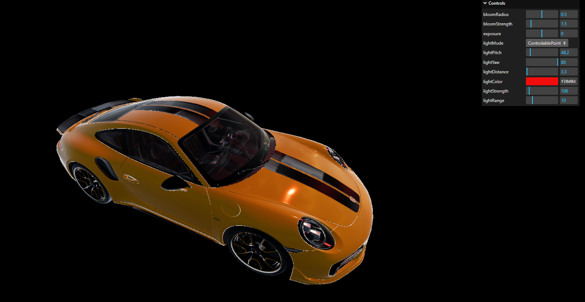

# PBR lighting

**Keywords:** glTF, PBR, light, WebGL2

**Technologies:** glTF, PBR, WebGL, CGTools

This demo is showcase of point and direct light usage with renderer. User can change light pararmeters like direction, position, strength, color, range using UI. Then renderer will show how light affects on PBR surface of glTF models.

**[How to run](../how_to_run.md)**

**References:**

* [Real Shading in Unreal Engine 4] - Industry standard PBR implementation
* [Background: Physics and Math of Shading] - Mathematical foundations
* [Moving Frostbite to PBR 2.0] - Production pipeline insights
* [Understanding Masking-Shadowing] - Geometry function theory
* [GGX Importance Sampling Part 1] - Monte Carlo integration
* [GGX Importance Sampling Part 2] - Advanced sampling techniques
* [Sampling Microfacet BRDF] - Practical BRDF implementation
* [Normal Mapping Without Tangents] - Alternative normal mapping approach
* [Vulkan glTF PBR Reference] - Complete reference implementation

[Real Shading in Unreal Engine 4]: https://blog.selfshadow.com/publications/s2013-shading-course/karis/s2013_pbs_epic_notes_v2.pdf
[Background: Physics and Math of Shading]: https://blog.selfshadow.com/publications/s2013-shading-course/hoffman/s2013_pbs_physics_math_notes.pdf
[Moving Frostbite to PBR 2.0]: https://web.archive.org/web/20160702002225/http://www.frostbite.com/wp-content/uploads/2014/11/course_notes_moving_frostbite_to_pbr_v2.pdf
[Understanding Masking-Shadowing]: https://inria.hal.science/hal-00942452v1/document
[GGX Importance Sampling Part 1]: https://schuttejoe.github.io/post/ggximportancesamplingpart1/
[GGX Importance Sampling Part 2]: https://schuttejoe.github.io/post/ggximportancesamplingpart2/
[Sampling Microfacet BRDF]: https://agraphicsguynotes.com/posts/sample_microfacet_brdf/
[Normal Mapping Without Tangents]: http://www.thetenthplanet.de/archives/1180
[Vulkan glTF PBR Reference]: https://github.com/SaschaWillems/Vulkan-glTF-PBR
