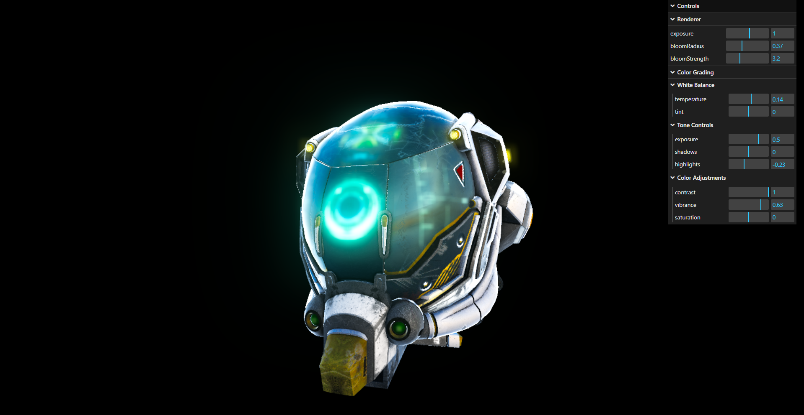

# Post-Processing

**Keywords:** Post-Processing, Color Grading, Bloom, HDR, Tone Mapping

A complete post-processing pipeline demonstrating how full-screen effects can transform a rendered 3D scene with cinematic visual quality through bloom, HDR tone mapping, and color grading.

**[How to run](../../how_to_run.md)**

## Why It's Useful

Post-processing effects are essential for modern 3D rendering:

- **Cinematic Look**: Achieve film-quality visuals by simulating camera and film characteristics
- **HDR Workflow**: Handle high dynamic range lighting that exceeds monitor capabilities through tone mapping
- **Visual Enhancement**: Add bloom for light bleeding, adjust colors for mood, and enhance contrast
- **Performance**: Apply complex effects as screen-space operations after rendering, avoiding expensive per-pixel calculations during geometry rendering
- **Artist Control**: Provide intuitive controls for non-technical users to achieve specific visual styles

This example serves as a reference implementation for building production-ready post-processing pipelines in WebGL2 applications.

## How It Works

### Multi-Pass Rendering Pipeline

The example implements a **multi-pass render-to-texture (RTT)** pipeline:

1. **Scene Rendering** (Pass 1)
   - Render 3D scene (glTF model) to an off-screen framebuffer
   - Output: HDR color texture (floating-point for values > 1.0)

2. **Bloom Effect** (Pass 2)
   - Extract bright regions exceeding threshold
   - Apply Gaussian blur in two passes (horizontal + vertical separable convolution)
   - Blend blurred result with original scene
   - Parameters: `Bloom Radius`, `Bloom Strength`

3. **Tone Mapping** (Pass 3)
   - Apply **ACES filmic tone mapping** to compress HDR values to displayable range [0, 1]
   - Preserves color and contrast better than simple exposure adjustment
   - Parameter: `Exposure` (pre-tone-map brightness control)

4. **Color Grading** (Pass 4)
   - Apply creative color adjustments:
     - **White Balance**: Temperature (warm/cool), Tint (magenta/green)
     - **Tonal Range**: Exposure, Shadows, Highlights
     - **Color**: Contrast (S-curve), Vibrance, Saturation
   - All parameters use -1.0 to 1.0 range with 0.0 as neutral

5. **Final Output**
   - Render processed texture to screen framebuffer

### Key Concepts

- **Framebuffer Objects (FBOs)**: Off-screen render targets for intermediate results
- **Ping-Pong Buffers**: Two textures alternating as source/destination for multi-pass effects
- **Separable Convolution**: Gaussian blur optimized by splitting 2D kernel into two 1D passes
- **HDR Rendering**: Floating-point textures preserve lighting detail beyond monitor range

## UI Controls

**Renderer:**
- Exposure, Bloom Radius, Bloom Strength

**Color Grading:**
- White Balance: Temperature, Tint
- Tone Controls: Exposure, Shadows, Highlights
- Color Adjustments: Contrast, Vibrance, Saturation

**[How to run](../../how_to_run.md)**

**References:**

* [GPU Gems - Post-Processing Effects] - Advanced examples of post-processing effects.

[GPU Gems - Post-Processing Effects]: https://developer.nvidia.com/gpugems/gpugems/part-iv-image-processing/chapter-21-real-time-glow
