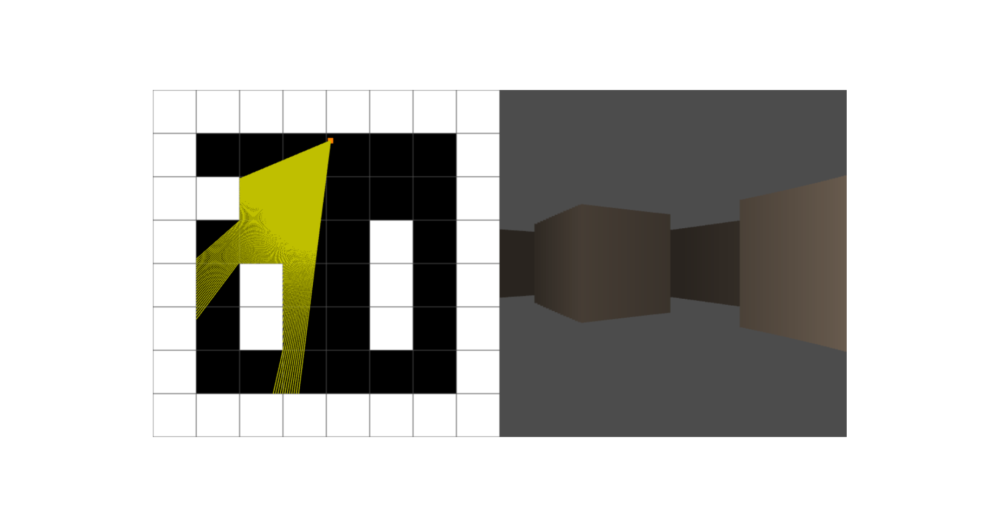

# Raycaster

**Keywords:** Ray Casting, Collision, WebGL2, Interaction

This demo demonstrates ray casting for 3D scene interaction in WebGL2. Ray casting converts 2D screen coordinates to 3D rays, enabling precise object selection, collision detection, and physics interactions.

Ray casting is fundamental for 3D user interfaces and game mechanics. This example provides a reusable implementation for mouse-based 3D interaction.

**[How to run](../how_to_run.md)**

**References:**

* [Lode's Computer Graphics Tutorial] - Comprehensive raycasting guide
* [Wolfenstein 3D Source Code] - Original implementation
* [Ray Casting Computer Graphics] - Wikipedia overview

[Lode's Computer Graphics Tutorial]: https://lodev.org/cgtutor/raycasting.html
[Wolfenstein 3D Source Code]: https://github.com/id-Software/wolf3d
[Ray Casting Computer Graphics]: https://en.wikipedia.org/wiki/Ray_casting
