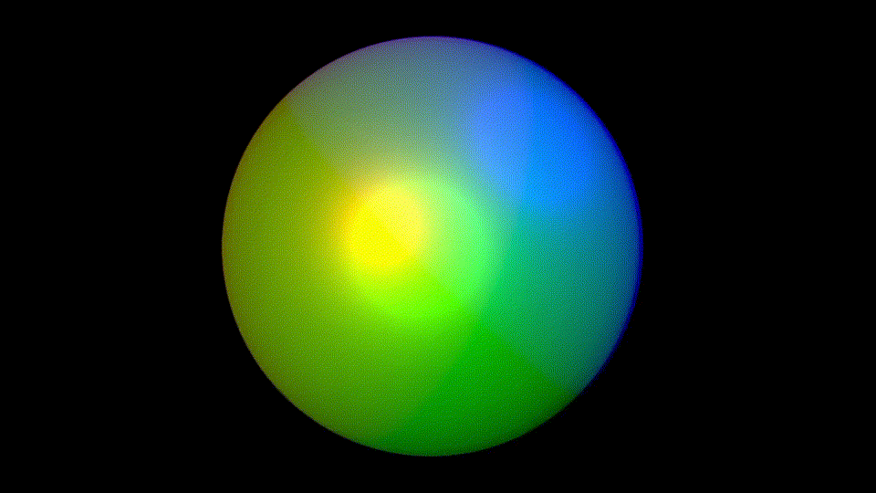

# Simple PBR

**Keywords:** PBR, Materials, WebGL2, Lighting

This demo demonstrates a simplified physically-based rendering implementation in WebGL2. It introduces PBR concepts with a minimal, educational approach focusing on core metallic-roughness workflow.

Simple PBR provides realistic materials without full complexity. This example is ideal for learning PBR fundamentals before tackling complete implementations.

**[How to run](../how_to_run.md)**

**References:**

* [Physically based rendering]
* [PBR Theory]

[Physically based rendering]: https://en.wikipedia.org/wiki/Physically_based_rendering
[PBR Theory]: https://learnopengl.com/PBR/Theory
