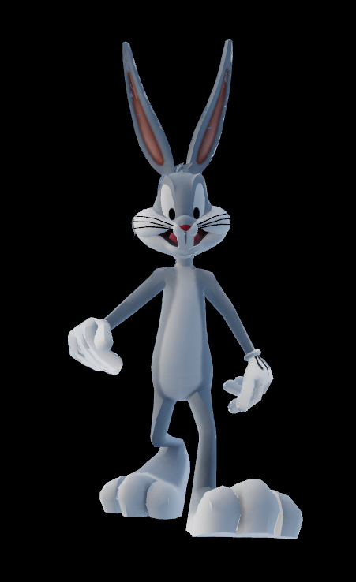

# Skeletal animation

This example demonstrates how to use a renderer for loading animated skinned 3D objects and run their animations. Choosen animation will play in a loop. User can choose any animations using UI control and rotate 3D objects.



## How it is useful

This example showcases several useful techniques and concepts for WebGL2 development:

  * How load skeletal animations of 3D objects from GLTF file.

  * How choose and run smoothly skeletal animations.

  * How update nodes transformations using updated skeletal animations.

## How it works

Playing skeletal animation using [renderer](../../../module/helper/renderer/readme.md) crate requires such steps:

### 1. Load 3D objects with skins from GLTF files.

It's involves such steps:

  * Load 3D objects and bind skin to it.
  * Bind list of related nodes to skin using `gltf::skin::Skin::joints()`.
  * Bind list of inverse bind matrices for every related node to skin using this code:

```rust
let reader = skin.reader
(
  | buffer | Some( buffers[ buffer.index() ].as_slice() )
);

let Some( inverse_bind_matrices_iter ) = reader.read_inverse_bind_matrices()
else
{
  return None;
};
```

### 2. Load animations from GLTF files.

Every animation consist of channels. Every channel is sequence of keyframes for one simple 3D transformation or morph target.

Every keyframe also defines easing function with its parameters. That used for channel value interpolation with previous keyframe.

GLTF support such types of easing functions:

  * linear

  * step

  * cubic spline that is represented by in_tangents and out_tangents parameters for each keyframe.

Every keyframe is decoded from raw GLTF file. Pairs of adjacent keyframes forms `Tween` struct that manages interpolation process and timing when start and finish interpolation. List of `Tween`s formed into `Sequence` structure. `Sequence` can control one channel playing process.

Every animation channel as `Sequence` stored in structure `Sequencer` that controls every channel playing process. It needed for managing channels for every animation. New channels can be added, modified or removed after loading.

### 3. Choose animations for playing.

```rust
let animation = gltf.animations[ 0 ].clone();
```

### 4. Update every animation.

Using method `Animation::update()`.

This method update every animation channel with delta_time that is calculated using frame time. When animation updated it contains data for every related nodes 3D transformation for current frame. This data is used for updating nodes transformation.

### 5. Update transformations of every related node for every animation.

Using method `Animation::set()`.

4-5 steps can be presented with this code:

```rust
let last_time = Rc::new( RefCell::new( 0.0 ) );
let current_animation = Rc::new( RefCell::new( gltf.animations[ 0 ].clone() ) );

let update_and_draw =
{
  move | t : f64 |
  {
    let time = t / 1000.0;

    {
      let last_time = last_time.clone();

      let delta_time = time - *last_time.borrow();
      *last_time.borrow_mut() = time;

      if current_animation.borrow().sequencer.borrow().is_completed()
      {
        current_animation.borrow().sequencer.borrow_mut().reset();
      }

      current_animation.borrow().update( delta_time as f32 );
      current_animation.borrow().set();
    }

    // render stuff
  }
};
```

### 6. Renderer crate vertex shader updates every vertex position using skin.

Every rendered 3D object that contains skin calculates and uploads joint matrices using related nodes global transform and inverse bind matrices. In vertex shader joint matrices, joints and weights attributes of every 3D object vertex are used for calculating every vertex position. Read more in [WebGL Skinning] and [GLTF reference guide].

## Running
Ensure you have all the necessary dependencies installed. This example uses trunk for building and serving the WebAssembly application.

To run the example:

Navigate to the example's directory in your terminal.

Run the command:

```bash
  trunk serve
```

Open your web browser to the address provided by trunk (usually http://127.0.0.1:8080).

The application will load the GLTF model, skeletons, animations and start the rendering loop, displaying animated 3D objects. You can select different animations that contained in GLTF file using the provided UI controls.

Feel free to replace `bug_bunny.glb` with your own 3D model by modifying path to file in the main.rs file and loading own assets into [folder](../../../assets/gltf/animated/).

## 📚 References

### Skinning
- [WebGL Skinning]
- [GLTF reference guide]
- [Animation Sampler Interpolation Modes]

### Data texture for uniform matrices
- [How to use textures as data]
- [WebGL2 3D - Data Textures]

### Assets
- [Bug Buggy GLTF asset]

[WebGL Skinning]: https://webglfundamentals.org/webgl/lessons/webgl-skinning.html
[GLTF reference guide]: https://www.khronos.org/files/gltf20-reference-guide.pdf
[Animation Sampler Interpolation Modes]: https://registry.khronos.org/glTF/specs/2.0/glTF-2.0.html#appendix-c-interpolation
[How to use textures as data]: https://webgl2fundamentals.org/webgl/lessons/webgl-qna-how-to-use-textures-as-data.html
[WebGL2 3D - Data Textures]: https://webgl2fundamentals.org/webgl/lessons/webgl-data-textures.html
[Bug Buggy GLTF asset]: https://skfb.ly/pAD7B

