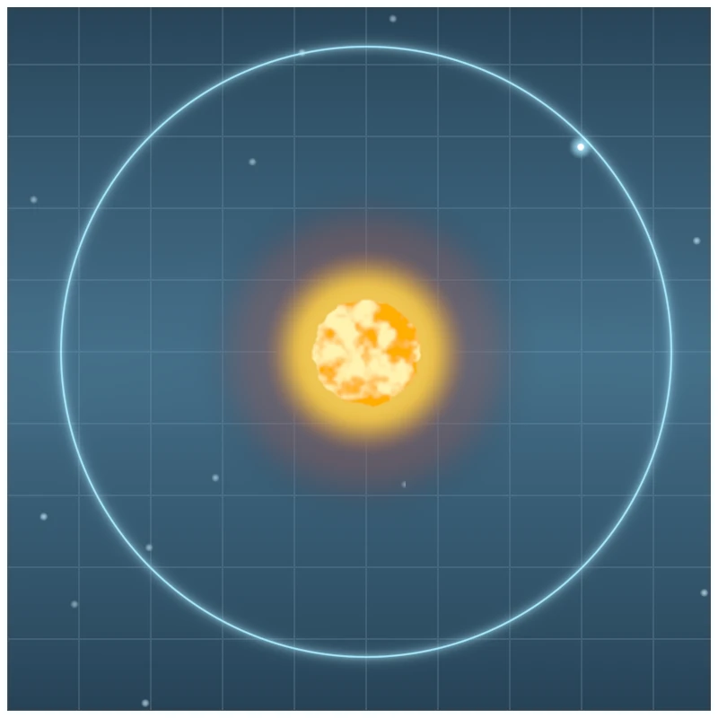

# Sun Grid Lines

**Keywords:** WebGL2, Fragment Shader, Procedural Generation, Noise, Fullscreen Pass, Bloom, MRT, Post-Processing

A sci-fi HUD-style solar-system diagram, rendered by a fullscreen fragment shader — no meshes, no textures, no vertex buffer. A dark vertical-gradient background carries a noise-modulated nebula band and sparse twinkling stars; a grid overlays the whole scene; a granulated, noise-jagged star sits at the center inside a layered radial corona; a glowing ring traces its orbit, with one or more nodes circling it.

The vertex shader uses the "big triangle" trick (three vertices, no buffer, positions derived from `gl_VertexID`) to cover the viewport in a single draw call. All visual structure — gradient, grid, nebula fog, star field, corona, star-surface granulation, rim jitter, orbit ring, and orbiting nodes — is procedural, built from a compact hash-based value-noise/fbm function local to the shader (the workspace has no existing Perlin/Simplex implementation to depend on).

**Real multi-pass bloom.** The fragment shader writes two outputs via MRT: `frag_color` (the full composited scene) and `frag_emission` (only the layers that should glow — corona, star disk, ring, node halos; background/nebula/stars/grid are left black). Both land in an offscreen framebuffer. Every frame, `frag_emission` is fed through the `renderer` crate's real `UnrealBloomPass` (5-mip Gaussian blur + weighted composite), additively blended back onto `frag_color` via `BlendPass`, then presented to the screen through `ToSrgbPass`. This is the identical bloom → blend → present sequence the `renderer` crate's own `Renderer` uses internally, not a bespoke pipeline.

**Live parameterization.** Three uniforms drive the shader and can be changed at runtime with the keyboard:

| Key | Effect |
| :--- | :--- |
| `↑` / `↓` | Increase / decrease the number of orbiting nodes (1–8) |
| `←` / `→` | Decrease / increase grid density |
| `Space` | Reshuffle the seed — reshuffles the star field and every node's orbital phase/radius |

**Scene file.** Everything not listed above as keyboard-live — every layer's color(s), the nebula/grid opacity, the sun disc's radius, and the orbit ring's radius — is data, not a shader constant: [`scene.rhai`](scene.rhai), a `scene_script`-based Rhai script evaluated by [`src/scene.rs`](src/scene.rs)'s `SceneConfig::load()` and uploaded once, right after the shader program links, as 17 individual `vec3`/`float` uniforms — unlike the WebGPU port's single packed uniform buffer, this crate uploads one GL uniform per field via `gl::uniform::upload`, so there's no bulk buffer to rewrite and no reason to re-upload unchanging values every frame. `load()` runs the script through `scene_script::build_engine()` and extracts the returned value into `SceneConfig` via `rhai`'s serde bridge (`rhai::serde::from_dynamic`) — the same crate and convention documented in [`scene_script`](../../../module/helper/scene_script/readme.md) and demonstrated in [`examples/scene_script/`](../../scene_script/f32x2_vector_arithmetic/readme.md). `scene.rhai` sticks to the declarative half of that convention: top-level `let` bindings and a single trailing map-literal expression, no `fn main()` and no host callbacks, since the scene is pure data with nothing imperative to drive. Edit `scene.rhai` and rebuild to restyle the diagram without touching `main.rs` or `scene.frag`. Two things it deliberately leaves alone: the script is bundled via `include_str!` at compile time like the shaders themselves, so it is not hot-reloadable — a rebuild is required; and the noise/hash internals, anti-aliasing epsilons, and orbiting-node jitter formula stay shader constants, since they're generation internals rather than author-facing content.

**[How to run](../../how_to_run.md)**

**References:**

* [WebGL2 Fundamentals]
* [inigo quilez — fbm]

[WebGL2 Fundamentals]: https://webgl2fundamentals.org/
[inigo quilez — fbm]: https://iquilezles.org/articles/fbm/
