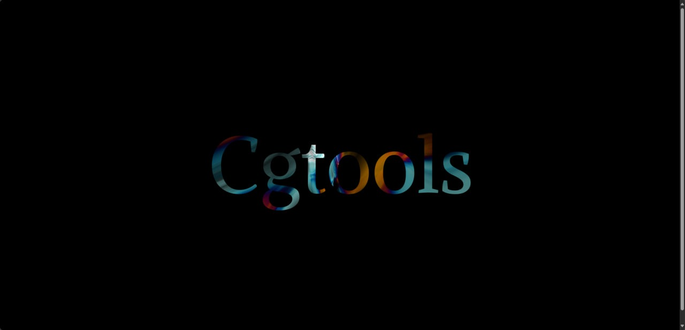

# MSDF Text Rendering

**Keywords:** Text, MSDF, Typography, WebGL2

This demo demonstrates high-quality text rendering using Multi-Channel Signed Distance Fields (MSDF) in WebGL2. MSDF text remains crisp at any zoom level, perfect for scalable UI and 3D text.

MSDF is the modern standard for GPU text rendering, offering superior quality to bitmap fonts. This example shows complete text rendering with proper layout and styling.

**[How to run](../how_to_run.md)**

**References:**

* [msdf-atlas-gen] - Command-line MSDF generator
* [MSDF Font Generator] - Web-based MSDF creation
* [msdfgen] - Core MSDF library
* [A-Frame Fonts] - Pre-generated MSDF fonts
* [Valve MSDF Paper] - Original SDF technique
* [GPU Text Rendering] - MSDF implementation guide
* [Typography in Games] - Game text rendering best practices

[msdf-atlas-gen]: https://github.com/Chlumsky/msdf-atlas-gen
[MSDF Font Generator]: https://msdf-bmfont.donmccurdy.com/
[msdfgen]: https://github.com/Chlumsky/msdfgen
[A-Frame Fonts]: https://github.com/etiennepinchon/aframe-fonts
[Valve MSDF Paper]: https://steamcdn-a.akamaihd.net/apps/valve/2007/SIGGRAPH2007_AlphaTestedMagnification.pdf
[GPU Text Rendering]: https://astiopin.github.io/2018/04/27/msdf.html
[Typography in Games]: https://www.gdcvault.com/play/1020751/Typography-in
