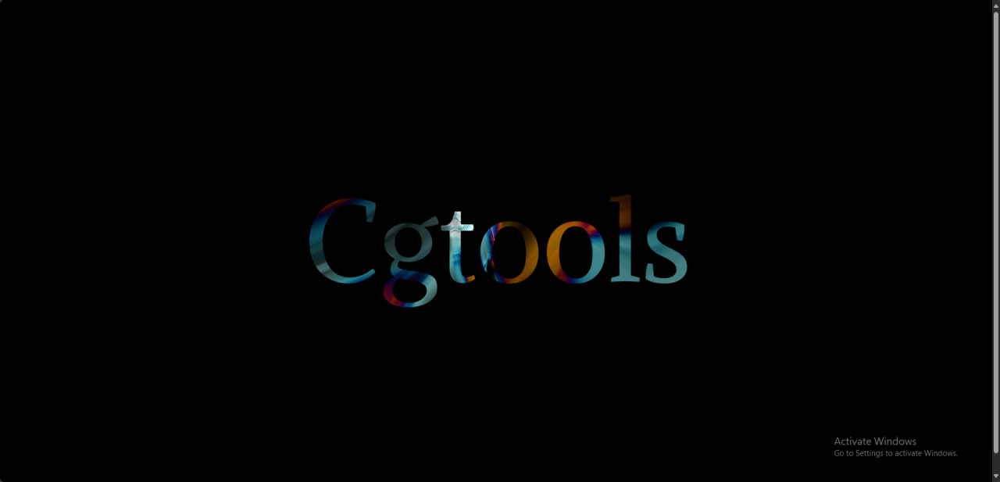

# 🔤 MSDF Text Rendering

> **Scalable, high-quality text rendering using Multi-Channel Signed Distance Fields**

A cutting-edge text rendering system that maintains crisp, readable text at any scale using the MSDF (Multi-Channel Signed Distance Field) technique. Perfect for games, UIs, and applications requiring high-quality typography across different zoom levels.



## ✨ Features

### 🎯 **Superior Text Quality**
- **Infinite Scalability** - Crisp text at any zoom level without pixelation
- **Multi-Channel Precision** - RGB channels encode fine glyph details
- **Sub-Pixel Accuracy** - Smooth text edges and curves
- **GPU Accelerated** - Hardware-accelerated distance field sampling

### 🛠️ **Technical Advantages**
- **Memory Efficient** - Single texture atlas for entire font
- **Performance Optimized** - Fast GPU fragment shader evaluation
- **Anti-Aliasing Built-In** - No additional AA passes required
- **WebGL Compatible** - Browser-native implementation

### 🎮 **Interactive Features**
- **Dynamic Text** - Real-time text content updates
- **Font Switching** - Multiple typefaces and weights
- **Color Styling** - Rich text formatting options
- **Responsive Layout** - Adaptive text sizing

## 🚀 Quick Start

### Prerequisites
- WebGL 2.0 compatible browser
- Rust with `wasm32-unknown-unknown` target  
- Trunk for development server

### Run the Example
```bash
# Navigate to MSDF text example
cd examples/minwebgl/text_msdf

# Install trunk if needed
cargo install trunk

# Serve the example
trunk serve --release
```

Open http://localhost:8080 to see scalable MSDF text in action.

## 🔧 Technical Deep Dive

### What are Signed Distance Fields?

Traditional bitmap fonts lose quality when scaled. **Signed Distance Fields** store the distance to the nearest glyph edge in each texel:

```glsl
// Traditional bitmap sampling
float alpha = texture(fontTexture, uv).a; // Binary 0 or 1

// SDF sampling with smooth edges
float distance = texture(sdfTexture, uv).r;
float alpha = smoothstep(0.5 - fwidth(distance), 0.5 + fwidth(distance), distance);
```

### Multi-Channel Enhancement

**MSDF** uses RGB channels to encode corner and edge information separately, achieving higher precision:

```glsl
// Sample all three channels
vec3 msdf = texture(msdfTexture, uv).rgb;

// Compute median for precise edge detection
float sigDist = median(msdf.r, msdf.g, msdf.b);

// Convert to alpha with anti-aliasing
float alpha = clamp((sigDist - 0.5) * pxRange + 0.5, 0.0, 1.0);
```

### MSDF Generation Process

1. **Vector Font Analysis** - Extract glyph outlines from TTF/OTF
2. **Distance Field Computing** - Calculate distance to edges for each pixel
3. **Multi-Channel Encoding** - Distribute corner/edge data across RGB
4. **Atlas Packing** - Combine all glyphs into single texture

## 📊 Quality Comparison

| Method | Memory | Quality | Scalability | GPU Cost |
|--------|--------|---------|-------------|----------|
| **Bitmap** | High | Poor when scaled | Limited | Low |
| **Vector** | Low | Perfect | Infinite | Very High |  
| **SDF** | Medium | Good | Excellent | Medium |
| **MSDF** | Medium | Excellent | Infinite | Medium |

## 🎨 Shader Implementation

### Vertex Shader
```glsl
#version 300 es
precision mediump float;

// Attributes
in vec2 position;
in vec2 texCoord;

// Uniforms
uniform mat4 mvpMatrix;
uniform vec2 atlasSize;

// Outputs to fragment shader
out vec2 vTexCoord;
out float vPxRange;

void main() {
  gl_Position = mvpMatrix * vec4(position, 0.0, 1.0);
  vTexCoord = texCoord;
  
  // Calculate pixel range for anti-aliasing
  vec2 screenTexSize = vec2(1.0) / fwidth(texCoord);
  vPxRange = max(0.5 * length(screenTexSize / atlasSize), 1.0);
}
```

### Fragment Shader  
```glsl
#version 300 es
precision mediump float;

// Inputs from vertex shader
in vec2 vTexCoord;
in float vPxRange;

// Uniforms
uniform sampler2D msdfTexture;
uniform vec4 textColor;
uniform vec4 outlineColor;
uniform float outlineWidth;

// Output
out vec4 fragColor;

// Median function for MSDF
float median(float r, float g, float b) {
  return max(min(r, g), min(max(r, g), b));
}

void main() {
  // Sample MSDF texture
  vec3 msdf = texture(msdfTexture, vTexCoord).rgb;
  
  // Get signed distance
  float sigDist = median(msdf.r, msdf.g, msdf.b);
  
  // Convert to screen space
  float screenPxDistance = vPxRange * (sigDist - 0.5);
  
  // Anti-aliased alpha
  float alpha = clamp(screenPxDistance + 0.5, 0.0, 1.0);
  
  // Optional outline effect
  float outlineAlpha = clamp(screenPxDistance + outlineWidth + 0.5, 0.0, 1.0);
  
  // Mix text and outline colors
  vec4 color = mix(outlineColor, textColor, alpha);
  fragColor = vec4(color.rgb, color.a * outlineAlpha);
}
```

## 🎯 Advanced Text Features

### Rich Text Formatting
```rust
// Text with multiple styles
struct StyledTextRun
{
  text : String,
  font_size : f32,
  color : [ f32; 4 ],
  bold : bool,
  italic : bool,
}

// Render styled text spans
fn render_rich_text( &mut self, runs : &[ StyledTextRun ] )
{
  let mut cursor_x = 0.0;
  
  for run in runs
  {
    let font = self.get_font( run.bold, run.italic );
    self.render_text_run( &run.text, cursor_x, 0.0, run.font_size, run.color, font );
    cursor_x += self.measure_text( &run.text, run.font_size, font );
  }
}
```

### Text Layout and Wrapping
```rust
// Automatic text wrapping
struct TextLayout
{
  width : f32,
  height : f32,
  line_height : f32,
  alignment : TextAlign,
}

impl TextLayout
{
  fn layout_text( &self, text : &str, font_size : f32 ) -> Vec< TextLine >
  {
    let mut lines = Vec::new();
    let mut current_line = String::new();
    let mut line_width = 0.0;
    
    for word in text.split_whitespace()
    {
      let word_width = measure_text( word, font_size );
      
      if line_width + word_width > self.width
      {
        // Start new line
        lines.push( TextLine::new( current_line.clone(), line_width ) );
        current_line = word.to_string();
        line_width = word_width;
      }
      else
      {
        // Add to current line
        if !current_line.is_empty() { current_line.push( ' ' ); }
        current_line.push_str( word );
        line_width += word_width;
      }
    }
    
    if !current_line.is_empty()
    {
      lines.push( TextLine::new( current_line, line_width ) );
    }
    
    lines
  }
}
```

### Text Effects and Animation
```rust
// Animated text effects  
struct TextEffect
{
  wave_amplitude : f32,
  wave_frequency : f32,
  color_cycle : f32,
  time : f32,
}

impl TextEffect
{
  fn apply_wave_effect( &self, base_position : Vec2, char_index : usize ) -> Vec2
  {
    let wave_offset = ( self.time * self.wave_frequency + char_index as f32 * 0.5 ).sin()
                      * self.wave_amplitude;
    
    Vec2::new( base_position.x, base_position.y + wave_offset )
  }
  
  fn get_character_color( &self, char_index : usize ) -> [ f32; 4 ]
  {
    let hue = ( self.time * self.color_cycle + char_index as f32 * 0.1 ) % 1.0;
    hsv_to_rgb( hue, 1.0, 1.0 )
  }
}
```

## 📚 Font Preparation Workflow

### 1. Font Generation
```bash
# Using msdf-atlas-gen tool
msdf-atlas-gen -font "arial.ttf" -size 32 -pxrange 4 -output msdf_atlas
```

### 2. Rust Font Loading
```rust
// Load MSDF font data
struct MsdfFont
{
  atlas_texture : WebGlTexture,
  glyph_data : HashMap< char, GlyphMetrics >,
  px_range : f32,
  atlas_size : ( u32, u32 ),
}

impl MsdfFont
{
  async fn load_from_json( gl : &WebGl2RenderingContext, json_path : &str ) -> Result< Self, JsValue >
  {
    // Load font metrics from JSON
    let font_data : FontData = load_json( json_path ).await?;
    
    // Load texture atlas
    let atlas_texture = load_texture( gl, &font_data.atlas_image_path ).await?;
    
    // Parse glyph metrics
    let mut glyph_data = HashMap::new();
    for glyph in font_data.glyphs
    {
      glyph_data.insert( glyph.unicode_char, glyph.metrics );
    }
    
    Ok( MsdfFont
    {
      atlas_texture,
      glyph_data,
      px_range : font_data.px_range,
      atlas_size : font_data.atlas_size,
    })
  }
}
```

## 🛠️ Tools and Resources

### MSDF Generation Tools
- **[msdf-atlas-gen](https://github.com/Chlumsky/msdf-atlas-gen)** - Command-line MSDF generator
- **[MSDF Font Generator](https://msdf-bmfont.donmccurdy.com/)** - Web-based MSDF creation
- **[msdfgen](https://github.com/Chlumsky/msdfgen)** - Core MSDF library
- **[A-Frame Fonts](https://github.com/etiennepinchon/aframe-fonts)** - Pre-generated MSDF fonts

### Development Resources
- **[Valve MSDF Paper](https://steamcdn-a.akamaihd.net/apps/valve/2007/SIGGRAPH2007_AlphaTestedMagnification.pdf)** - Original SDF technique
- **[GPU Text Rendering](https://astiopin.github.io/2018/04/27/msdf.html)** - MSDF implementation guide
- **[Typography in Games](https://www.gdcvault.com/play/1020751/Typography-in)** - Game text rendering best practices

## 🎮 Use Cases and Applications

### Game Development
- **UI Text** - Scalable menus, HUDs, and interface elements
- **3D World Text** - Billboard text, signs, and labels
- **Subtitles** - Dynamic dialogue and caption systems
- **Debug Overlays** - Development tools and performance metrics

### Web Applications  
- **Data Visualization** - Chart labels and annotations
- **Interactive Maps** - Scalable place names and markers
- **E-Learning** - Educational content with zoom features
- **Design Tools** - WYSIWYG editors with precise typography

### Performance Critical Applications
- **Mobile Games** - Battery-efficient text rendering
- **VR/AR Applications** - High-resolution text in 3D space
- **Real-Time Dashboards** - Dense information displays
- **Embedded Systems** - Resource-constrained environments

## 🔧 Performance Optimization

### GPU Memory Management
```rust
// Efficient atlas packing
struct AtlasManager
{
  texture : WebGlTexture,
  free_regions : Vec< Rect >,
  used_glyphs : HashSet< char >,
}

impl AtlasManager
{
  fn pack_glyph( &mut self, glyph : char, size : ( u32, u32 ) ) -> Option< Rect >
  {
    // Find best-fit region using shelf packing
    for ( i, region ) in self.free_regions.iter().enumerate()
    {
      if region.width >= size.0 && region.height >= size.1
      {
        let allocated = Rect::new( region.x, region.y, size.0, size.1 );
        
        // Split remaining space
        self.split_region( i, allocated );
        
        return Some( allocated );
      }
    }
    None
  }
}
```

### Batch Text Rendering
```rust
// Batch multiple text draws
struct TextBatch
{
  vertex_buffer : WebGlBuffer,
  vertices : Vec< TextVertex >,
  draw_calls : Vec< DrawCall >,
}

impl TextBatch
{
  fn add_text( &mut self, text : &str, position : Vec2, size : f32, color : [ f32; 4 ] )
  {
    let start_vertex = self.vertices.len();
    
    // Add vertices for each character
    for ( i, ch ) in text.chars().enumerate()
    {
      if let Some( glyph ) = self.font.get_glyph( ch )
      {
        self.add_glyph_quad( glyph, position, size, color );
      }
    }
    
    let vertex_count = self.vertices.len() - start_vertex;
    self.draw_calls.push( DrawCall { start_vertex, vertex_count } );
  }
  
  fn render( &mut self, gl : &WebGl2RenderingContext )
  {
    // Upload vertex data once
    upload_vertices( gl, &self.vertices );
    
    // Render all batched text
    for draw_call in &self.draw_calls
    {
      gl.draw_arrays
      (
        WebGl2RenderingContext::TRIANGLES,
        draw_call.start_vertex as i32,
        draw_call.vertex_count as i32
      );
    }
    
    // Clear batch for next frame
    self.vertices.clear();
    self.draw_calls.clear();
  }
}
```

## 🛠️ Troubleshooting

### Common Issues
- **Blurry Text** - Check px_range and screen resolution scaling
- **Jagged Edges** - Verify anti-aliasing parameters in shader
- **Incorrect Sizing** - Ensure proper world-to-screen space conversion
- **Atlas Artifacts** - Check texture filtering and mipmap settings

### Debug Visualization
```rust
// Visualize MSDF atlas for debugging
fn debug_render_atlas( &self, gl : &WebGl2RenderingContext )
{
  // Render atlas texture directly to screen
  let debug_shader = self.get_debug_shader();
  gl.use_program( Some( &debug_shader ) );
  gl.bind_texture( WebGl2RenderingContext::TEXTURE_2D, Some( &self.font.atlas_texture ) );
  
  // Render full-screen quad showing atlas
  self.render_fullscreen_quad( gl );
}
```

