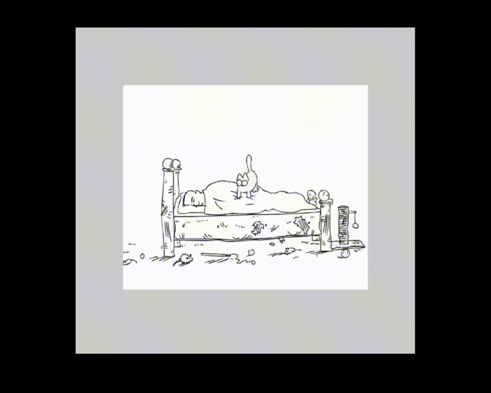

# Video as Texture

**Keywords:** Video, Textures, WebGL2, Media

This demo demonstrates using video as a texture source in WebGL2. It shows how to stream video content to GPU textures, enabling effects like video walls, displays in 3D scenes, or post-processing.

Video textures enable dynamic content integration. This example handles video loading, synchronization, and efficient GPU upload.

**[How to run](../how_to_run.md)**

**References:**

* [MDN Video API] - Complete video element reference
* [WebGL Video] - Video texturing fundamentals
* [Video Optimization] - Web video best practices

[MDN Video API]: https://developer.mozilla.org/en-US/docs/Web/API/HTMLVideoElement
[WebGL Video]: https://webglfundamentals.org/webgl/lessons/webgl-video.html
[Video Optimization]: https://web.dev/video/
