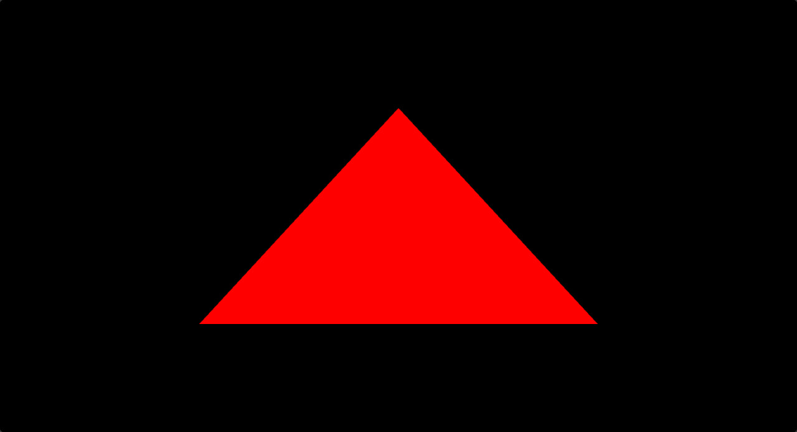

# Hello Triangle (WebGPU)

**Keywords:** WebGPU, Tutorial, Basics, Getting Started

This demo is the classic "Hello Triangle" in WebGPU. It demonstrates the minimum code needed to render a triangle using the modern WebGPU API, serving as an introduction to GPU programming.

This is the essential first step for learning WebGPU, covering device setup, pipeline creation, and basic rendering commands.

**[How to run](../how_to_run.md)**

**References:**

* [WebGPU Specification]
* [WebGPU Fundamentals]

[WebGPU Specification]: https://www.w3.org/TR/webgpu/
[WebGPU Fundamentals]: https://webgpufundamentals.org
