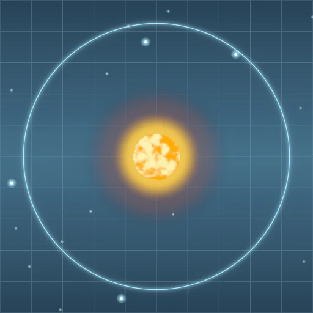

# Sun Grid Lines, Chunked (wgpu)

**Keywords:** wgpu, Rust, WGSL, Shader Composition, Shader Manifest, Fragment Shader, Procedural Generation, Noise, Offscreen Rendering

A variant of [`sun_grid_lines`](../sun_grid_lines/readme.md) that renders the
identical image but assembles its shader from **chunks**: small, reusable
pieces of WGSL from the shared
[`shader_chunks`](../../../module/min/shader_chunks/readme.md) crate, instead
of duplicating them inline into one `scene.wgsl`. Each chunk is exactly one
function — or, for the vertex stage, one entry point plus the struct type it
returns — stored as a `.wgsl` file whose leading comment block is a
**manifest** describing its interface: `hash21`, `value_noise`, `fbm3`, and
`fullscreen_triangle`. At startup, `shader_chunks::compose()` reads every
chunk's manifest header, topologically sorts the chunks by their declared
dependencies, and concatenates their WGSL bodies in that order — before this
example's own fragment body (`shaders/scene_fragment.wgsl`) is appended as
the final, non-reusable "program" that consumes them.

That duplication is real, not hypothetical: the fullscreen-triangle trick and
the noise functions are hand-copied verbatim across
[`sun_grid_lines`](../sun_grid_lines/readme.md), its
[Vulkan-backend sibling](../sun_grid_lines_vulkan/readme.md), and — re-derived
by hand in GLSL — the
[WebGL2 original](../../minwebgl/sun_grid_lines/readme.md). This example and
the [browser WebGPU port](../../scene_script/sun_grid_lines/readme.md) are
the two variants that share the crate's chunks instead of carrying their own
copies.

**Manifest, not just a file split.** Each chunk opens with a `//@`-prefixed
comment block declaring `name`, a one-line `description`, `depends_on`, and
one `export` line per exported symbol — and `compose()` actually reads and
relies on `depends_on`: chunks can be passed in any order and are still
concatenated dependency-before-dependent, with a typo'd or missing
dependency panicking immediately, naming the offending chunk. The manifest
format, the crate's manifest-honesty tests, and the no-Rust-mirror principle
(chunks are a shader-side concept only; no `hash21`/`value_noise`/`fbm3`
Rust ports exist) are documented in the crate's own
[readme](../../../module/min/shader_chunks/readme.md). This example began as
the chunk pattern's example-scoped prototype; the composer and the four
chunks were promoted into `module/min/shader_chunks` once the browser
WebGPU port became their second consumer.

There is no windowing anywhere in this workspace (no `winit`, no
`wgpu::Surface`), so this example follows the same pattern as
[`hello_triangle`](../hello_triangle/readme.md) and
[`grid_render`](../grid_render/readme.md): render once into an offscreen
texture, copy it into a `MAP_READ` buffer, and save the result as
`-sun_grid_lines_chunked.png`. No live loop, no animation, no keyboard
interactivity — `node_count = 4` is baked into a single fixed uniform buffer
at buffer-creation time, to show off the orbiting-node parameterization in
the one frame this example produces.

**No multi-pass bloom**, for the same reason as the other native/WebGPU
ports: no post-processing library exists for `minwgpu` in this workspace.
Glow uses the shader's analytic radial-falloff / `exp()` terms.

**[How to run](../../how_to_run.md)**

**References:**

* [wgpu Documentation]
* [WGSL Specification]
* [inigo quilez — fbm]

[wgpu Documentation]: https://docs.rs/wgpu/latest/wgpu/
[WGSL Specification]: https://www.w3.org/TR/WGSL/
[inigo quilez — fbm]: https://iquilezles.org/articles/fbm/
