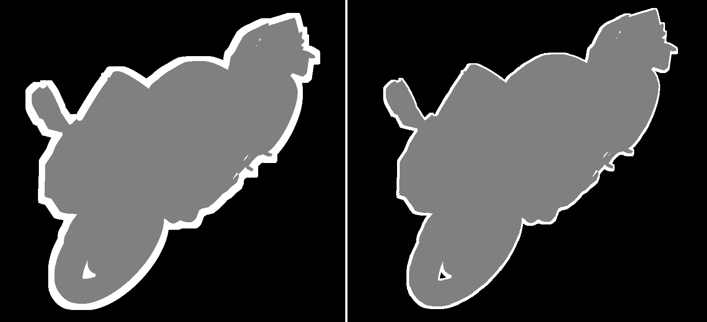

# Examples

Interactive WebGL/WebGPU examples demonstrating CGTools capabilities.

## Quick Start

Prerequisites:
```bash
rustup target add wasm32-unknown-unknown
cargo install trunk
```

Run example:
```bash
cd minwebgl/hexagonal_grid
trunk serve --release
# Open http://localhost:8080
```

More detailed setup and run instruction: [how_to_run.md](./how_to_run.md)

## Math Examples

| | | |
|:-------------------------:|:-------------------------:|:-------------------------:|
|<br>[Game of life](./math/life/readme.md) | | |

## WebGL Examples

| | | |
|:-------------------------:|:-------------------------:|:-------------------------:|
|[2D line](./minwebgl/2d_line/readme.md)<br>*(No showcase yet)* |<br>[3D line](./minwebgl/3d_line/readme.md) |<br>[Animated objects surface rendering](./minwebgl/animation_surface_rendering/readme.md) |
|<br>[Area light](./minwebgl/area_light/readme.md) |<br>[Attributes instanced](./minwebgl/attributes_instanced/readme.md) |<br>[Attributes matrix](./minwebgl/attributes_matrix/readme.md) |
|<br>[Attributes VAO](./minwebgl/attributes_vao/readme.md) |<br>[Color space conversions](./minwebgl/color_space_conversions/readme.md) |<br>[Curve rendering on surface](./minwebgl/curve_surface_rendering/readme.md) |
|<br>[Deferred shading](./minwebgl/deferred_shading/readme.md) |<br>[Diamond](./minwebgl/diamond/readme.md) |<br>[Image filter](./minwebgl/filter/readme.md) |
|<br>[Image filters](./minwebgl/filters/readme.md) |<br>[GLTF viewer](./minwebgl/gltf_viewer/readme.md) |<br>[Hexagonal grid](./minwebgl/hexagonal_grid/readme.md) |
|<br>[Hexagonal map](./minwebgl/hexagonal_map/readme.md) |<br>[Cube map](./minwebgl/make_cube_map/readme.md) |<br>[Tilemaps rendering](./minwebgl/mapgen_tiles_rendering/readme.md) |
|<br>[Minimize wasm](./minwebgl/minimize_wasm/readme.md) |<br>[Narrow outline](./minwebgl/narrow_outline/readme.md) |<br>[OBJ loading](./minwebgl/obj_load/readme.md) |
|<br>[OBJ viewer](./minwebgl/obj_viewer/readme.md) |<br>[Object picking](./minwebgl/object_picking/readme.md) |<br>[Outline](./minwebgl/outline/readme.md) |
|<br>[Raycaster](./minwebgl/raycaster/readme.md) |<br>[Outlines postprocessing](./minwebgl/renderer_with_outlines/readme.md) |<br>[Simple PBR](./minwebgl/simple_pbr/readme.md) |
|<br>[Spinning cube](./minwebgl/spinning_cube_size_opt/readme.md) |<br>[Sprite animation](./minwebgl/sprite_animation/readme.md) |<br>[Text MSDF](./minwebgl/text_msdf/readme.md) |
|<br>[Text rendering](./minwebgl/text_rendering/readme.md) |<br>[Trivial](./minwebgl/trivial/readme.md) |<br>[Uniform animation](./minwebgl/uniforms_animation/readme.md) |
|<br>[Video as texture](./minwebgl/video_as_texture/readme.md) |<br>[Wave function collapse](./minwebgl/wfc/readme.md) |

## WebGPU Examples

| | | |
|:-------------------------:|:-------------------------:|:-------------------------:|
|<br>[Deffered rendering](./minwebgpu/deffered_rendering/readme.md) |<br>[Hello triangle](./minwebgpu/hello_triangle/readme.md) | |

## WGPU Examples

| | | |
|:-------------------------:|:-------------------------:|:-------------------------:|
|<br>[Grid renderer](./minwgpu/grid_render/readme.md) |<br>[Hello triangle](./minwgpu/hello_triangle/readme.md) | |
