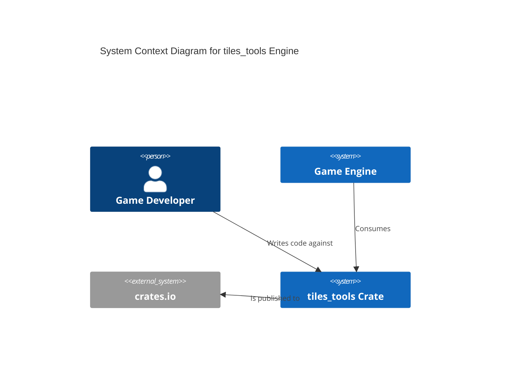
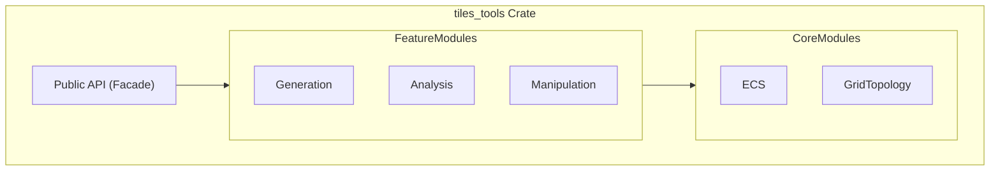

# spec

- **Name:** Tiles Tools Engine
- **Version:** 1.0 (Final)
- **Date:** 2025-08-08

### **Table of Contents**

**Part I: Public Contract (Mandatory Requirements)**
1.  [Project Goal](#1-project-goal)
2.  [Problem Solved](#2-problem-solved)
3.  [Ubiquitous Language (Vocabulary)](#3-ubiquitous-language-vocabulary)
4.  [Deliverables](#4-deliverables)
5.  [Success Metrics](#5-success-metrics)
6.  [Vision & Scope](#6-vision--scope)
7.  [System Actors](#7-system-actors)
8.  [Supported Grid Topologies](#8-supported-grid-topologies)
9.  [Functional Requirements](#9-functional-requirements)
10. [Non-Functional Requirements](#10-non-functional-requirements)

**Part II: Internal Design (Design Recommendations)**
11. [System Architecture](#11-system-architecture)
12. [External Dependencies Analysis](#12-external-dependencies-analysis)
13. [Core Algorithms](#13-core-algorithms)
14. [Architectural & Flow Diagrams](#14-architectural--flow-diagrams)
15. [Reference Implementation Examples](#15-reference-implementation-examples)

**Part III: Project & Process Governance**
16. [Core Principles of Development](#16-core-principles-of-development)
17. [Open Questions](#17-open-questions)

**Appendix: Addendum**
- [Developer Implementation Notes](#appendix-addendum)

---

**Part I: Public Contract (Mandatory Requirements)**

### 1. Project Goal
To create a high-performance, generic, and extensible Rust crate (`tiles_tools`) that provides a comprehensive suite of tools for developing tile-based games and applications. The engine will serve as a foundational layer, handling complex grid logic, pathfinding, and procedural generation, allowing developers to focus on game-specific rules and rendering.

### 2. Problem Solved
Game developers frequently reinvent the wheel for fundamental grid and tilemap mechanics. `tiles_tools` aims to solve this by providing a single, robust, and highly optimized library that offers a versatile data model, first-class support for grid duality, a performant ECS architecture, and powerful procedural generation and map analysis capabilities.

### 3. Ubiquitous Language (Vocabulary)
| Term | Definition |
| :--- | :--- |
| **Grid** | The abstract topological and geometric space on which the game exists. |
| **Primal Grid** | The primary grid structure, typically what the user sees as "tiles" (Faces, Edges, Vertices). |
| **Dual Grid** | A graph representation that is the dual of the `Primal Grid`, essential for representing relationships *between* tiles. |
| **Entity** | A unique identifier (ID) that represents a specific instance of a `Primitive` or a game object. |
| **Component** | A single piece of data associated with an `Entity` (e.g., `Position`, `PlayerID`). |
| **ECS** | Entity-Component-System, the core architectural pattern for the engine. |
| **WFC** | Wave Function Collapse, a powerful algorithm for procedural generation. |

### 4. Deliverables
1.  **Published Rust Crate:** The compiled `tiles_tools` library, published on `crates.io`.
2.  **Source Code Repository:** Full access to the version-controlled source code in a Git repository.
3.  **Comprehensive API Documentation:** `cargo doc` generated documentation, hosted publicly.
4.  **Usage Examples & Tutorials:** A collection of small projects demonstrating library usage.

### 5. Success Metrics
| Category | Metric | Target |
| :--- | :--- | :--- |
| **Adoption** | Downloads on `crates.io` | Achieve 1,000 downloads within 6 months of the 1.0 release. |
| **Usability** | Time to proficiency | A new developer can build the 'Procedural Island' example in under 2 hours. |
| **Community** | Engagement | Receive at least 10 non-trivial community contributions (issues, PRs) in the first year. |

### 6. Vision & Scope
#### 6.1. Vision
To be the premier open-source engine for tile-based world-building in the Rust ecosystem, empowering developers to create complex, beautiful, and performant game worlds with minimal boilerplate.

#### 6.2. In Scope (for Version 1.0)
-   An ECS-based core data model.
-   Support for Square and Hexagonal grids.
-   Procedural generation via WFC and Perlin noise.
-   Pathfinding (A*, Flow Fields), FOV, and region analysis.
-   API for map manipulation and mesh generation.

#### 6.3. Out of Scope (for Version 1.0)
-   Rendering and physics engines.
-   Game-specific logic, rules, or networking.
-   3D, non-uniform, or spherical grids.

### 7. System Actors
| Actor | Category | Description |
| :--- | :--- | :--- |
| **Game Developer** | Human | The primary user who integrates the library into their game. |
| **Game Engine** | External System | The host program that consumes the `tiles_tools` crate. |
| **Rendering Engine** | External System | Receives mesh data from `tiles_tools` to draw the world. |
| **CI System** | External System | Automated system that compiles and tests the source code. |

### 8. Supported Grid Topologies
| Topology | Variations | Primal Grid | Dual Grid |
| :--- | :--- | :--- | :--- |
| **Square** | N/A | Squares | Squares (offset 45°) |
| **Hexagonal** | `pointy-top`, `flat-top` | Hexagons | Triangles |

### 9. Functional Requirements
#### 9.1. FR-A: Core Data Model (ECS)
- **FR-A1:** Must be implemented using an ECS architecture (SoA layout).
- **FR-A2:** An `Entity` must be a simple, unique identifier.
- **FR-A3:** All data must be stored in `Component` structs.
- **FR-A4:** Must impose **no restrictions** on the definition of custom components by the `Game Developer`.
- **FR-A4.1:** Documentation must recommend the newtype pattern for type-safe custom components.
- **FR-A5:** Must provide a standard set of built-in components (e.g., `Coordinates`, `PlayerID`, `SpritePath`).
- **FR-A6:** Must provide a mechanism to tag entities as one of the six primitive types.
- **FR-A7:** Must provide an efficient query interface to retrieve entities by their components.

#### 9.2. FR-B: Grid Management
- **FR-B1:** Must provide a `GridBuilder` to generate complete grids.
- **FR-B2:** `GridBuilder` must create a unique `Entity` for every primitive.
- **FR-B3:** Generated entities must be populated with standard components.
- **FR-B4:** `Parent` components must be used to establish grid topology.
- **FR-B5:** Must provide a query API (`grid.query_...`) to traverse the topology.
- **FR-B6:** Topological queries must be symmetrical for the dual grid.
- **FR-B7:** Must provide geometric utilities (`grid.calculate_...`) like distance and line of sight.

#### 9.3. FR-C: Procedural Generation
- **FR-C1:** Must provide a `Tileset` object for defining generation rules.
- **FR-C2:** `Tileset` must have methods for defining prototypes and constraints.
- **FR-C3:** Must provide a `WfcSolver` for Wave Function Collapse.
- **FR-C4:** `WfcSolver` must have a `solve` method that returns a `WfcSolution`.
- **FR-C5:** `Grid` must have a method to apply a `WfcSolution`.
- **FR-C6:** Must provide a `NoiseGenerator` for creating value maps.
- **FR-C7:** `NoiseGenerator` must have a `generate_map` method.
- **FR-C8:** Must provide pre-built `Tileset` configurations for common patterns.

#### 9.4. FR-D: Pathfinding & Analysis
- **FR-D1:** Must provide a `Pathfinder` for A* pathfinding.
- **FR-D2-4:** `Pathfinder` must use `PathQuery` and `PathSolution` structs.
- **FR-D5:** Must provide a `FlowFieldCalculator` for multi-unit pathfinding.
- **FR-D6:** `FlowFieldCalculator` must return a `FlowField` (vector map).
- **FR-D7:** Must provide a `VisionCalculator` for Field of View (FOV).
- **FR-D8-10:** `VisionCalculator` must use `VisionQuery` and `VisionResult` structs for cone-of-vision calculations.
- **FR-D11:** Must provide a `RegionAnalyzer` for identifying contiguous areas.
- **FR-D12:** `RegionAnalyzer` must have a method to calculate Voronoi regions.
- **FR-D13:** `Grid` must provide traversal methods: `calculate_line`, `query_ring`, `query_spiral`, `search_bfs`.
- **FR-D14:** Must provide a `CoordinateConverter` utility.

#### 9.5. FR-E: Map Manipulation
- **FR-E1:** Must provide methods for creating and destroying entities (`world.create_entity`, `world.destroy_entity`).
- **FR-E2:** Must provide generic methods for component manipulation (`world.add_component`, `world.get_component`, etc.).
- **FR-E3:** Must provide a `GridTransaction` system for atomic batch operations.
- **FR-E4:** `GridTransaction` must be applied via a `world.apply_transaction` method.
- **FR-E5:** Must provide a `RuleValidator` to check the grid against user-defined rules.
- **FR-E6:** `RuleValidator` must have a `validate` method that returns rule violations.
- **FR-E7:** Must provide a high-level `TilesetReplacer` utility.
- **FR-E8:** `TilesetReplacer` must have a `replace` method based on a mapping.

### 10. Non-Functional Requirements
- **NFR-1:** **Performance:** `GridBuilder` (100x100 grid) < 250ms.
- **NFR-2:** **Performance:** A* pathfinding < 5ms.
- **NFR-3:** **Memory Usage:** Must be consistent with SoA layout with minimal overhead.
- **NFR-4:** **API Usability:** Must adhere to Rust API Guidelines.
- **NFR-5:** **API Usability:** Must achieve 100% documentation coverage via `cargo doc`.
- **NFR-6:** **Reliability:** Must achieve >80% unit test coverage on core logic.
- **NFR-7:** **Reliability:** Use of `unsafe` Rust must be minimized and justified.
- **NFR-8:** **Extensibility:** Architecture must be decoupled to allow future extension.
- **NFR-9:** **Compatibility:** Must compile and test on stable Rust for Linux, macOS, and Windows.

---

**Part II: Internal Design (Design Recommendations)**

### 11. System Architecture
It is recommended that the crate be organized into loosely coupled modules (`ecs`, `grid`, `api`, `generation`, `analysis`, `manipulation`). An `api` module should serve as a public facade over the internal logic. It is highly recommended to use a mature, existing ECS library like `bevy_ecs` or `hecs`.

### 12. External Dependencies Analysis
The choice of a core ECS library is the most critical external dependency. The selection should be made after a careful trade-off analysis.

| Crate | Key Advantage | Potential Drawback |
| :--- | :--- | :--- |
| **`bevy_ecs`** | Extremely performant, powerful query system, large community. | Can have slower compile times, larger dependency tree. |
| **`hecs`** | Very lightweight, fast compile times, simple API. | Fewer advanced features than `bevy_ecs`. |
| **`specs`** | The original major Rust ECS, very stable. | Less actively developed, architecture is older (less ergonomic). |

### 13. Core Algorithms
- **Pathfinding:** A* with Jump Point Search optimization.
- **Field of View:** Recursive Shadowcasting.
- **Procedural Generation:** Wave Function Collapse (WFC).
- **Flow Fields:** Dijkstra Maps.
- **Dungeon Generation:** Binary Space Partitioning (BSP) and Cellular Automata.
- **Branching Structures:** L-Systems.
- **Mesh Generation:** Greedy Meshing and support for Tile Blending.

### 14. Architectural & Flow Diagrams
#### 14.1. C4 Model: System Context

#### 14.2. High-Level Architecture

*(Other diagrams from Section 12 omitted for brevity in this final view, but are considered part of the spec)*

### 15. Reference Implementation Examples
- **Conway's Game of Life:** To demonstrate the core ECS and manipulation API.
- **Chess:** To demonstrate rule validation and heterogeneous units.
- **Procedural Island Generation:** To showcase the advanced generation and analysis toolkit.

---

**Part III: Project & Process Governance**

### 16. Core Principles of Development
1.  **Single Source of Truth:** The Git repository is absolute.
2.  **Documentation-First Development:** Spec changes are reviewed and merged before code.
3.  **Review-Driven Change Control:** All changes must go through a Pull Request.
4.  **Radical Transparency:** All decisions and discussions are captured in writing.
5.  **File Naming Conventions:** All files must use `snake_case`.

### 17. Open Questions
| ID | Question | Status |
| :--- | :--- | :--- |
| **Q1** | Final selection of the core ECS library (`bevy_ecs` vs `hecs`). | Open |
| **Q2** | Optimal API design for the `is_blocking_function` in the `VisionCalculator`. | Open |
| **Q3** | Strategy for `GreedyMeshing` with differing per-tile component data. | Open |

---

### Appendix: Addendum

#### Purpose
This document is intended to be completed by the **Developer** during the implementation phase to capture the final, as-built details of the **Internal Design**.

#### Conformance Checklist
*This checklist is the definitive list of acceptance criteria. Before final delivery, each item must be verified as complete and marked with `✅`.*

| Status | Requirement ID | Requirement Summary |
| :--- | :--- | :--- |
| ❌ | **FR-A1** | Must use an ECS architecture. |
| ❌ | **FR-A2** | Entity must be a unique ID. |
| ❌ | **FR-A3** | Data must be stored in Components. |
| ❌ | **FR-A4** | No restrictions on custom components. |
| ❌ | **FR-A4.1**| Docs must recommend newtype pattern. |
| ❌ | **FR-A5** | Must provide standard built-in components. |
| ❌ | **FR-A6** | Must provide a way to tag primitive types. |
| ❌ | **FR-A7** | Must provide an efficient query interface. |
| ❌ | **FR-B1** | Must provide a `GridBuilder`. |
| ❌ | **FR-B2** | `GridBuilder` must create entities for all primitives. |
| ❌ | **FR-B3** | Generated entities must have standard components. |
| ❌ | **FR-B4** | `Parent` components must define topology. |
| ❌ | **FR-B5** | Must provide a `grid.query_...` API. |
| ❌ | **FR-B6** | Queries must be symmetrical for dual grid. |
| ❌ | **FR-B7** | Must provide `grid.calculate_...` utilities. |
| ❌ | **FR-C1** | Must provide a `Tileset` object. |
| ❌ | **FR-C2** | `Tileset` must have methods for rules. |
| ❌ | **FR-C3** | Must provide a `WfcSolver`. |
| ❌ | **FR-C4** | `WfcSolver.solve` must return a `WfcSolution`. |
| ❌ | **FR-C5** | `Grid.apply_solution` must apply the solution. |
| ❌ | **FR-C6** | Must provide a `NoiseGenerator`. |
| ❌ | **FR-C7** | `NoiseGenerator.generate_map` must return a map. |
| ❌ | **FR-C8** | Must provide pre-built `Tileset` configs. |
| ❌ | **FR-D1-4** | Must provide a `Pathfinder` using A*. |
| ❌ | **FR-D5-6** | Must provide a `FlowFieldCalculator`. |
| ❌ | **FR-D7-10**| Must provide a `VisionCalculator` for FOV. |
| ❌ | **FR-D11** | Must provide a `RegionAnalyzer`. |
| ❌ | **FR-D12** | `RegionAnalyzer` must support Voronoi regions. |
| ❌ | **FR-D13** | `Grid` must have traversal methods (line, ring, etc.). |
| ❌ | **FR-D14** | Must provide a `CoordinateConverter`. |
| ❌ | **FR-E1** | Must provide `world.create/destroy_entity`. |
| ❌ | **FR-E2** | Must provide generic component manipulation methods. |
| ❌ | **FR-E3-4** | Must provide a `GridTransaction` system. |
| ❌ | **FR-E5-6** | Must provide a `RuleValidator`. |
| ❌ | **FR-E7-8** | Must provide a `TilesetReplacer`. |

#### Finalized Internal Design Decisions
- *To be completed by the developer.*

#### Finalized Internal Data Models
- *To be completed by the developer.*

#### Environment Variables
- *To be completed by the developer.*

#### Finalized Library & Tool Versions
- *To be completed by the developer.*

#### Deployment Checklist
- *To be completed by the developer.*
