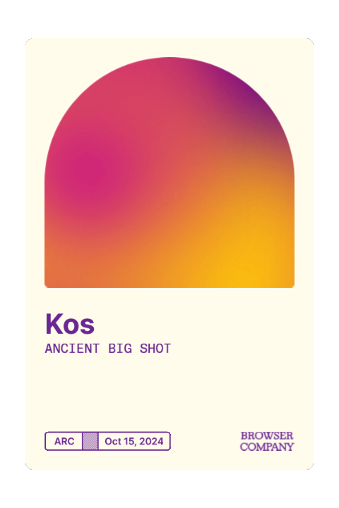
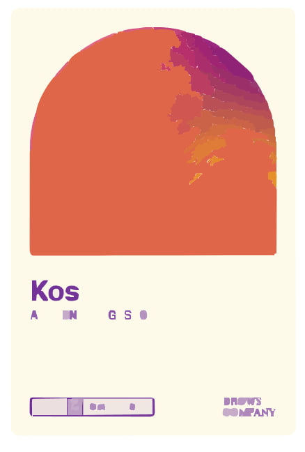
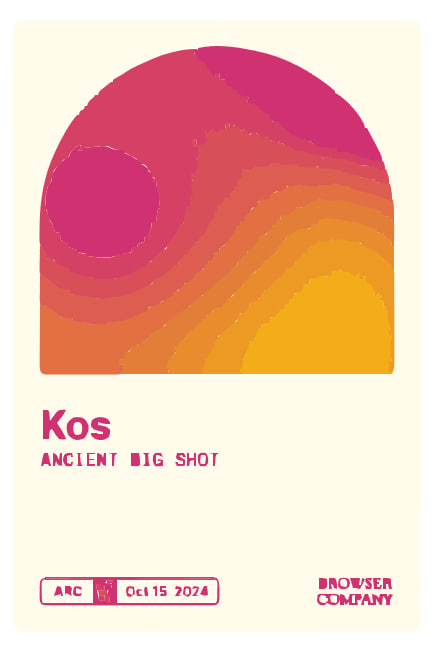
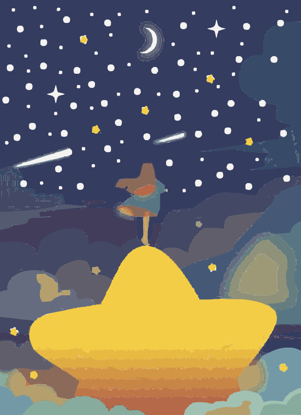
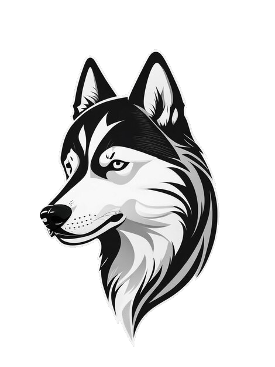
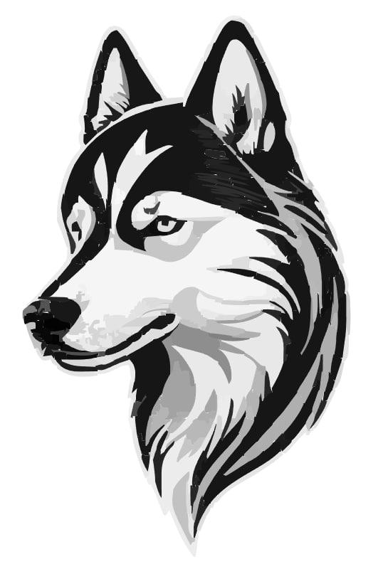
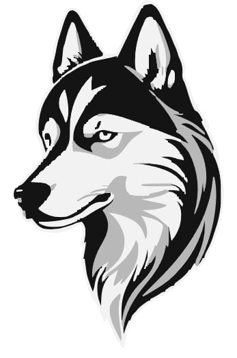

## Vectorizer
A tool to convert raster images to vector images, built on top of [Vtracer].  
The tool consists of two modes: `clusters` and `layers`. `clusters` is the original vectorization method using clusters by [Vtracer], with a few additions:

```sh
Usage: vectorizer raster vectorize clusters [OPTIONS] --input <INPUT>

Options:
  -i, --input <INPUT>
          Input file
  -o, --output <OUTPUT>
          Output file
  -p, --color-precision <COLOR_PRECISION>
          The amount of significant bits to use when comparing `closeness` of two colors [default: 8]
  -f, --filter-speckle <FILTER_SPECKLE>
          Discard patches smaller than X px in size [default: 4]
  -g, --gradient-step <GRADIENT_STEP>
          Color difference between gradient layers [default: 16]
  -m, --mode <MODE>
          Curve fitting mode [default: spline] [possible values: pixel, polygon, spline]
      --corner-threshold <CORNER_THRESHOLD>
          Minimum momentary angle ( in degrees ) to be considered a corner [default: 60.0]
      --segment-length <SEGMENT_LENGTH>
          Perform iterative subdivide smooth until all segments are shorter than this length [default: 4.0]
      --splice-threshold <SPLICE_THRESHOLD>
          Minimum angle displacement ( in degrees ) to splice a spline [default: 45.0]
      --hierarchical <HIERARCHICAL>
          Clustering mode [default: cutout] [possible values: stacked, cutout]
      --remove-background
          Specifies whether to remove the background or not from the image
      --background-color <BACKGROUND_COLOR>
          If omitted, the background color will be calculated automatically
      --background-similarity <BACKGROUND_SIMILARITY>
          Specifies similarity threshold for colors to be considered as `background`
          Works best with the `cutout` clustering mode [default: 10.0]
  -h, --help
          Print help (see more with '--help')
```

`layers` is a custom implementation on top of [Vtracer]'s cluster tracing, that allows for more customization. It devides an image into layers, specified by colors, and traces them one by one, combining all of them in the final vector image.

```sh
Usage: vectorizer raster vectorize layers [OPTIONS] --input <INPUT>

Options:
  -i, --input <INPUT>
          Input file
  -o, --output <OUTPUT>
          Output file
  -p, --color-precision <COLOR_PRECISION>
          The amount of significant bits to use when reading colors. Up to 8.
          This parameter reduces the number of unique colors in the image by shifting the color bits.
          Higher values retain more color detail, while lower values reduce the color palette. [default: 8]
  -l, --num-layers <NUM_LAYERS>
          The number of layers determines how many unique color will be used( each color will be moved to a separate layer ).
          If ommited, the amount will be chosen based on image statistics.
          Ignored, if custom_colors are provided
  -s, --similarity <SIMILARITY>
          Determines the threshold when comparing colors.
          Colors are deemed similiar, if the distance between them is less than `similiarity`
          Default value depends on the `color_difference` method selected
  -f, --filter-speckle <FILTER_SPECKLE>
          Discard patches smaller than X px in size [default: 4]
  -g, --grow <GROW>
          Each layer will be increased in size, using circular brush, by the amount of pixels specified [default: 0]
  -c, --custom-colors <CUSTOM_COLORS>
          A list of custom colors( layers ) to use for the image.
          If not provided, layers will be computed automatically from the image.
      --strict
          Each layer will only consume pixels whose color is `similiar` to the color of the layer
      --color-difference <COLOR_DIFFERENCE>
          Method to calculate the difference between two colors. [default: ciede] [possible values: ciede, hybrid]
  -m, --mode <MODE>
          Curve fitting mode [default: spline] [possible values: pixel, polygon, spline]
      --corner-threshold <CORNER_THRESHOLD>
          Minimum momentary angle ( in degrees ) to be considered a corner. [default: 60.0]
      --segment-length <SEGMENT_LENGTH>
          Perform iterative subdivide smooth until all segments are shorter than this length [default: 4.0]
      --splice-threshold <SPLICE_THRESHOLD>
          Minimum angle displacement ( in degrees ) to splice a spline [default: 45.0]
      --remove-background
          Specifies whether to remove the background or not from the image
      --background-color <BACKGROUND_COLOR>
          If omitted, the background color will be calculated automatically
      --background-similarity <BACKGROUND_SIMILARITY>
          Specifies similarity threshold for colors to be considered as `background`
          Works best with the `cutout` clustering mode [default: 10.0]
      --only-chroma
          Specifies whether or not to compare colors using only chromaticity value( Hue on HSL cylinder )
          Recommended to be used with "Ciede" color difference
      --retain-speckle-detail
          Specifies whether or not to merge small clusters into big ones
      --min-grow-speckle <MIN_GROW_SPECKLE>
          Specifies the minimun size of a cluster to be grown when `--grow` option is used [default: 4]
  -h, --help
          Print help (see more with '--help')
```


Image  | Clusters | Layers
:-----:|:--------:|:------:
||
||
||

[Vtracer]: https://github.com/visioncortex/vtracer