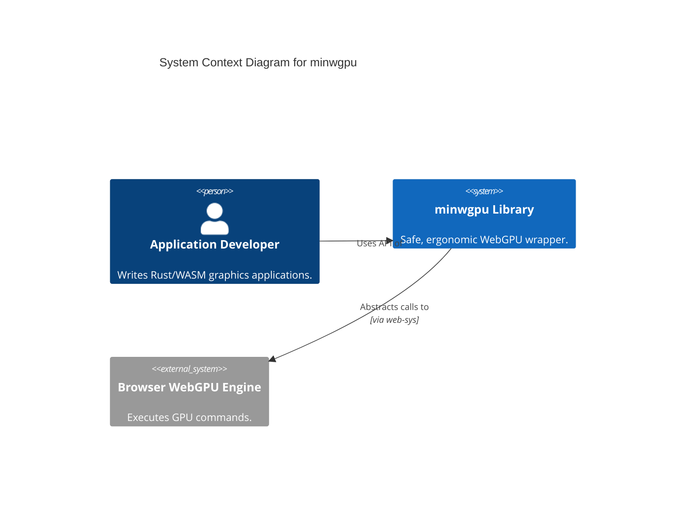
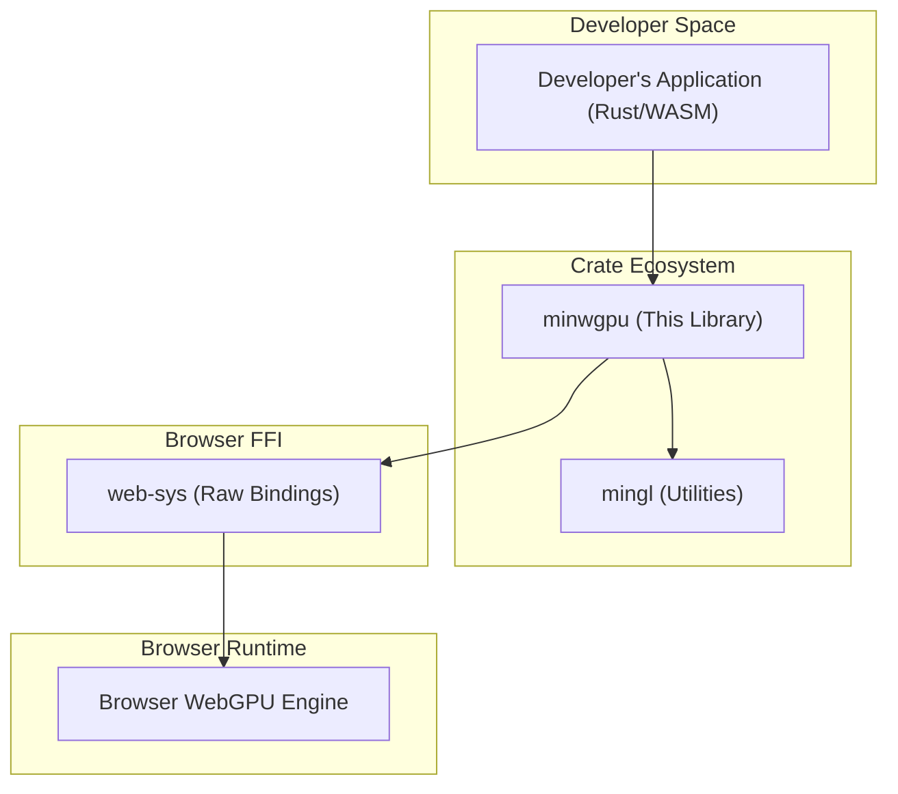
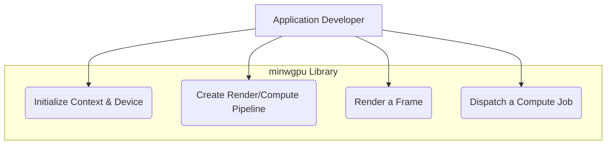
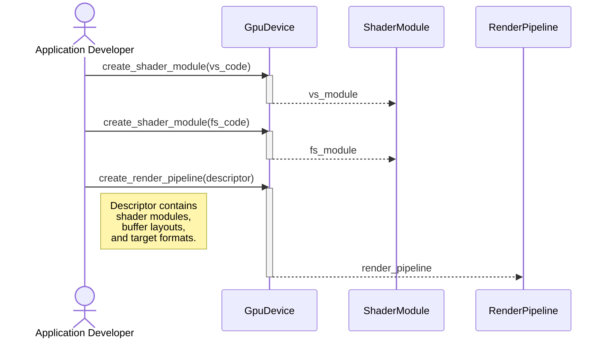

# spec

- **Name:** minwebgpu
- **Version:** 0.1.0
- **Date:** 2025-08-10

### 1. Core Principles & Deliverables

#### 1.1. Design Principles

This specification strictly separates the **Public Contract** from the **Internal Design**.

*   **Public Contract:** This defines the library's public API—the functions, structs, and traits that developers will use. These are defined as **Mandatory Requirements** (e.g., "The library must provide a function to create a buffer...") and are considered stable.
*   **Internal Design:** This describes the recommended implementation details *within* the library. These are flexible **Design Recommendations** (e.g., "It is recommended that buffer management uses a pooling strategy..."). The final developer has the authority to change the internal design as long as the Public Contract is fulfilled.

#### 1.2. Project Deliverables

Upon completion, the project will deliver the following:

1.  The published `minwgpu` crate on crates.io.
2.  Full source code repository access.
3.  Generated API documentation, available on docs.rs.

### 2. Table of Contents

#### Part I: Public Contract (Mandatory Requirements)
1.  **Goal & Vision**
2.  **Scope**
    1.  In Scope
    2.  Out of Scope
3.  **Vocabulary (Ubiquitous Language)**
4.  **Success Metrics**
5.  **System Actors**
6.  **Developer Use Cases & Journeys**
7.  **Functional Requirements**
8.  **Non-Functional Requirements**
9.  **Limitations**
10. **External System Dependencies & Interfaces**

#### Part II: Internal Design (Design Recommendations)
11. **System Architecture**
12. **Architectural & Flow Diagrams**
13. **Core Modules & Responsibilities**
14. **Error Handling Strategy**

#### Part III: Project & Process Governance
15. **Open Questions**
16. **Core Principles of Development**

---
### Part I: Public Contract (Mandatory Requirements)

#### 1. Goal & Vision

The primary goal of `minwgpu` is to provide a safe, ergonomic, and minimal-boilerplate Rust wrapper for the WebGPU API, specifically optimized for WebAssembly environments. The vision is to empower developers to leverage modern GPU capabilities—including compute shaders and descriptor-based pipelines—with the full safety guarantees of Rust, while abstracting away the verbosity of direct web API calls. This library will serve as the next-generation counterpart to `minwebgl`, offering a forward-looking solution for high-performance web graphics and computation.

#### 2. Scope

##### 2.1. In Scope

The `minwgpu` library **must** provide the following capabilities:

*   **WebGPU Abstraction:** A safe, Rusty, and ergonomic wrapper around the `web-sys` WebGPU API.
*   **Context & Device Management:** Functionality to initialize the WebGPU context from an HTML canvas, request an adapter, and acquire a logical device.
*   **Resource Management:**
    *   **Buffers:** Create, initialize, and manage GPU buffers for vertices, indices, uniforms, and storage.
    *   **Textures:** Create, configure, and manage 2D textures and samplers.
    *   **Bind Groups:** Construct and manage bind groups and bind group layouts for resource binding.
*   **Pipeline Management:**
    *   **Render Pipelines:** A descriptor-based builder pattern for creating and configuring render pipelines.
    *   **Compute Pipelines:** A descriptor-based builder pattern for creating and configuring compute pipelines.
*   **Shader Management:** Functionality to create shader modules from WGSL source code.
*   **Command Encoding:** Abstractions for creating command encoders and recording render and compute passes.
*   **Queue Operations:** Functionality to submit command buffers to the device queue and write data to buffers.
*   **Integration with `mingl`:** The library will depend on `mingl` for shared abstractions like error handling, logging, and file loading where applicable.

##### 2.2. Out of Scope

The following areas are explicitly **out of scope** for this project:

*   **Native WebGPU Backend:** This library will **only** target the `wasm32-unknown-unknown` architecture and browser environments. It will not provide bindings for native WebGPU implementations (e.g., via `wgpu-native`).
*   **High-Level Rendering Engine:** `minwgpu` is a low-level wrapper. It will **not** provide high-level constructs like a scene graph, material system, or a complete rendering engine.
*   **Graphics Primitives or Geometry:** The library will not include pre-defined shapes or geometry. This functionality is expected to be provided by the user or other libraries.
*   **Legacy API Support:** There will be no support or fallback for WebGL1 or WebGL2. The library is exclusively for WebGPU.
*   **Automatic Shader Reflection:** The library will not automatically generate pipeline layouts or bindings from shader code. The developer is responsible for explicitly defining resource layouts.

#### 3. Vocabulary (Ubiquitous Language)

This section defines the common language used throughout the project's documentation, code, and discussions.

*   **Adapter:** A representation of a physical GPU available to the system. It is the entry point for querying device capabilities.
*   **Device:** A logical connection to a GPU, used to create resources (buffers, textures, pipelines) and submit commands. All resource creation is associated with a specific device.
*   **Queue:** A command queue associated with a `Device`. All work for the GPU (rendering, compute, copies) is submitted to the queue via `Command Buffers`.
*   **Buffer:** A linear block of GPU-accessible memory used to store data such as vertex attributes, indices, uniforms, or storage data for compute shaders.
*   **Texture:** A structured block of GPU memory, typically used for images, that can be sampled or used as a render target.
*   **Sampler:** An object that defines how a `Texture` is read (sampled) within a shader, controlling filtering (e.g., linear, nearest) and addressing (e.g., clamp, repeat).
*   **Shader Module:** A compiled representation of a single WGSL shader source file. It contains one or more entry points (e.g., a vertex shader function and a fragment shader function).
*   **Pipeline:** An object that defines a complete GPU operation, either for rendering (**Render Pipeline**) or computation (**Compute Pipeline**). It encapsulates shaders, resource layouts, and fixed-function state (e.g., blending, depth testing).
*   **Bind Group:** A collection of resources (Buffers, Textures, Samplers) that are bound together and made available to shaders as a single unit. It is an instance of a `Bind Group Layout`.
*   **Bind Group Layout:** A template that defines the structure and types of resources within a `Bind Group`. It is part of a `Pipeline Layout`.
*   **Pipeline Layout:** Defines all the `Bind Group Layouts` that a `Pipeline` will use. It is the interface between a pipeline and its shader resources.
*   **Command Encoder:** An object used to record a sequence of GPU commands into a `Command Buffer`.
*   **Command Buffer:** A record of GPU commands that can be submitted to the `Queue` for execution.
*   **Render Pass:** A sequence of drawing commands recorded by a `Command Encoder` that render to a specific set of texture attachments.
*   **Compute Pass:** A sequence of compute commands recorded by a `Command Encoder` that dispatch compute shaders.
*   **WGSL:** WebGPU Shading Language. The only shading language used by `minwgpu`.

#### 4. Success Metrics

The success of the `minwgpu` library will be measured against the following criteria upon the `v1.0.0` release:

1.  **API Completeness:**
    *   **Metric:** The library must provide abstractions for 100% of the WebGPU features required to successfully implement the three target examples: "Hello Triangle," "Compute Particles," and "Deferred Rendering."
    *   **Measurement:** A feature checklist will be maintained, and all items must be checked off.

2.  **Performance Overhead:**
    *   **Metric:** The abstractions provided by `minwgpu` must introduce negligible performance overhead compared to raw `web-sys` calls. The target overhead is less than 5% in terms of CPU time for equivalent operations.
    *   **Measurement:** Performance benchmarks comparing a `minwgpu`-based implementation against a raw `web-sys` implementation for a standard rendering loop.

3.  **Developer Ergonomics:**
    *   **Metric:** Using `minwgpu`'s builder patterns and abstractions must result in a significant reduction in boilerplate code compared to a raw `web-sys` implementation. The target is a 30-40% reduction in lines of code for common tasks like pipeline and bind group creation.
    *   **Measurement:** A line-of-code (LoC) comparison for setting up a standard render pipeline in both `minwgpu` and raw `web-sys`.

4.  **Correctness and Stability:**
    *   **Metric:** The library must be free of memory safety issues and produce no WebGPU validation errors or warnings when running the official example applications.
    *   **Measurement:** All example applications must run successfully, and the browser's developer console must show zero WebGPU errors or warnings during their execution.

5.  **Documentation Quality:**
    *   **Metric:** The public API must be fully documented with clear explanations and usage examples for all major components (pipelines, buffers, shaders).
    *   **Measurement:** 100% of public functions, structs, and traits must have doc comments (`///`), and the generated documentation on docs.rs must be complete and easy to navigate.

#### 5. System Actors

The following actors are involved in the `minwgpu` ecosystem.

*   **Primary Actor:**
    *   **`Application Developer` (Human Actor):** The primary user of the `minwgpu` library. This developer writes Rust code for a WebAssembly target and uses `minwgpu` to create and manage WebGPU rendering and compute operations.

*   **Interacting Systems (System Actors):**
    *   **`Developer's Application` (Internal System Actor):** The Rust/WASM application being built by the `Application Developer`. This is the direct consumer of the `minwgpu` public API.
    *   **`mingl` Crate (Internal System Actor):** A foundational library providing shared, backend-agnostic utilities such as error handling, logging, and file I/O abstractions that `minwgpu` will depend on.
    *   **`web-sys` Crate (External System Actor):** The low-level, direct bindings to the browser's Web APIs. `minwgpu` acts as a higher-level, safer abstraction layer on top of the WebGPU APIs provided by `web-sys`.
    *   **Browser WebGPU Engine (External System Actor):** The browser's underlying implementation of the WebGPU specification. This is the ultimate runtime that executes the commands and manages the physical GPU resources. `minwgpu` interacts with this engine indirectly via `web-sys`.

#### 6. Developer Use Cases & Journeys

This section describes common workflows an `Application Developer` will follow when using the `minwgpu` library.

##### Use Case 1: Initializing a WebGPU Application

*   **Actor:** `Application Developer`
*   **Goal:** To set up a WebGPU-enabled canvas and acquire a logical device to begin rendering.
*   **Journey:**
    1.  The developer calls a `minwgpu` function to retrieve or create an HTML canvas element.
    2.  They use the canvas to get a `GpuCanvasContext`.
    3.  They request a `GpuAdapter` from the browser's navigator.
    4.  From the adapter, they request a `GpuDevice` and a `GpuQueue`.
    5.  Finally, they configure the canvas context with the device and a preferred texture format.
*   **Outcome:** The developer has a valid `Device` and `Queue`, and a canvas ready for rendering.

##### Use Case 2: Creating a Basic Render Pipeline

*   **Actor:** `Application Developer`
*   **Goal:** To create a `RenderPipeline` for drawing colored triangles.
*   **Journey:**
    1.  The developer writes WGSL source code for a vertex and a fragment shader.
    2.  They use `minwgpu` to create a `ShaderModule` from each WGSL source string.
    3.  They define the vertex buffer layout, specifying the stride and attributes (e.g., position).
    4.  Using `minwgpu`'s descriptor-based builder pattern, they construct a `RenderPipelineDescriptor`.
    5.  The builder is configured with the vertex shader module, fragment shader module, vertex buffer layout, and the color target format (matching the canvas).
    6.  They call a `create` method on the builder to get a `RenderPipeline` object from the `Device`.
*   **Outcome:** The developer has a compiled and validated `RenderPipeline` ready to be used in a render pass.

##### Use Case 3: Rendering a Single Frame

*   **Actor:** `Application Developer`
*   **Goal:** To render geometry to the canvas using a pre-existing pipeline and buffers.
*   **Journey:**
    1.  The developer acquires the current `GpuTextureView` from the canvas context to use as a render target.
    2.  They create a `CommandEncoder` from the `Device`.
    3.  They begin a `RenderPass` using the command encoder, providing the texture view as the color attachment.
    4.  Inside the render pass, they set the active `RenderPipeline`.
    5.  They set the vertex buffer and index buffer (if applicable).
    6.  They set any required `BindGroups` (e.g., for uniforms).
    7.  They issue a draw call (e.g., `draw()` or `draw_indexed()`).
    8.  They end the render pass.
    9.  They finish encoding, which produces a `CommandBuffer`.
    10. They submit the command buffer to the `Queue`.
*   **Outcome:** The commands are sent to the GPU, and the geometry is rendered to the canvas for the current frame.

##### Use Case 4: Dispatching a Compute Job

*   **Actor:** `Application Developer`
*   **Goal:** To execute a compute shader on a set of data in a storage buffer.
*   **Journey:**
    1.  The developer creates `Buffer`s with the `STORAGE` usage flag for input and output data.
    2.  They create a `BindGroupLayout` and a `BindGroup` to make these buffers available to the shader.
    3.  They create a `ComputePipeline` using the WGSL compute shader source.
    4.  They create a `CommandEncoder` and begin a `ComputePass`.
    5.  Inside the compute pass, they set the active `ComputePipeline` and the `BindGroup`.
    6.  They dispatch the workgroups with a specified size (e.g., `dispatch_workgroups()`).
    7.  They end the compute pass and finish the command encoder to get a `CommandBuffer`.
    8.  They submit the command buffer to the `Queue`.
*   **Outcome:** The compute shader executes on the GPU, transforming the data in the storage buffers.

#### 7. Functional Requirements

The `minwgpu` library **must** provide the following functionalities, which constitute its Public Contract.

##### FR-1: Context and Device Management
*   **FR-1.1:** The system must provide a function to retrieve an existing `HtmlCanvasElement` from the DOM or create a new one.
*   **FR-1.2:** The system must provide a function to get a `GpuCanvasContext` from an `HtmlCanvasElement`.
*   **FR-1.3:** The system must provide a function to request a `GpuAdapter`.
*   **FR-1.4:** The system must provide a function on the `GpuAdapter` to request a `GpuDevice` and `GpuQueue`.
*   **FR-1.5:** The system must provide a function on the `GpuCanvasContext` to configure it with a `GpuDevice` and a `GpuTextureFormat`.
*   **FR-1.6:** The system must provide a function to query the browser's preferred canvas texture format.
*   **FR-1.7:** The system must provide a function on the `GpuCanvasContext` to get the current texture view for rendering.

##### FR-2: Shader Management
*   **FR-2.1:** The system must provide a function on the `GpuDevice` to create a `GpuShaderModule` from a WGSL source code string.

##### FR-3: Buffer Management
*   **FR-3.1:** The system must provide a function on the `GpuDevice` to create a `GpuBuffer` from a `GpuBufferDescriptor`.
*   **FR-3.2:** The system must provide a descriptor builder for `GpuBufferDescriptor` that allows setting size, usage, and mapped-at-creation status.
*   **FR-3.3:** The system must provide a convenience function on the `GpuDevice` to create and initialize a `GpuBuffer` with data from a slice (e.g., `&[u8]`).
*   **FR-3.4:** The system must provide a function on the `GpuQueue` to write data from a slice into an existing `GpuBuffer`.

##### FR-4: Pipeline Management
*   **FR-4.1:** The system must provide a descriptor builder pattern for creating a `GpuRenderPipeline`.
*   **FR-4.2:** The render pipeline builder must allow configuration of:
    *   Vertex and Fragment shaders (module and entry point).
    *   Vertex buffer layouts.
    *   Primitive topology (e.g., triangle-list).
    *   Color target states (format, blending).
    *   Depth/stencil state.
    *   A `GpuPipelineLayout`.
*   **FR-4.3:** The system must provide a descriptor builder pattern for creating a `GpuComputePipeline`.
*   **FR-4.4:** The compute pipeline builder must allow configuration of the compute shader (module and entry point) and a `GpuPipelineLayout`.
*   **FR-4.5:** The system must provide a function on the `GpuDevice` to create both render and compute pipelines from their respective descriptors.

##### FR-5: Resource Binding
*   **FR-5.1:** The system must provide a descriptor builder for creating a `GpuBindGroupLayout`.
*   **FR-5.2:** The system must provide a descriptor builder for creating a `GpuBindGroup`.
*   **FR-5.3:** The bind group builder must allow binding of resources such as `GpuBuffer`, `GpuSampler`, and `GpuTextureView` to specific binding points.
*   **FR-5.4:** The system must provide a function on the `GpuDevice` to create `GpuBindGroupLayout` and `GpuBindGroup` objects.

##### FR-6: Command Recording and Execution
*   **FR-6.1:** The system must provide a function on the `GpuDevice` to create a `GpuCommandEncoder`.
*   **FR-6.2:** The system must provide a method on the `GpuCommandEncoder` to begin a `GpuRenderPass`.
*   **FR-6.3:** The `GpuRenderPassEncoder` must provide methods to:
    *   Set the active pipeline.
    *   Set bind groups.
    *   Set vertex buffers.
    *   Set an index buffer.
    *   Issue draw calls (`draw`, `draw_indexed`).
*   **FR-6.4:** The system must provide a method on the `GpuCommandEncoder` to begin a `GpuComputePass`.
*   **FR-6.5:** The `GpuComputePassEncoder` must provide methods to:
    *   Set the active pipeline.
    *   Set bind groups.
    *   Dispatch workgroups (`dispatch_workgroups`).
*   **FR-6.6:** The system must provide a method on the `GpuCommandEncoder` to finish recording, returning a `GpuCommandBuffer`.
*   **FR-6.7:** The system must provide a method on the `GpuQueue` to submit one or more `GpuCommandBuffer`s for execution.

#### 8. Non-Functional Requirements

The `minwgpu` library **must** adhere to the following quality attributes.

##### NFR-1: Performance
*   **NFR-1.1:** **Minimal Abstraction Overhead:** The Rust abstractions **must** introduce less than 5% CPU time overhead compared to equivalent raw `web-sys` calls for the same WebGPU operations in a typical render loop.
*   **NFR-1.2:** **Zero-Cost Abstractions:** Where possible, the library **must** use Rust's zero-cost abstractions (e.g., newtype wrappers with `Deref`, generics) to ensure that compile-time safety does not result in runtime performance penalties.
*   **NFR-1.3:** **Efficient Memory Usage:** The library **must not** introduce unnecessary memory allocations during per-frame operations (e.g., within a render pass). All descriptor builders and command recorders should be designed to minimize heap allocations.

##### NFR-2: Safety & Correctness
*   **NFR-2.1:** **Memory Safety:** The library **must** be written in 100% safe Rust. No `unsafe` code blocks are permitted in the library's implementation.
*   **NFR-2.2:** **WebGPU Validation:** The library's API and examples **must** produce code that passes the browser's WebGPU validation layer without generating any errors or warnings in the developer console.
*   **NFR-2.3:** **Error Handling:** The library **must** use the `error_tools` crate for error handling, as per the design rulebook. All fallible operations (e.g., resource creation, pipeline compilation) **must** return a `Result` and provide clear, descriptive error messages. Panics **must** only be used for unrecoverable logic errors.

##### NFR-3: Usability & Ergonomics
*   **NFR-3.1:** **Builder Pattern:** The library **must** use the builder pattern for all complex descriptor objects (e.g., `RenderPipelineDescriptor`, `BindGroupDescriptor`) to provide a fluent, discoverable, and type-safe configuration experience.
*   **NFR-3.2:** **API Documentation:** All public items (functions, structs, enums, traits) **must** be documented with clear explanations of their purpose, parameters, and usage examples.
*   **NFR-3.3:** **Minimal Dependencies:** The library **must** adhere to the "Feature Gating: Granular and Disable-able by Default" design rule. The core `enabled` feature should pull in only the essential dependencies required for basic WebGPU operations.

##### NFR-4: Maintainability
*   **NFR-4.1:** **Code Style:** The codebase **must** adhere to the project's established Rust style guidelines. The use of `cargo fmt` is forbidden.
*   **NFR-4.2:** **Modularity:** The internal structure **must** be organized into logical modules by feature (e.g., `buffer`, `pipeline`, `shader`), with a clear separation between the public API and private implementation details, enforced by `mod_interface!`.
*   **NFR-4.3:** **Test Coverage:** All public API functionality **must** be covered by automated tests located in the `/tests` directory.

#### 9. Limitations

*   **L-1: WebAssembly Exclusive:** The `minwgpu` library is designed exclusively for the `wasm32-unknown-unknown` target. It contains no support for native execution and will not compile for other architectures.
*   **L-2: No High-Level Abstractions:** The library is a low-level wrapper. It does not provide a scene graph, material system, automatic resource management (RAII), or other high-level rendering engine features. The `Application Developer` is responsible for managing the lifecycle of all GPU resources.
*   **L-3: Explicit Layout Definition:** The library requires the `Application Developer` to explicitly define all resource layouts (Bind Group Layouts, Pipeline Layouts). It does not perform any form of automatic shader reflection to derive these layouts.

#### 10. External System Dependencies & Interfaces

The `minwgpu` library has the following critical external dependencies.

##### 10.1. `web-sys` Crate

*   **Service Name:** `web-sys`
*   **Purpose:** To provide the raw, low-level FFI bindings to the browser's WebGPU JavaScript API. `minwgpu` is a safe, ergonomic abstraction layer built directly on top of these bindings.
*   **API Type:** Rust FFI Bindings
*   **Access Method:** Direct function calls to the `web-sys` Rust API.
*   **Required Endpoints/Operations:** The library will make extensive use of the `web_sys::gpu_...` family of types and functions, including but not limited to:
    *   `GpuDevice`, `GpuQueue`, `GpuAdapter`
    *   `GpuBuffer`, `GpuTexture`, `GpuSampler`
    *   `GpuRenderPipeline`, `GpuComputePipeline`
    *   `GpuCommandEncoder`, `GpuRenderPassEncoder`
*   **Risk Assessment:**
    *   **Availability:** High. `web-sys` is a core, stable component of the Rust WASM ecosystem. The primary risk is the availability of the WebGPU API in the end-user's browser, not the `web-sys` crate itself. The library **must** provide clear errors if the WebGPU API is not found in the browser navigator.
    *   **Performance:** Low. The bindings are designed to be thin and introduce minimal overhead.
    *   **Security:** Low. The crate is maintained by the official Rust WASM working group.
    *   **Cost:** None.

##### 10.2. `mingl` Crate

*   **Service Name:** `mingl`
*   **Purpose:** To provide shared, backend-agnostic utilities, ensuring consistency with the `cgtools` ecosystem.
*   **API Type:** Rust Library API
*   **Access Method:** Direct function calls to the `mingl` public API.
*   **Required Endpoints/Operations:**
    *   `mingl::error`: For all error handling, conforming to the project's design rules.
    *   `mingl::web::canvas`: For DOM canvas creation and management.
    *   `mingl::web::log`: For browser console logging.
    *   `mingl::web::file`: For asynchronous file loading (used in examples).
*   **Risk Assessment:**
    *   **Availability:** High. `mingl` is an internal, co-developed library within the same workspace. The risk of breaking changes is managed through coordinated versioning.
    *   **Performance:** Low. The utilities are designed to be lightweight.
    *   **Security:** N/A (internal dependency).
    *   **Cost:** None.

---
### Part II: Internal Design (Design Recommendations)

This part of the specification outlines the recommended, non-binding approach for the library's internal implementation. The development team has the final authority to modify this design, provided the Public Contract defined in Part I is fulfilled.

#### 11. System Architecture

It is recommended that the `minwgpu` library be structured as a layered set of modules, each responsible for a distinct aspect of the WebGPU API. The architecture is designed to be thin and ergonomic, acting as a "safe and rusty" facade over the raw `web-sys` bindings.

The core architectural principles are:

1.  **Facade Pattern:** The library will act as a simplifying facade over the more verbose and unsafe `web-sys` API. It will group related operations and manage object creation through descriptor-based builders.
2.  **Modularity:** The internal code will be organized into modules that mirror the major components of the WebGPU API (e.g., `buffer`, `texture`, `pipeline`, `shader`). This aligns with the "Organize by Feature or Layer" design rule.
3.  **Descriptor-Based Configuration:** All complex WebGPU objects (pipelines, bind groups, etc.) should be created using a builder pattern (`Descriptor` structs). This pattern provides a fluent, readable, and type-safe method for configuration, which is then translated into the dictionary-based objects required by `web-sys`.
4.  **No State Management:** The library itself should remain stateless. It will not hold onto a global `Device` or `Queue`. Instead, these core objects should be passed explicitly as arguments to functions that require them. This makes the control flow clear and avoids hidden global state.
5.  **Dependency on `mingl`:** The library should delegate all non-WebGPU concerns (e.g., canvas handling, logging, error types) to the `mingl` crate to maintain a clean separation of concerns and ensure consistency with the broader `cgtools` ecosystem.

#### 12. Architectural & Flow Diagrams

This section provides visual representations of the system's architecture and key developer workflows.

##### 12.1. System Context Diagram

This C4 diagram shows `minwgpu` as a single "black box" system, illustrating its relationship with the primary human actor (the developer) and the external system it interacts with (the browser's WebGPU engine).



##### 12.2. High-Level Architecture Diagram

This diagram shows the layered architecture, illustrating how `minwgpu` fits between the developer's application and the lower-level browser APIs, and its dependency on `mingl`.



##### 12.3. Use Case Diagram

This diagram outlines the primary capabilities (use cases) that `minwgpu` offers to the `Application Developer`.



##### 12.4. Sequence Diagram: Render Pipeline Creation

This diagram details the typical sequence of calls a developer makes to `minwgpu` to compile shaders and create a complete render pipeline.



##### 12.5. Sequence Diagram: Frame Rendering

This diagram illustrates the sequence of commands required to render a single frame, from acquiring a target texture to submitting the final command buffer.

```mermaid
sequenceDiagram
    actor Dev as Application Developer
    participant Ctx as GpuCanvasContext
    participant Devc as GpuDevice
    participant Q as GpuQueue
    participant Enc as CommandEncoder
    participant Pass as RenderPassEncoder

    Dev->>Ctx: get_current_texture_view()
    activate Ctx
    Ctx-->>Dev: texture_view
    deactivate Ctx

    Dev->>Devc: create_command_encoder()
    activate Devc
    Devc-->>Enc: encoder
    deactivate Devc

    Enc->>Pass: begin_render_pass(texture_view)
    activate Enc

    Pass->>Pass: set_pipeline(pipeline)
    Pass->>Pass: set_vertex_buffer(buffer)
    Pass->>Pass: set_bind_group(group)
    Pass->>Pass: draw_indexed(...)

    Enc-->>Pass: end()
    deactivate Enc

    Dev->>Enc: finish()
    activate Enc
    Enc-->>Dev: command_buffer
    deactivate Enc

    Dev->>Q: submit(command_buffer)
    activate Q
    deactivate Q```

#### 13. Core Modules & Responsibilities

It is recommended that the `minwgpu` library's internal source code be organized into the following modules. Each module should be self-contained and focus on a single feature area, exposing its public API via `mod_interface!`.

*   **`lib.rs`**
    *   **Responsibility:** The crate root. It will declare all top-level modules and use `mod_interface!` to construct the final public API from the components exposed by its child modules. It will also contain the top-level feature gating logic.

*   **`error.rs`**
    *   **Responsibility:** To define the crate's primary `WebGPUError` enum and any specialized error types. It will re-export error-handling utilities from `mingl::error`.

*   **`webgpu.rs`**
    *   **Responsibility:** To act as a central point for re-exporting core `web-sys` types (e.g., `GpuDevice`, `GpuBuffer`) and constants (e.g., `gpu_buffer_usage::VERTEX`). This provides a single, consistent import point for both internal modules and end-users.

*   **`context.rs`**
    *   **Responsibility:** To handle the initial setup and interaction with the browser environment. This includes functions for acquiring the adapter, device, and queue, and for configuring the canvas context.

*   **`shader.rs`**
    *   **Responsibility:** To manage the creation of `GpuShaderModule` objects from WGSL source code.

*   **`buffer.rs`**
    *   **Responsibility:** To provide functions for creating and initializing `GpuBuffer` objects. This module will contain the `BufferDescriptor` and `BufferInitDescriptor` builders.

*   **`texture.rs`**
    *   **Responsibility:** To provide functions for creating `GpuTexture` and `GpuTextureView` objects.

*   **`sampler.rs`**
    *   **Responsibility:** To provide a builder (`SamplerDescriptor`) and creation function for `GpuSampler` objects.

*   **`layout/`** (directory)
    *   **`mod.rs`, `bind_group.rs`, `pipeline.rs`, `vertex_buffer.rs`**
    *   **Responsibility:** This parent module and its children are responsible for defining the builders for layout-related objects: `GpuBindGroupLayout`, `GpuPipelineLayout`, and `GpuVertexBufferLayout`.

*   **`state/`** (directory)
    *   **`mod.rs`, `vertex.rs`, `fragment.rs`, `primitive.rs`, etc.**
    *   **Responsibility:** This parent module and its children define the builders for the various state objects that are used to configure a `GpuRenderPipelineDescriptor` (e.g., `VertexState`, `PrimitiveState`, `DepthStencilState`).

*   **`pipeline/`** (directory)
    *   **`mod.rs`, `render_pipeline.rs`, `compute_pipeline.rs`**
    *   **Responsibility:** This parent module and its children contain the primary descriptor builders for `GpuRenderPipeline` and `GpuComputePipeline`, which aggregate the various state and layout objects.

*   **`binding/`** (directory)
    *   **`mod.rs`, `bind_group.rs`, `bind_group_entry.rs`**
    *   **Responsibility:** This parent module and its children are responsible for the builders that create `GpuBindGroup` and `GpuBindGroupEntry` objects, which are used to bind resources to shaders.

*   **`command.rs`** (or `pass.rs`)
    *   **Responsibility:** To provide abstractions for creating command encoders and recording render and compute passes. This module will wrap `GpuCommandEncoder`, `GpuRenderPassEncoder`, and `GpuComputePassEncoder`.

*   **`queue.rs`**
    *   **Responsibility:** To provide convenience functions for interacting with the `GpuQueue`, primarily for submitting command buffers and writing to buffers.

#### 14. Error Handling Strategy

A clear and consistent error handling strategy is mandatory for ensuring the library is robust and easy to debug. The implementation **must** adhere to the following principles, in accordance with the project's design rulebook.

##### 14.1. Centralized Error Type

*   **Requirement:** The library **must** define a single, comprehensive public error enum named `WebGPUError`. This enum will be the single error type returned from all fallible public functions.
*   **Implementation:** It is recommended that `WebGPUError` be defined in the `error.rs` module and implemented using the `error_tools::typed::Error` derive macro.
*   **Structure:** The `WebGPUError` enum should be structured with variants that correspond to the different categories of operations that can fail. Each variant should contain a string or a source error to provide specific, actionable context.

```rust
// Recommended Structure (Internal Design)
#[ derive( Debug, error::typed::Error ) ]
pub enum WebGPUError
{
    #[ error( "Canvas Error: {0}" ) ]
    CanvasError( String ),

    #[ error( "Adapter/Device Request Error: {0}" ) ]
    RequestDeviceError( String ),

    #[ error( "Resource Creation Error ({resource}): {details}" ) ]
    ResourceCreationError
    {
        resource : &'static str, // e.g., "Buffer", "Pipeline"
        details : String,
    },

    #[ error( "Command Encoding Error: {0}" ) ]
    CommandEncodingError( String ),

    #[ error( "JavaScript Value Error: {0:?}" ) ]
    JsValueError( JsValue ),
}
```

##### 14.2. Strict `Result`-Based API

*   **Requirement:** Any function in the public API that can fail **must** return a `Result<T, WebGPUError>`. This includes all operations that interact with the underlying WebGPU API, such as creating resources, compiling pipelines, or submitting commands.
*   **Rationale:** This makes the library's API explicit and forces the `Application Developer` to handle potential failures, preventing unexpected crashes.

##### 14.3. No Panics in Library Code

*   **Requirement:** The library **must not** panic on invalid input or API misuse from the `Application Developer`. Such conditions should always result in a `Result::Err`.
*   **Exception:** Panics are only permissible for unrecoverable internal logic errors (invariant violations) that indicate a bug within the `minwgpu` library itself. These should be unreachable under normal circumstances.

##### 14.4. Conversion from JavaScript Errors

*   **Requirement:** The library **must** gracefully handle errors that originate from the underlying `web-sys` JavaScript bindings.
*   **Implementation:** When a `web-sys` function returns a `Result<_, JsValue>`, the `JsValue` error should be captured and converted into a variant of the `WebGPUError` enum (e.g., `WebGPUError::JsValueError(js_error)`). This ensures that all errors are exposed to the developer through the single, consistent `WebGPUError` type.

---
### Part III: Project & Process Governance

This part of the specification defines procedures and captures information related to the management and execution of the development process.

#### 15. Open Questions

This section lists unresolved questions and decisions that need to be addressed before or during the implementation phase.

1.  **Q1: Synchronous vs. Asynchronous API Design:**
    *   **Question:** The WebGPU API offers both synchronous (`createRenderPipeline`) and asynchronous (`createRenderPipelineAsync`) methods for pipeline creation. Should `minwgpu` expose both variants, or should it standardize on one?
    *   **Default Stance:** It is recommended to prefer the asynchronous methods to avoid blocking the main browser thread, which is a best practice for web applications. However, synchronous versions could be offered for convenience in simpler use cases.
    *   **Decision Needed:** Finalize the public API contract regarding synchronous and asynchronous methods.

2.  **Q2: Granularity of Descriptor Builders:**
    *   **Question:** How granular should the builder patterns be? For example, should `GpuBlendState` have its own builder, or should its properties be set directly on the `GpuColorTargetState` builder?
    *   **Default Stance:** It is recommended to mirror the structure of the WebGPU specification, which implies creating separate builders for nested descriptor objects (like `GpuBlendState`). This improves modularity but can increase verbosity.
    *   **Decision Needed:** Define the final structure and convenience methods for all descriptor builders.

3.  **Q3: Automatic Labeling for Debugging:**
    *   **Question:** Should `minwgpu` automatically generate debug labels for all created resources (e.g., based on source file and line number) when in a debug build configuration?
    *   **Default Stance:** This could significantly improve the debugging experience but adds complexity and a dependency on procedural macros. The initial implementation should probably require manual labeling.
    *   **Decision Needed:** Decide whether automatic labeling is a `v1.0.0` feature or a future enhancement.

#### 16. Core Principles of Development

This section declares the fundamental rules governing the project's development process, change management, and collaboration. Adherence to these principles is mandatory.

##### 16.1. Single Source of Truth
The project's Git repository **must** be the absolute single source of truth for all project-related information. This includes specifications, documentation, source code, configuration files, and architectural diagrams. Links to all external project assets (e.g., deployed environments, cloud service consoles, shared data stores) **must** be stored in a central, version-controlled file (e.g., `assets.md`).

##### 16.2. Documentation-First Development
All changes to the system's functionality or architecture **must** be documented in the relevant specification files *before* implementation begins. The workflow is:
1.  **Propose:** A change is proposed by creating a new branch and modifying the documentation.
2.  **Review:** The change is submitted as a Pull Request (PR) for team review.
3.  **Implement:** Implementation work starts only after the documentation PR is approved and merged.

##### 16.3. Review-Driven Change Control
All modifications to the repository, without exception, **must** go through a formal Pull Request review. Each PR **must** have a clear description of its purpose and be approved by at least one other designated reviewer before being merged.

##### 16.4. Radical Transparency and Auditability
The development process **must** be fully transparent and auditable. All significant decisions and discussions **must** be captured in writing within the relevant Pull Request or a linked issue tracker. The repository's history should provide a clear, chronological narrative of the project's evolution.

##### 16.5. File Naming Conventions
All file names within the project repository **must** use lowercase `snake_case`. This ensures consistency and avoids issues with case-sensitive file systems.
- ✅ **Good:** `specification.md`, `render_pipeline.rs`, `main_app.rs`
- ❌ **Bad:** `Specification.md`, `RenderPipeline.rs`, `MainApp.rs`

### Appendix: Addendum

---

#### Purpose
This document is intended to be completed by the **Developer** during the implementation phase. It is used to capture the final, as-built details of the **Internal Design**, especially where the implementation differs from the initial `Design Recommendations` in `specification.md`.

#### Instructions for the Developer
As you build the system, please use this document to log your key implementation decisions, the final data models, environment variables, and other details. This creates a crucial record for future maintenance, debugging, and onboarding.

---

#### Conformance Checklist
*This checklist is the definitive list of acceptance criteria for the project. Before final delivery, each item must be verified as complete and marked with `✅`. Use the 'Verification Notes' column to link to evidence (e.g., test results, screen recordings).*

| Status | Requirement | Verification Notes |
| :--- | :--- | :--- |
| ❌ | **UC-1:** As an `Application Developer`, I want to initialize a WebGPU context and device, so that I can prepare a canvas for rendering. | |
| ❌ | **UC-2:** As an `Application Developer`, I want to build a complete render pipeline from WGSL shaders, so that I can define how my geometry will be drawn. | |
| ❌ | **UC-3:** As an `Application Developer`, I want to encode and submit drawing commands for a single frame, so that I can render graphics to the screen. | |
| ❌ | **UC-4:** As an `Application Developer`, I want to dispatch a compute shader on a set of data, so that I can perform parallel computations on the GPU. | |
| ❌ | **FR-1.1:** The system must provide a function to retrieve an existing `HtmlCanvasElement` from the DOM or create a new one. | |
| ❌ | **FR-1.2:** The system must provide a function to get a `GpuCanvasContext` from an `HtmlCanvasElement`. | |
| ❌ | **FR-1.3:** The system must provide a function to request a `GpuAdapter`. | |
| ❌ | **FR-1.4:** The system must provide a function on the `GpuAdapter` to request a `GpuDevice` and `GpuQueue`. | |
| ❌ | **FR-1.5:** The system must provide a function on the `GpuCanvasContext` to configure it with a `GpuDevice` and a `GpuTextureFormat`. | |
| ❌ | **FR-1.6:** The system must provide a function to query the browser's preferred canvas texture format. | |
| ❌ | **FR-1.7:** The system must provide a function on the `GpuCanvasContext` to get the current texture view for rendering. | |
| ❌ | **FR-2.1:** The system must provide a function on the `GpuDevice` to create a `GpuShaderModule` from a WGSL source code string. | |
| ❌ | **FR-3.1:** The system must provide a function on the `GpuDevice` to create a `GpuBuffer` from a `GpuBufferDescriptor`. | |
| ❌ | **FR-3.2:** The system must provide a descriptor builder for `GpuBufferDescriptor` that allows setting size, usage, and mapped-at-creation status. | |
| ❌ | **FR-3.3:** The system must provide a convenience function on the `GpuDevice` to create and initialize a `GpuBuffer` with data from a slice. | |
| ❌ | **FR-3.4:** The system must provide a function on the `GpuQueue` to write data from a slice into an existing `GpuBuffer`. | |
| ❌ | **FR-4.1:** The system must provide a descriptor builder pattern for creating a `GpuRenderPipeline`. | |
| ❌ | **FR-4.2:** The render pipeline builder must allow configuration of shaders, buffer layouts, topology, color targets, depth/stencil state, and pipeline layout. | |
| ❌ | **FR-4.3:** The system must provide a descriptor builder pattern for creating a `GpuComputePipeline`. | |
| ❌ | **FR-4.4:** The compute pipeline builder must allow configuration of the compute shader and a `GpuPipelineLayout`. | |
| ❌ | **FR-4.5:** The system must provide a function on the `GpuDevice` to create both render and compute pipelines from their respective descriptors. | |
| ❌ | **FR-5.1:** The system must provide a descriptor builder for creating a `GpuBindGroupLayout`. | |
| ❌ | **FR-5.2:** The system must provide a descriptor builder for creating a `GpuBindGroup`. | |
| ❌ | **FR-5.3:** The bind group builder must allow binding of resources such as `GpuBuffer`, `GpuSampler`, and `GpuTextureView`. | |
| ❌ | **FR-5.4:** The system must provide a function on the `GpuDevice` to create `GpuBindGroupLayout` and `GpuBindGroup` objects. | |
| ❌ | **FR-6.1:** The system must provide a function on the `GpuDevice` to create a `GpuCommandEncoder`. | |
| ❌ | **FR-6.2:** The system must provide a method on the `GpuCommandEncoder` to begin a `GpuRenderPass`. | |
| ❌ | **FR-6.3:** The `GpuRenderPassEncoder` must provide methods to set pipeline, bind groups, vertex/index buffers, and issue draw calls. | |
| ❌ | **FR-6.4:** The system must provide a method on the `GpuCommandEncoder` to begin a `GpuComputePass`. | |
| ❌ | **FR-6.5:** The `GpuComputePassEncoder` must provide methods to set pipeline, bind groups, and dispatch workgroups. | |
| ❌ | **FR-6.6:** The system must provide a method on the `GpuCommandEncoder` to finish recording, returning a `GpuCommandBuffer`. | |
| ❌ | **FR-6.7:** The system must provide a method on the `GpuQueue` to submit one or more `GpuCommandBuffer`s for execution. | |

#### Finalized Internal Design Decisions
*A space for the developer to document key implementation choices for the system's internal design, especially where they differ from the initial recommendations in `specification.md`.*

-   [Decision 1: Reason...]
-   [Decision 2: Reason...]

#### Finalized Internal Data Models
*The definitive, as-built schema for all databases, data structures, and objects used internally by the system.*

-   [Model 1: Schema and notes...]
-   [Model 2: Schema and notes...]

#### Environment Variables
*List all environment variables required to run the application. Include the variable name, a brief description of its purpose, and an example value (use placeholders for secrets).*

| Variable | Description | Example |
| :--- | :--- | :--- |
| `RUST_LOG` | Controls the log level for browser console output. | `info` |

#### Finalized Library & Tool Versions
*List the critical libraries, frameworks, or tools used and their exact locked versions (e.g., from `package.json` or `requirements.txt`).*

-   `rustc`: `1.75.0`
-   `wasm-bindgen`: `...`
-   `web-sys`: `...`
-   `mingl`: `...`

#### Deployment Checklist
*A step-by-step guide for deploying the application from scratch. Include steps for setting up the environment, running migrations, and starting the services.*

1.  Install `wasm-pack`: `cargo install wasm-pack`
2.  Build the WASM package: `wasm-pack build --target web`
3.  ...
