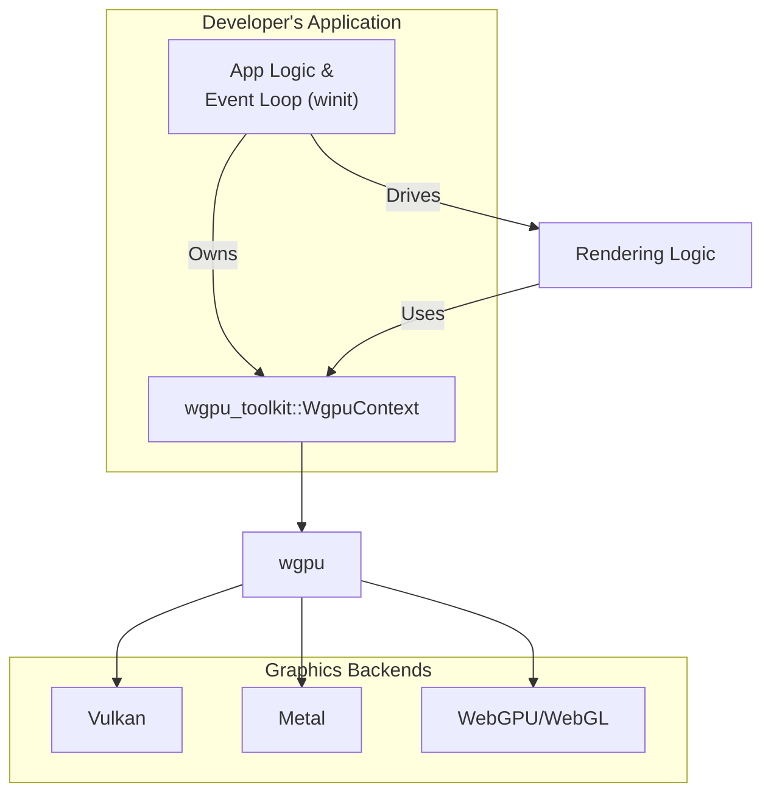

# spec

- **Name:** wgpu_toolkit
- **Version:** 0.2.0
- **Date:** 2025-08-10

### 1. Core Principles & Deliverables

#### 1.1. Design Principles

This specification strictly separates the **Public Contract** from the **Internal Design**.

*   **Public Contract:** This defines the library's public API—the functions, structs, and traits that developers will use. These are defined as **Mandatory Requirements** and are considered stable.
*   **Internal Design:** This describes the recommended implementation details. These are flexible **Design Recommendations**. The final developer has the authority to change the internal design as long as the Public Contract is fulfilled.

#### 1.2. Project Deliverables

Upon completion, the project will deliver the following:

1.  The published `wgpu_toolkit` crate on crates.io.
2.  Full source code repository access.
3.  Generated API documentation, available on docs.rs, with platform-specific features clearly marked.

### 2. Table of Contents

#### Part I: Public Contract (Mandatory Requirements)
1.  **Goal & Vision**
2.  **Scope**
    1.  In Scope
    2.  Out of Scope
3.  **Vocabulary (Ubiquitous Language)**
4.  **Success Metrics**
5.  **System Actors**
6.  **Developer Use Cases & Journeys**
7.  **Functional Requirements**
8.  **Non-Functional Requirements**
9.  **Limitations**
10. **External System Dependencies & Interfaces**

#### Part II: Internal Design (Design Recommendations)
11. **System Architecture**
12. **Architectural & Flow Diagrams**
13. **Core Modules & Responsibilities**
14. **Error Handling Strategy**

#### Part III: Project & Process Governance
15. **Open Questions**
16. **Core Principles of Development**

---
### Part I: Public Contract (Mandatory Requirements)

#### 1. Goal & Vision

The primary goal of `wgpu_toolkit` is to provide an **opinionated but un-intrusive** cross-platform graphics and compute toolkit. The vision is to offer a "write once, run anywhere" API that abstracts the complexities of `wgpu` setup and resource management, without taking control of the application's architecture or event loop. It is designed for developers who want to accelerate `wgpu` development for native and web targets while retaining full control over their application's structure.

#### 2. Scope

##### 2.1. In Scope

*   **Cross-Platform Context Management:** A unified struct (`WgpuContext`) to manage the `wgpu` instance, device, queue, surface, and surface configuration.
*   **Surface Integration:** Functionality to create a `WgpuContext` from a raw window handle (for native) or an HTML canvas element (for web).
*   **Ergonomic Resource Builders:** Descriptor-based builders for all core `wgpu` objects (pipelines, buffers, textures, bind groups) that simplify configuration.
*   **Explicit Surface Control:** Methods on the `WgpuContext` to handle surface resizing and frame acquisition.

##### 2.2. Out of Scope

*   **Event Loop Management:** The toolkit will **not** provide or manage a cross-platform event loop. The developer is responsible for their own event loop (e.g., using `winit`).
*   **Window Creation:** The toolkit will **not** create native windows or HTML canvases. It will only integrate with existing ones.
*   **Full Rendering Engine:** The toolkit will not provide a scene graph, material system, or other high-level engine features.
*   **Direct `wgpu` API Exposure:** The toolkit's public API will abstract `wgpu` types. It will not expose raw `wgpu` objects to the end-user to ensure a stable and simplified interface.
*   **Backend-Specific Features:** The API will target the common feature set of all `wgpu` backends. It will not expose features unique to a single backend (e.g., specific Vulkan extensions).

#### 3. Vocabulary (Ubiquitous Language)

*   **`WgpuContext`:** The central, state-holding struct provided by the toolkit. It owns the `wgpu` Device, Queue, Surface, and Surface Configuration. It does **not** own the window or canvas.
*   **Raw Window Handle:** A platform-specific, unsafe pointer to a native window, used to create the rendering surface. The `raw-window-handle` crate defines this interface.
*   **Platform:** The target environment, either `native` (desktop/server) or `web` (browser).
*   **Instance:** The top-level `wgpu` object, representing a connection to the system's graphics drivers.
*   **Adapter:** A handle to a physical GPU.
*   **Device:** A logical connection to a GPU for creating resources.
*   **Queue:** A queue for submitting command buffers to the GPU for execution.
*   **Surface:** An abstraction for a renderable surface, which can be a native window or an HTML canvas.
*   **Pipeline:** A complete definition of a GPU operation (Render or Compute).
*   **WGSL:** WebGPU Shading Language, the single shading language for the toolkit.

#### 4. Success Metrics

1.  **Cross-Platform Parity:** The official examples must compile and run on Windows, macOS, and Web, producing visually identical output with no changes to the rendering logic.
2.  **Ergonomics:** The number of distinct API calls required to initialize a `wgpu` context and render a triangle must be less than 10, a significant reduction from the steps required with raw `wgpu` and `winit`.
3.  **Performance:** Abstraction overhead must be less than 10% compared to a raw `wgpu` application.
4.  **Stability:** The library must be free of panics and `wgpu` validation errors.

#### 5. System Actors

*   **`Application Developer` (Human Actor):** The primary user, writing cross-platform Rust applications.
*   **`Developer's Application` (Internal System Actor):** The developer's own code, which owns the window, the event loop, and the `WgpuContext`.
*   **`wgpu` Crate (External System Actor):** The core dependency for hardware abstraction.
*   **`winit` Crate (External System Actor):** The windowing library the developer uses to create a window and run the event loop.
*   **`Desktop OS` (External System Actor):** The native operating system (Windows, macOS, Linux) that provides windowing and access to graphics drivers.
*   **`Web Browser` (External System Actor):** The runtime environment for the `wasm32` target, providing the WebGPU or WebGL API.

#### 6. Developer Use Cases & Journeys

##### Use Case 1: Initializing a `wgpu` Application

*   **Goal:** To integrate `wgpu_toolkit` into an existing `winit`-based application.
*   **Journey:**
    1.  The developer initializes their `winit` event loop and creates a `winit::window::Window`.
    2.  They get the raw window handle from the `winit` window.
    3.  They create a `wgpu_toolkit::WgpuContext` by passing the window handle and its size to a constructor (e.g., `WgpuContext::new_from_handle(...)`).
    4.  Internally, the toolkit creates the `wgpu` instance, adapter, device, queue, and surface, and configures the surface.
*   **Outcome:** The developer has a `WgpuContext` object ready for rendering and retains full control over their window and event loop.

##### Use Case 2: Handling a Window Resize Event

*   **Goal:** To correctly resize the `wgpu` surface when the native window is resized.
*   **Journey:**
    1.  Inside their `winit` event loop, the developer receives a resize event with the new physical size.
    2.  They call a method on their `WgpuContext` instance, e.g., `context.resize(new_size)`.
    3.  Internally, the toolkit re-configures the `wgpu::Surface` with the new dimensions.
*   **Outcome:** The rendering surface is correctly resized to match the window, preventing stretching or distortion.

##### Use Case 3: Rendering a Frame

*   **Goal:** To render geometry using the toolkit.
*   **Journey:**
    1.  The developer calls a method on their `WgpuContext` to get the current frame's output texture (e.g., `context.get_current_frame()`).
    2.  They create a `CommandEncoder` using a builder provided by the toolkit.
    3.  They begin a `RenderPass`, setting the texture view from the current frame as the color attachment.
    4.  They set the pipeline, buffers, and bind groups.
    5.  They issue a draw call.
    6.  They end the pass and finish the encoder to get a `CommandBuffer`.
    7.  They submit the command buffer to the `WgpuContext`'s queue.
    8.  They present the frame.
*   **Outcome:** The frame is rendered and displayed on the surface.

#### 7. Functional Requirements

##### FR-1: Context and Surface Management
*   **FR-1.1:** The system must provide a central struct, `WgpuContext`, to hold the core `wgpu` objects.
*   **FR-1.2:** The system must provide a constructor for `WgpuContext` that accepts a raw window handle and size, enabling integration with any windowing library that provides one.
*   **FR-1.3:** The constructor must transparently handle platform differences (native vs. web).
*   **FR-1.4:** The `WgpuContext` must provide a `resize` method that takes a new physical size and re-configures the underlying `wgpu::Surface`.
*   **FR-1.5:** The `WgpuContext` must provide a method to get the current `wgpu::SurfaceTexture` to render into for the current frame.

##### FR-2: Resource Management
*   **FR-2.1:** The system must provide a single, unified API for creating buffers, textures, samplers, shader modules, and bind groups that is independent of the underlying platform.
*   **FR-2.2:** The system must use a descriptor-based builder pattern for creating all `wgpu` resources, taking the `WgpuContext` or `wgpu::Device` as an argument.

##### FR-3: Pipeline Management
*   **FR-3.1:** The system must provide a unified descriptor builder for creating Render Pipelines.
*   **FR-3.2:** The system must provide a unified descriptor builder for creating Compute Pipelines.

#### 8. Non-Functional Requirements

*   **NFR-1.1 (Portability):** All public APIs in the toolkit must be platform-agnostic. All platform-specific code must be confined to private, conditionally-compiled modules.
*   **NFR-1.2 (Performance):** Abstraction overhead must be minimal (<10% compared to raw `wgpu`).
*   **NFR-1.3 (Safety):** The library must be 100% safe Rust.
*   **NFR-1.4 (Ergonomics):** The API must be significantly simpler and less verbose than using `wgpu` and `winit` directly, as measured by the success metrics.

#### 9. Limitations

*   **L-1:** The toolkit is not a full game engine. It provides rendering context and resource management, not scene graphs or physics.
*   **L-2:** The toolkit will not expose every feature of `wgpu`, prioritizing a simpler, more opinionated API over exhaustive control.
*   **L-3:** The developer is responsible for creating and managing their own window and event loop.

#### 10. External System Dependencies & Interfaces

*   **`wgpu`:** The core dependency for all graphics and compute operations.
*   **`winit`:** The primary dependency for native windowing and event loop management in examples and the native platform module.
*   **`raw-window-handle`:** Used to abstract the window/canvas handle for surface creation.
*   **`web-sys` / `wasm-bindgen`:** Required for the web target to interface with the browser's canvas and JavaScript environment.
*   **`mingl`:** Used for shared, non-graphics utilities like error handling and logging.

---
### Part II: Internal Design (Design Recommendations)

#### 11. System Architecture

The architecture is centered on a stateless **toolkit** that provides a stateful **context object** (`WgpuContext`) for the developer to own and manage.

*   **`WgpuContext`:** This struct is the heart of the library. It encapsulates the `wgpu` objects (`Instance`, `Device`, `Queue`, `Surface`, `SurfaceConfiguration`). It is created once by the developer and passed as a mutable reference to rendering functions.
*   **Platform Abstraction:** A private `platform` module will contain all conditionally compiled code. It will provide a unified internal function like `create_surface_from_handle` that takes a raw handle and returns a `wgpu::Surface`, hiding the platform-specific logic.
*   **Stateless Builders:** All other parts of the library (pipeline builders, buffer creators) are stateless functions or temporary builder objects that operate on the developer's `WgpuContext` but do not retain any state themselves. **The toolkit does not have a global state.**

#### 12. Architectural & Flow Diagrams

##### 12.1. High-Level Architecture Diagram

This diagram shows the developer's application owning the event loop and the `WgpuContext`, which in turn manages `wgpu`.

#### 13. Core Modules & Responsibilities

*   **`context.rs`:** Defines the `WgpuContext` struct and its methods (`new`, `resize`, `get_current_frame`). This is the primary state-holding object given to the user.
*   **`platform/`:** Contains `native.rs` and `web.rs` for all platform-specific logic.
*   **`pipeline.rs`, `buffer.rs`, `texture.rs`, etc.:** Modules for the platform-agnostic builders and wrappers around `wgpu` objects.
*   **`error.rs`:** Centralized error enum for the toolkit.

#### 14. Error Handling Strategy

The library will use a single `WgpuToolkitError` enum, built with `error_tools`. All public functions that can fail will return a `Result`. Errors from `wgpu`, `winit`, or `web-sys` will be wrapped into this error type to provide a consistent error-handling experience.

---
### Part III: Project & Process Governance

#### 15. Open Questions

1.  **Feature Discrepancies:** How should the toolkit handle features or limits that differ between backends (e.g., texture format support)? Should it expose these differences, or abstract them away by enforcing a common subset? (Recommendation: Enforce a common subset for simplicity).
2.  **Shader Management:** Should the toolkit provide helpers for shader compilation from files (e.g., using `naga`), or only accept pre-compiled WGSL strings? (Recommendation: Accept WGSL strings only to keep the core library simple).
3.  **Async by Default?:** `wgpu`'s API is heavily async. Should the toolkit's API be async by default to match, or should it provide synchronous wrappers where possible for simpler use cases? (Recommendation: Embrace `async` for all I/O-bound operations like device requests).

#### 16. Core Principles of Development

(This section contains the standard, mandatory development principles regarding source control, documentation-first development, change control, transparency, and file naming conventions.)

##### 16.1. Single Source of Truth
...
##### 16.2. Documentation-First Development
...
##### 16.3. Review-Driven Change Control
...
##### 16.4. Radical Transparency and Auditability
...
##### 16.5. File Naming Conventions
...

### Appendix: Addendum

---

#### Purpose
This document is intended to be completed by the **Developer** during the implementation phase. It is used to capture the final, as-built details of the **Internal Design**.

#### Instructions for the Developer
As you build the system, please use this document to log your key implementation decisions, environment variables, and other details.

---

#### Conformance Checklist
*This checklist is the definitive list of acceptance criteria for the project.*

| Status | Requirement | Verification Notes |
| :--- | :--- | :--- |
| ❌ | **UC-1:** As a developer, I want to integrate the toolkit into my existing `winit` application to manage the `wgpu` context. | |
| ❌ | **UC-2:** As a developer, I want to handle window resize events by calling a single method on the toolkit's context object. | |
| ❌ | **UC-3:** As a developer, I want to get the current frame's texture, encode draw commands, and submit them to the queue. | |
| ❌ | **FR-1.1:** The system must provide a central struct, `WgpuContext`. | |
| ❌ | **FR-1.2:** The `WgpuContext` must have a constructor that accepts a raw window handle. | |
| ❌ | **FR-1.3:** The constructor must handle native and web platforms transparently. | |
| ❌ | **FR-1.4:** The `WgpuContext` must provide a `resize` method. | |
| ❌ | **FR-1.5:** The `WgpuContext` must provide a method to get the current surface texture. | |
| ❌ | **FR-2.1:** The system must provide a unified API for creating resources. | |
| ❌ | **FR-2.2:** The system must use a descriptor-based builder pattern for all resources. | |
| ❌ | **FR-3.1:** The system must provide a unified descriptor builder for Render Pipelines. | |
| ❌ | **FR-3.2:** The system must provide a unified descriptor builder for Compute Pipelines. | |

#### Finalized Internal Design Decisions
-   [Decision 1: Reason...]

#### Environment Variables
-   `WGPU_BACKEND`: Selects the native backend (e.g., `vulkan`, `metal`).
-   `RUST_LOG`: Controls log level.

#### Deployment Checklist
1.  **Native:** `cargo run --release`
2.  **Web:** `wasm-pack build --target web`
