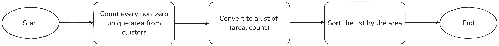
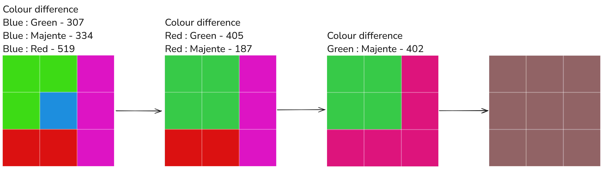

[Vtracer] is an open source tool for vectorization of raster images, that uses an original clustering arlgorithm implemented in the library [Visioncortex]. 

## 2. Vtracer's clustering method

An entire algorithm is shown on the diagram below:
<p align="center">

</p>

Each  stage is explained in consecutive paragraphs

### 2.1. Preprocessing
Before feeding an image to the clusterization algorithm, we can analyze and process it to improve the final result. The core lybrary [Visioncortex] provides us with the ability to specify a keying color - the color that will be ignored by the algorithm. This feature can be used to ignore the transparent pixels in the image by assigning them a certain key color, since the core algorithm doesn't do it on its own, and we can remove the background color from the image by specifying it as the key color.  
To identify the background color, we can scan pixels at the edges of the image and the dominant color among all those pixels will be our background color.
```c++
background_color( image )
    unique_colors = an empty map // stores colors and amount of occurrences
    
    for each pixel at lines y = 0, y = height - 1, x = 0 and x = width - 1:
        current_color = color of the current pixel
        if pixel is not transparent
            // Add the color to the list of unique colors, increasing occurrences( starting from 1 )
            unique_colors[ current_color ] += 1
    
    return the most frequent color
```


To use keying without the background color, we need to pick a color that is absent from the image:
```c++
find_unused_color_in_image( image )
    // Create a list of special colors we want to check first
    special_colors = {
        (255, 0, 0), // Red
        (0, 255, 0), // Green
        (0, 0, 255), // Blue
        (255, 255, 0), // Yellow
        (0, 255, 255), // Cyan
        (255, 0, 255) // Magenta
    }
    
    for each color in special_colors
        current_color = color of the current pixel
        if current_color does not exist in the image:
            return current_color
    
    random_colors = { c1, c2, c3, ..., c100 } // Generate a list of random colors

    for each color in random_colors:
        current_color = color of the current pixel
        if current_color is does not exist in the image:
            return color
    
    // It is very unlikely to not find an unused color
```
With these functions, we pass the keying color to the core algorithm and specify the action 
to perform on the key color: to discard or to keep the color

### 2.2. Stage 1: primary clusterization

Primary clusterization means we are going to create the smallest clusters 
from the image, assigning each pixel to its own cluster.  

We iterate over every pixel in the image, and for every pixel we choose 
wether to create a new cluster, or to add  the current pixel to an existing 
cluster above the pixel( y - 1 ), to the left of the pixel( x - 1 ), 
or to the upleft of the pixel( x - 1, y - 1 ).  

Clusters will be stored in a list. To know what clusters are neighbouring our 
pixel we can map each pixel to the cluster using pixel's position as an entry to the map
and cluster's id in the list of clusters as a value. A map can simply be a list the size of
the image that stores integer numbers. Pixel's position can be used to index into the 
list `pixel.y * width + pixel.x`.

Bedies the global map between pixels and cluster, each cluster will also locally store
which pixels belong to the cluster. For this stage, the cluster structure will have the following look:

```c++
struct Cluster
{
    indices, // a list of unsigned integers that point to the pixel in the image belonging to the cluster
    holes, // same as indices, but stores pixels that should be excluded from the cluster
    sum, // structure that holds the sum and the count of colors of all pixels constituting the cluster
    rect, //  bounding rectangle of the cluster
}
```

Same as with the map from pixel to cluster, pixel's position can be turne into an index `pixel.y * width + pixel.x` -  
what the `indices` and `holes` will store.  
The color consists of r, g, b values, so the color of a cluster will be
`(sum.color.red + sum.color.green + sum.color.blue) / sum.count`, which is just avarage among the pixels of a cluster.

The pseudocode of the vtracer algorithm looks like this:

```c++
stage_1( key_color, image )
    // Specifies if clusters can be merged diagonally
    // In Vtracer's implementation, this is only true when gradient_step == 0
    // gradient_step is a user provided threshold used in stage 2 
    // when deepening the hierarchical cluster structure  
    diagonal = user provided value
    clusters = a list with one default cluster // to hold clusters
    cluster_indices = an empty map // to map pixel's position to the cluster index in the list of clusters
    
    for each pixel in the image:
        x, y = coordinates of the current pixel
        PIXEL = current pixel

        // Get neighbouring pixels:
        // If pixels are outside of the image boundary, then they will have a value NULL
        PIXEL_UP = if y > 0 { image.get( x, y - 1 ) } else { NULL }
        PIXEL_LEFT = if x > 0 { image.get( x - 1, y ) } else { NULL }
        PIXEL_UP_LEFT = if x > 0 and y > 0 { image.get( x - 1, y - 1 ) } else { NULL }
    
        // Get neighbouring clusters:
        // If pixels are outside of the image boundary, then clusters will have a value ZERO
        CLUSTER_UP = if y > 0 { cluster_indices.get( PIXEL_UP ) } else: { ZERO }
        CLUSTER_LEFT = if x > 0 { cluster_indices.get( PIXEL_LEFT ) } else: { ZERO }
        CLUSTER_UP_LEFT = if x > 0 and y > 0 { cluster_indices.get( PIXEL_UP_LEFT ) } else { ZERO }
        
        if  
        ( 
            CLUSTER_UP is a different cluster from CLUSTER_LEFT 
            and
            PIXEL_UP is similar in color to PIXEL_LEFT 
        ) 
        and 
        ( diagonal or PIXEL is similar in color to PIXEL_LEFT and PIXEL_UP )
            // Merge smaller one into a bigger one
            Merge CLUSTER_UP and CLUSTER_LEFT 
    
    // Decide whether to add the current pixel to an existing cluster, or create a new cluster
    if PIXEL is the same color as state.key_color
        if state.key_action = keep
            //Add current color to the ZERO cluster
            state.clusters[ ZERO ].add( PIXEL )
    else if PIXEL is similar to PIXEL_UP and PIXEL_UP_LEFT
        // Add current pixel to the CLUSTER_UP
        state.cluster_indices[ PIXEL ] = CLUSTER_UP
        state.clusters[ CLUSTER_UP ].add( PIXEL )
    else if PIXEL is similar to PIXEL_LEFT and PIXEL_UP_LEFT
        // Add current pixel to the CLUSTER_LEFT
        state.cluster_indices[ PIXEL ] = CLUSTER_LEFT
        state.clusters[ CLUSTER_LEFT ].add( PIXEL )
    else if diagonal and PIXEL is similar to PIXEL_UP_LEFT
        // Add current pixel to the CLUSTER_LEFT
        state.cluster_indices[ PIXEL ] = PIXEL_UP_LEFT
        state.clusters[ PIXEL_UP_LEFT ].add( PIXEL )
    else
        new_cluster = create a new default cluster
        new_cluster.add( PIXEL )
        state.clusters.push( new_cluster )
        state.cluster_indices[ PIXEL ] = new_cluster

    return clusters, cluster_indices
```

Vtracer calculates color similarity by simply comparing the absolute difference of each chanel
with a user provided threshold:
```c++
same_colors( c1, c2, threshold )
    delta_r = abs( c1.r - c2.r )
    delta_g = abs( c1.g - c2.g )
    delta_b = abs( c1.b - c2.b )

    return delta_r <= threshold and delta_g <= threshold and delta_b <= threshold
```

The difference between colors can then be calculated in the following way
```c++
color_difference( c1, c2 )
    delta_r = abs( c1.r - c2.r )
    delta_g = abs( c1.g - c2.g )
    delta_b = abs( c1.b - c2.b )

    return delta_r + delta_g + delta_b 
```

<p align="center">

</p>

<p align="center">

</p>

### 2.3. Preperation for stage 2

Stage 2 iterates over cluster areas, so before that we need to take the result of the stage 1 
and create a list of all uninque areas from clusters:

```c++
stage_2_preperation( clusters )
    cluster_areas = an empty map // holds cluster area and count of clusters with that area

    for every cluster in clusters
        cluster = current claster
        // Increase the count of occurences, starting from 1
        cluster_areas[ cluster.area() ] += 1

    return cluster_areas 
```

<p align="center">

</p>

### 2.3. Stage 2: Hierarchical cluster merging

The next stage is going to iteratively merge existing clusters, starting from the smallest ones
until there no merging can be done.  
The result can be thought of as a hierarchical tree of clusters, where at the top are the biggest clusters
and at the bottom are the smallest ones. When merging clusters, adding new clusters to the tree is like increasing
its depth, hence the condition `deepen` used in the algorithm below:

```c++
combing_clusters( clusters, cluster_indices, from, to )
    for each point in the clusters[ from ].indices
        point = current point in the iteration
        // Update the cluster_indices map, to assign point from the `from` cluster to the `to` cluster
        cluster_indices[ point ] = to

    // Also add locally indices form the `from` cluster to the `to` cluster
    clusters[ to ].indices.add( clusters[ from ].indices )
    // Combine colors of the two clusters
    clusters[ to ].sum.merge( clusters[ from ].sum )
    // Expand the bounding rectangle of the `to` cluster from the bounding rectangle of the `from` cluster
    clusters[ to ].rect.merge( clusters[ from ].rect )

    // Clear data of the `from` cluster
    clusters[ from ].indices.clear()
    clusters[ from ].sum.clear()
    clusters[ from ].rect.clear()

merge_clusters( clusters, cluster_indices, from, to, deepen, hollow )
    if !deepen
        combing_clusters( clusters, cluster_indices, from, to )
    else
        // Save the data of the `from` cluster
        from_clone = clusters[ from ].clone()
        combing_clusters( clusters, cluster_indices, from, to )
        clusters[ from ] = from_clone

        if hollow
            // Mark newly merged points as holes
            clusters[ to ].holes.add( clusters[ from ].indices )


// Function parameters are recieved from the previous stage
// cluster_areas - the map from cluster area to the number of occurences in `clusters`
// clusters - list of all clusters from stage 1
// cluster_indices - the map from pixel's position to the index of a cluster in `clusters`
stage_2_merging( cluster_areas, clusters, cluster_indices )
    // If the amount of neighbours for a cluster is less then or equals this number, then 
    // the current cluster will be added as `holes` to the neightbouring cluster
    min_neighbours_amount = unsigned int, user specified value
    // The limits to the size of the cluster when decided if a cluster should be added to the final output
    // Size is represented as the amount of pixels constituting a cluster
    max_cluster_size = unsigned int, use specified value
    min_cluster_size = unsigned int, user specified value
    // Determines the minimun color difference between two clusters for a cluster to be added to the result
    gradient_step = float, user specified value
    // This list will contain clusters that make up the image
    clusters_output = an empty list
    // Merging has to happen starting from the smallest areas, so we need to sort the list
    Sort cluster_areas by occurences

    for each area in cluster_areas
        current_area = current area being processed
        for each cluster with cluster.area() == current_area
            current_cluster = current cluster being processed
            current_color = color of the current_cluster

            //
            // Skipped hierarchical
            //

            // Find all clusters neightbouring the current cluster
            // cluster_indices from the stage_1 holds the map from a pixel to a cluster id
            // and each cluster locally holds a list of pixels that belong to him.
            // We can find neighbours by iterating over cluster's local list of pixels and
            // using the map looking at clusters corresponding to up, down, left and right pixels
            // relative to the current pixel
            neighbours = a list of neighbouring clusters

            if neighbours is empty
                // SKIPPED THE SECOND TERM IN IF
                if area is the last one
                    clusters_output.add( current_cluster )

            // Similarity, in vtrace's case, is computed with the following formula
            // color_difference * 65535 + cluster_id
            // cluster_id is the index in clusters list for a cluster, that is taken from cluster_indices
            target_id = most similar neighbour
            target = clusters[ target_id ]
            // Boolean value, specifying whether to include the current cluster in the result or not before merging
            deepen = color_difference( target, current_cluster ) < gradient_step and current_cluster is within the size limit

            // Boolean value, specifying if the current cluster shoud be treated as a hole when merging
            hollow = neighbours.length() < min_neighbours_amount

            cluster_areas[ target.area() ].count -= 1;

            // Merge current_cluster into target
            merge_clusters( clusters, cluster_indices, current_cluster, target, deepen, hollow )

            new_area = clusters[ target_id ].area()

            if new_area exists in cluster_areas
                cluster_areas[ new_area ].count += 1
            else
                // Add new entry to the map
                // Area, occurences
                // The list has to remain sorted, so new_area needs to be inserted at an appropriate position
                cluster_areas.insert( new_area, 1 )
    
    return clusters_output
```

<p align="center">

</p>

<p align="center">

</p>

### 2.3. Stage 3: Cluster preprocessing

Before tracing our clusters, they need to undergo a preprocessing step to ease the tracing stage.
First each cluster is rasterized into a binary image( without taking holes into account; holes in vtracer
from stage 2 are not actually used anywhere, as far as I can see). The size of the image for each cluster
is determined from cluster's bounding rectangle to save space and time( because of this 
additional offset needs to applied to the path after tracing ). This is needed because
clusters from stage 2 are not guaranteed to be monolith, which will hinder the tracing process.
The black and white image is then turned back into clusters, using an algorithm very 
similar to stage 1 clusterization, but now without any color involved. This algorithms, 
as the algoritm in stage 1, takes `diagonal` as a parameter, but this time it is set to `false` at all times.  

Each cluster is now represented by a list of subclusters we got after clusterizing the black and white image.
Again, we turn each subcluster back into a binary image

```c++
// Clockwise parameters determines the direction of traversal
// true - for clusters
// false - for holes in the cluster
image_to_path( image, clockwise )
    // Explained in stage 4
    stage_4_tracing( image, clockwise )

cluster_to_binary_image( cluster )
    width = width of the original image
    height = height of the original image

    // The size of the image equals to the size of the bounding box of the cluster
    image = new binary image 
    for each index in cluster.indices
        x = index % width
        y = index / height

        // Draw a pixel onto the image
        image.set( x, y, true )

    return image

// big_clusters is the clusters_output from the previous stage
stage_3_preprocessing( big_clusters )
    // Stores the resulting paths from tracing of clusters 
    paths_result = an empty list
    for each big_cluster in big_clusters
        // Bounding rectangle of the big_cluster
        big_rect = big_cluster.rect
        // Turn cluster into an image the size of the bounding rectangle of a cluster
        // Clusters are not guaranteed to be monolith so they have to be broken down
        big_image = cluster_to_binary_image( big_cluster )
        // Turn image back into clusters
        // The algorithm is very similar to the one in stage 1, but without color
        // Each cluster in this list is monolith
        small_clusters = big_image.to_clusters()

        for each small_cluster in small_clusters
            // Bounding rectangle of the small_cluster
            small_rect = small_cluster.rect
            // Offset to shift the path traced from this cluster
            small_offset = { big_rect.left + small_rect.left, big_rect.top + small_rect.top }
            // Back into to the image
            small_image = cluster_to_binary_image( small_cluster )
            // Negate the image
            neg_small_image = small_image.negative()
            // The negative image consists of pixels that do not belong to the cluster
            // This pixels will form clusters that are either inside the cluster, creating holes,
            // or outside, creating a cluster that sits on the edge of the image
            holes = neg_small_image.to_clusters()

            // To store images from 'hole' clusters and their offset in the original image
            // Offset is needed because the resulting path has to be move to its intended place
            hole_images = an empty list

            for each hole in holes
                rect = hole.rect // bounding rectangle of the hole
                // Not a hole, if hole's bounding rectangle touches the edges of the image
                if  rect.left == 0 or 
                    rect.top == 0 or 
                    rect.right == image.width  or 
                    rect.down == image.height
                    continue

                // Remove the hole from the small_image
                for each point in hole
                    small_image.set( point.x, point.y, true )

                hole_image = cluster_to_binary_image( hole )
                offset = { rect.left, rect.top }
                hole_images.add( ( hole_image, offset ) )


            path = image_to_path( small_image, true )
            if path is not empty
                path.offset( small_offset )
                paths_result.add( path )

            for each ( hole_image, hole_offset ) in hole_images
                path = image_to_path( hole_image, false )

                if path is not empty
                    path.offset( small_offset + hole_offset )
                    paths_result.add( path )
    
    return paths_result
```

<p align="center">

</p>

### 2.3. Stage 4: Cluster tracing

Tracing takes an image and traces a path along pixel. The path then undergoes some postprocessing
to simplify and optimize it. A detailed explanation on how this algorithm works, I recommend
to look at [Vtracer Article] and [Potrace paper]. For implementation of the potrace's algorithm
you can look at [Potrace] itself.  

A diagram below shows a high level overview of the algorithm implemented in [Vtracer]. The result
of the algoritm is assembled into the final svg file

<p align="center">

</p>

## 3. Tracing with layers

The algorithm uses [Color difference] in [CIELAB] color space to calculate the 
similarity between colors. The program give user a choice to choose between [CIEDE2000],
which is slow but accurate for small color distances, or [HyAB], which is fast and
accurate for large color distances, but is less accurate for small distances.  

If an option to remove background color is chosen, then similarity with the background color
is calculated through simple euclidian distance:

```c++
// Color c1 and c2 should be CIELAB color space
color_difference( c1, c2 )
    if HyAB is chosen
        hybrid_distance( c1, c2 )
    else
        ciede2000_distance( c1, c2 )

euclid_distance( c1, c2 )
    distance_squared( c1, c2 )
```

### 3.1. Image Preprocessing

In this stage, current algorithm only determines the background color of the image,
if an option to remove was set. The process is identical to the one described in section 2

```c++
background_color( image )
    unique_colors = an empty map // stores colors and amount of occurrences
    
    for each pixel at lines y = 0, y = height - 1, x = 0 and x = width - 1:
        current_color = color of the current pixel
        if pixel is not transparent
            // Add the color to the list of unique colors, increasing occurrences( starting from 1 )
            unique_colors[ current_color ] += 1
    
    return the most frequent color
```

### 3.2 Stage 1: Color merging

The main part of the algorithm is two devide an image into layers. Each layer is represented
by a color. Once layers are determined, each pixel is then mapped to a layer with the most
similar color.  

Layer colors can be provided by a user, or calculated from an image. 
In the second case, the algorithm finds all unique colors in the image and their count. 
Colors are then merged with each other based on their similarity. Merging is happening until 
there are no colors left that can be merged. The resulting list of colors represents layers the 
image will be devided into.

```c++
reduce_color( color_stats )
    // Specifies the distance between colors for them to be considered similar
    similarity_threshold = user provided value

    // Initial state
    length_before = color_stats.length()
    length_after = 0

    sort color_stats in descending order by the amount of color

    // After each iteration, the amount of color should decrease.
    // If it does not, it means that there are no more colors to merge
    // and the algorithm can be stopped
    while length_before != length_after
        // Save the length of the list
        length_before = color_stats.length()

        // This set stores colors that have been merged already
        seen = an empty set
        // Stores the result of a merge pass
        merged_colors = an empty list

        // Tracks the id of the iteration below
        id1 = 0
        for each ( color1, count1 ) in color_stats
            // If current color has been processed already, skip tit
            if seen contains id1
                continue

            // List of colors similar to the current one
            similars = an empty list
            // Current color is similar to itself
            similars.add( ( color1, count1 ) )
            // Get the average color
            avg_color1 = color / count

            // Convert avg_color1 from Linear SRGB to CIELAB color space
            lab_color1 = to_lab( avg_color1 )

            // Track the id of the iteration below
            id2 = 0
            for each ( color2, count2 ) in color_stats
                // If current color has been processed already, skip tit
                if seen contains id2
                    continue
                // Get the average color
                avg_color2 = color / count

                // Convert avg_color2 from Linear SRGB to CIELAB color space
                lab_color2 = to_lab( avg_color2 )

                if color_difference( lab_color1, lab_color2 ) <= similarity_threshold
                    similars.add( color2 )
                
                id2 += 1
            
            total_color = 0
            total_count = 0

            // Combine all similar colors together
            for each ( color, count ) in similars
                total_color += color
                total_count += count
            
            // The new color to the list
            merged_colors.add( total_colot, total_count )
            id1 += 1
        
        // Update the length after merge
        length_after = merged_colors.length()
        // A list of merged_colors is now the new list of colors to start the next iteration with
        color_stats = merged_colors

    return color_stats

// Return a list of colors( layers ) to devide the image into
stage_1_get_layers( image, background_color )
    //Minimum percentage of pixels layers should cover
    layer_cutoff_threshold = 0.9
    number_of_layers = user provided value determing the maximum amount of layers
    // A map to store color and its amount of occurencies in the image
    frequency = an empy map
    // Total amount of pixels in the image
    total_pixels = 0

    for each pixel in image
        // Color of the current pixel
        color = pixel.color
        // Skip fully transparent pixels
        if pixel is fully transparent
            continue
        
        // The similarity is just the difference between colors being
        // less then a user provided threshold
        if color is similar to the background_color
            continue
        
        // Update frequency of the color
        frequency[ color ] += 1
        total_pixels += 1
    
    // Stores the sum of color and the amount of colors that formed the sum
    // Meaning that the actual color is the average among the colors: color / count 
    color_stats = an empty list
    for each ( color, count ) in frequency
        linsrgb = convert color from Srgb to linear rgb space

        // Add the total sum of the color and its count to the list
        color_stats.add( ( linsrgb * count, count ) )

    // Merge similar colors to reduce amount of layers
    merged_colors = reduce_colors( color_stats )

    if number_of_layers is provided
        // A list of final colors
        layers = an empty list

        for each ( color, count ) in merged_colors
            if layers.length() >= number_of_layers
                break
            // Add the average color to the list
            layers.add( color / count ) 
        
        return layers
    else
        layers = an empty list
        // Count the amount of pixels layers cover
        pixel_count = 0

        for each ( color, count ) in merged_colors
            // Add the average color to the list
            layers.add( color / count)
            pixel_count += count
            
            if pixel_count / total_pixels >= layer_cutoff_threshold
                break
        
        return layers
```

<p align="center">

</p>


<p align="center">

</p>


### 3.3 Stage 2: Color mapping

Each pixel on the image now needs to be mapped to  one of the layers. This is done by caclulating the color difference between the current pixel and all layers, then picking the layer with the smallest difference. Then we map pixel's color to the most similar layer.

```c++
stage_2_color_mapping( image, layers )

    // Stores a mapping from a pixel's color to a layer id
    color_map = an empty map

    for pixel in image
        current_color = color of the pixel
        if pixel is transparent
            continue
        if current_color is similar to the background color
            continue
        
        // lab_current_color
        lab_cc = convert current_color from SRGB to CIELAB color space

        // Id of the layer with the smallest difference
        min_id = 0 
        // Minimu difference between the current_color and a layer color
        min_dif = color_difference( layers[ 0 ], lab_cc )
        id = 1
        for layer_color in layers
            // Layer color are stored in linear SRGB 
            lab_lc = convert layer_color to CIELAB color space

            //
            // SKIPPED NO CHROMA PART
            //

            // Get the difference between the colors
            difference = color_difference( lab_lc, lab_cc )

            // Update the minimun difference if the current difference
            // is less than the minimum
            if difference < min_dif
                min_id = id
                min_dif = difference

            id += 1

        //
        // Skipped the `strict` part
        //
        
        // Map the current color to the layer with the smalles color difference
        color_map[ current_color ] = min_id

    return color_map
```

<p align="center">

</p>


### 3.4 Stage 3: Clusterization
For each layer we now need to convert the image into a binary format, 
leaving only pixel's whose color maps into the current layer( from the resutl of the previous stage ).

[Visioncortex] provides us with a method `to_clusters`, which converts our image into clusters, using an algorithm for clusterization which is very similiar to the one described in [Stage 1: primary clusterization](#22-stage-1-primary-clusterization) of Vtracer.

But here arises a problem. Both creating of layers and pixel mapping stage operate only on colors, without any knowledge of the surrounding pixels.
This simplifies algorithm, but can create mappings that produce small clusters in clusterization stage. Small clusters can either be discarded or vectorized, but both cases produce vector image of very poor quality.
To solve this problem, we can just merge small clusters into neighbouring bigger ones.

For binary clusterization only, Vtracer uses a structure `MonoImage`, which maps each pixel of the image to an `id` of the cluster that pixel belongs to. For each layer a list of clusters and such mapping will be created. If we could combine all lists of clusters from all layers into a single big list and have a new mapping ( which I call `MonoImageBig` ) for each pixel into this new big list, then we could just iterate over all clusters smaller than a certain size and, using `MonoImageBig`, find its neighbouring clusters we can merge the current cluster into.

Since Vtracer doesn't expose the resulting `MonoImage`, we have to modify the `to_clusters` function to take another parameter `MonoImageBig`, which stores the mapping into a combined list of clusters, an `index_offset` - an offset into a combined list of clusters that we have to add to clusters of the current layer when storing their index in `MonoImageBig` map, `layer_color` to assign to each cluster.  

`Cluster` structure is expanded into `ClusterPack` to also store the color `( cluster, color )`.

You can view the [original](https://github.com/obox-systems/visioncortex/blob/60bda92167a07f3ab7907707fd7a7d6f1cc4197d/src/clusters.rs#L285) and [modified](https://github.com/obox-systems/visioncortex/blob/60bda92167a07f3ab7907707fd7a7d6f1cc4197d/src/clusters.rs#L364) code.

The algorithm itself looks like this
```c++
stage_3_clusterization( image, layers, color_map )
    // The smallest allowed cluster size
    min_cluster_area = user specifed value
    // A list of all clusters from all layers
    all_clusters = a list with one default cluster
    // Maps each pixel to a cluster id in `all_clusters` list
    big_cluster_map = an empty map
    // Index offset for each layer
    cluster_index_offset = 0

    // Current layer
    id = 0
    for each layer in layers
        color = convert layer color from linear to SRGB

        binary_image = black and white image with with dimensions of input image

        for each pixel in image
            color = current pixel color
            x, y = position of the current pixel
            // From the map get a layer id that correspond to the current pixel
            layer_id = color_map[ color ]
            
            // If layer id in the map match the current layer id
            // then paint that pixel black
            if layer_id == id
                binary_image.set( x, y, true)

        // Conert image to clusters using the modified method
        clusters = binary_image.clusters_big( false, big_cluster_map, cluster_index_offset, color)

        // Move the offset by the amount of new clusters
        cluster_index_offset += clusters.length()
        // Add clusters to the global list of clusters
        all_clusters.add( clusters )

        // Update the layer count
        id += 1

    for each cluster in all_clusters
        if size of the cluster is less than min_cluster_area
            // Stores cluster index and the count of occurences of that cluster
            neighbours = an empty map

            // Iterate over all pixels that belong to the cluster
            for each point in cluster
                x, y = position of the point
                // Get neightbour cluster above the pixel
                if y > 0
                    up = big_cluster_map.get( x, y - 1 )
                    // Update the neighbour map
                    neighbours[ up ] += 1

                // Get neightbour cluster below the pixel
                if y < image.height - 1
                    down = big_cluster_map.get( x, y + 1 )
                    neighbours[ down ] += 1

                // Get neightbour cluster on the left the pixel
                if x > 0
                    left = big_cluster_map.get( x - 1, y )
                    neighbours[ left ] += 1

                // Get neightbour cluster on the right the pixel
                if x < image.width - 1
                    right = big_cluster_map.get( x + 1, y )
                    neighbours[ right ] += 1

            // Remove the current cluster from the list of neighbours
            neighbours.remove( id )
            
            to = most frequent neighbour from the neighbours map

            // The merging part is copied from Vtracer
            // The merging will move all points from the current cluster
            // to the `to` cluster, leaving the current cluster empty
            Merge current cluster into `to` cluster

    return all_clusters
```

<p align="center">

</p>

### 3.4 Stage 4: Tracing
Each cluster now has to be traced into a path. The only difference from [Stage 4: Cluster tracing](#23-stage-4-cluster-tracing), is the addition of a `grow` step - if specified by the user, each layer will be grown in size using a circular brush by the amount of pixels specified. This is an easy way to hide holes in the vector image from a faulti tracing result.

```c++

```


[Vtracer]: https://github.com/visioncortex/vtracer
[Visioncortex]: https://github.com/visioncortex/visioncortex
[Vtracer Article]: https://www.visioncortex.org/vtracer-docs
[Potrace paper]: https://potrace.sourceforge.net/potrace.pdf
[Potrace]: https://potrace.sourceforge.net/#articles
[Color difference]: https://en.wikipedia.org/wiki/Color_difference
[CIELAB]: https://en.wikipedia.org/wiki/CIELAB_color_space
[pallete crate]: https://docs.rs/palette/latest/palette/
[CIEDE2000]: https://hajim.rochester.edu/ece/sites/gsharma/ciede2000/ciede2000noteCRNA.pdf
[HyAB]: http://markfairchild.org/PDFs/PAP40.pdf
