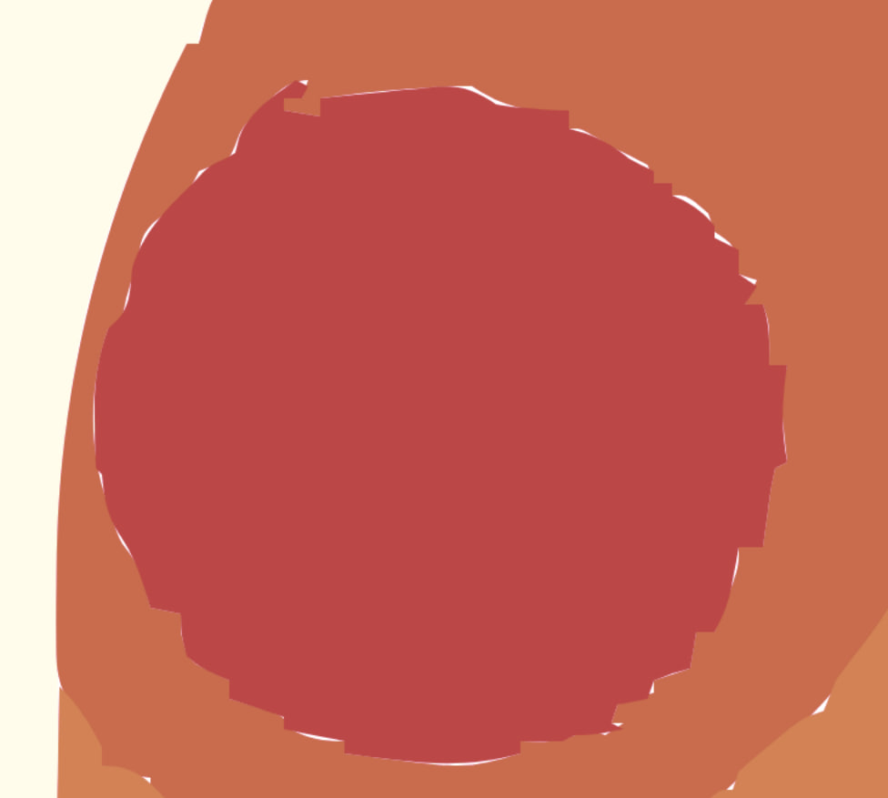
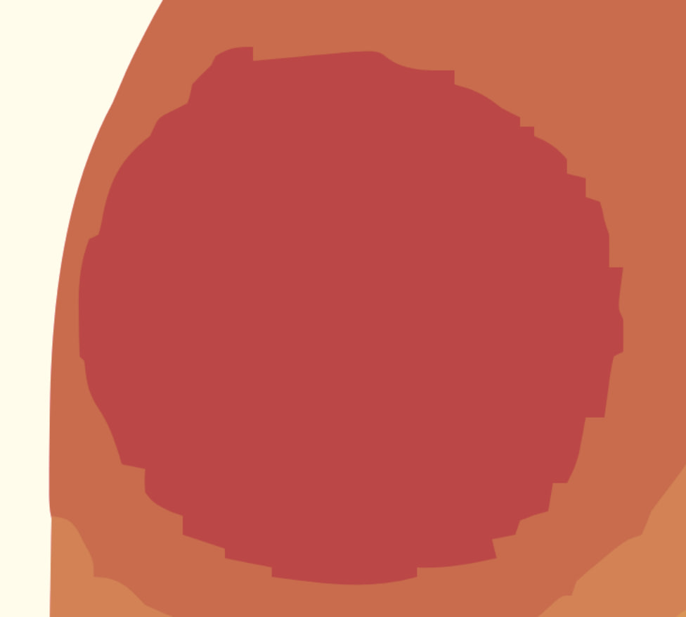

Solutions to improve the quality of vectorization with the layers method.
## 1. Layer growing
During vectorization, each pixel is mapped to a unique layer color. Since the mapping process doesn't not take into consideration the color's of neighbouring pixels, the resulting layer outline can look like this:

The outline is very rough, which cause holes to appear during the tracing process:

Costly, but an easy solution to this is to smooth the layer with a circular brush. The user is exposed to the following commands:
- `grow` - Specify the radius of the circular brush
- `min_grow_speckle` - the minimum size required for the cluster to be grown

The result lookk in the following way( the image is increased by the size of the circular brush):

### Improvement Idea
For two neighbouring layers, the path at the boundary is the same, but inverted. The idea is two change the tracing algorithm to make it produce the same path regardless of the walking direction( clockwise, or counter-clockwise ):

