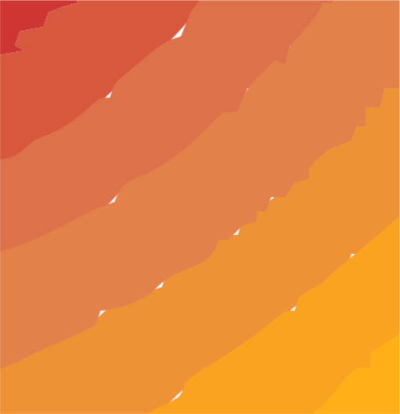

Solutions to improve the quality of vectorization with the layers method.
## 1. Cluster inside of another cluster
During vectorization, each pixel is mapped to a unique layer color. Since the mapping process doesn't not take into consideration the colors of neighbouring pixels, the resulting layer outline can look like this:

The outline is very rough, which causes holes to appear during the tracing process:

During tracing, clusters can be walked in clockwise or counter-clockwise directions. Clockwise is for clusters and counter-clockwise is for holes inside of a cluster. So the problem is that holes and clusters that will replace them are traced in two different directions, creating two different paths. 

The solution is to trace holes in clockwise direction and then reverse the path.

## 2. Neighbouring clusters
Unfortunately, the same trick cannot be done for neighbouring clusters. For two clusters, the boundary is traced in the clockwise direction, but for the second cluster the boundary is the inverse of the first one, creating two different paths.

The problem cannot be solved by simply combining the two paths because of the way Vtracer finds corners and smoothes path.
Costly, but an easy solution to this is to smooth the layers with a circular brush. The user is exposed to the following commands:
- `grow` - Specify the radius of the circular brush
- `min_grow_speckle` - the minimum size required for the cluster to be grown

Each layers greater than the specified size will be increased in size, making them overlap with each other more, covering the holes in between.

### Desirable improvement
The solution above is more of a ( costly ) hack, than a proper solution. Maybe there is a way to analyze and process the resulting paths to remove the holes by protruding points of a path to cover larger area. Or maybe the Vtrace's algorithm itself needs to be updated to make the holes disappear.