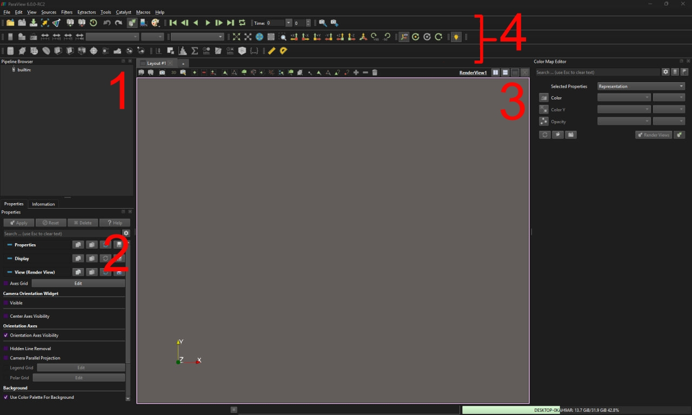
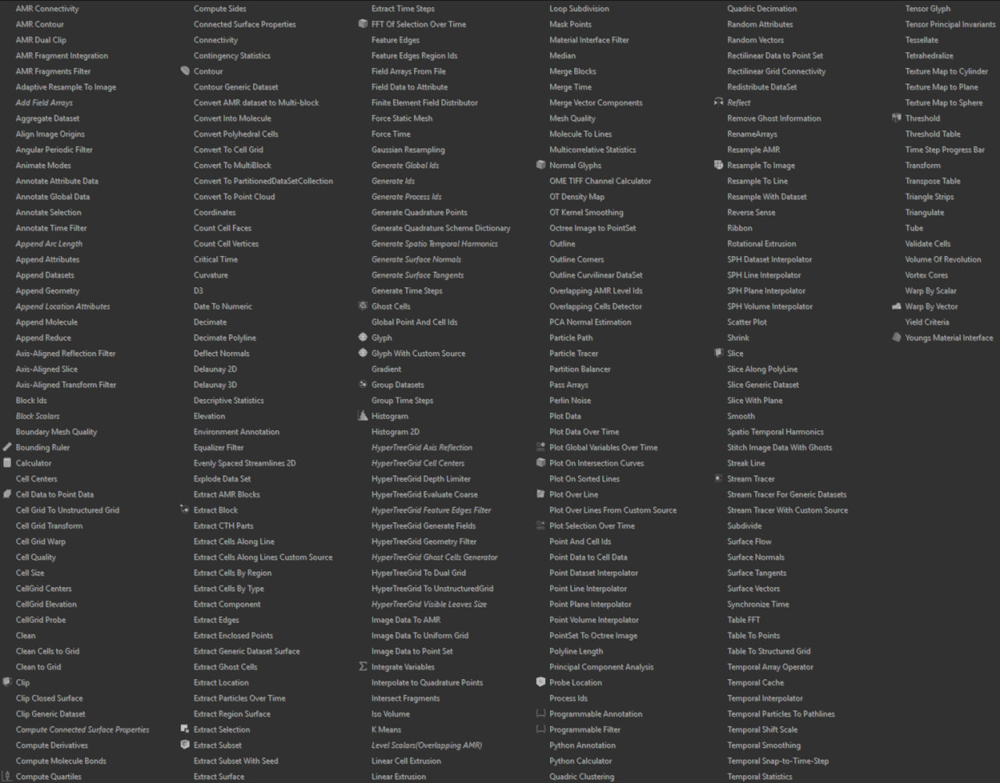

- [1. Paraview](#1-paraview)  
    - [1. Interface](#11-interface)
    - [1.2 Files](#12-files)
    - [1.3 Filters](#13-filters)
- [2. OpenFOAM](#2-openfoam)


## 1. [Paraview](https://www.paraview.org/)

It is an open source tool for data visualization. It is build on top of [VTK] (Visualization toolkit) graphics library. Paraview has a visual pipeline that uses filters to process data. Each stage of the pipeline takes data as input, applies filter to the data, and return some new visual representation of the data.  

- [Documentation](https://docs.paraview.org/en/latest/)  
- [Repository](https://gitlab.kitware.com/paraview/paraview)
- [C++ API](https://www.paraview.org/paraview-docs/nightly/cxx/)

### 1.1 Interface


<p align="center">
    
</p>

The main 4 panels are:  
1. Pipeline browser - display the visual pipeline( a sequance of filters applied to meshes/datasets ).
2. Properties - displays properties related to the currently selected object in the pipeline browser.
3. Render view - renders the resulting image
4. Quick access panel - contain shortcuts for the most used functionality( Color maps, animation controls, camera controls and filters )

### 1.2 Files

Paraview supports more then 200 different file formats, and allows for Reader intergration for you desired filetype.

You can export your scene in one of the formats shown below:
<p align="center">
    
</p>

For example, you can save your work as gltf file and use it somewhere in your project.

You can export the point data in your mesh in the following formats:

<p align="center">
    
</p>

Paraview also allows to same the rendered scene as an image.

### 1.3 Filters

Filters are the most important part and Paraview has over 100 available filters for a wide variaty of technical tasks:

<p align="center">
    
</p>

Here is an example of visualizaion with paraview:

<p align="center">
    
</p>

## 2. [OpenFOAM](https://www.openfoam.com/)

OpenFOAM( Field Operation and Manipulation ) - is a Computational Fluid Dynamics software, that provides with solvers for physical simulations. It does not provide the visualization. For that you need to use another software like Paraview.

- [Documentation](https://www.openfoam.com/documentation/overview)
- [User Guide](https://dl.openfoam.com/source/latest/UserGuide.pdf)
- [Tutorial](https://dl.openfoam.com/source/latest/TutorialGuide.pdf)
- [Repository](https://develop.openfoam.com/Development/openfoam)

Before working with the openFOAM, you need to set it up by running the following command
```sh
source /installation/path/OpenFOAM-v2506/etc/bashrc
```

For each simulations( case ) a seperate directory needs to be created, where you specify the simulation properties in files, that contain key value pair in plane text format

-   `constant` directory - for geometric and physical properties
-   `system` directory - settings of the simulation
-   `0`(zero) directory - for field and boundary conditions at timestemp zero( For each property in a seperate file )

OpenFOAM has helper programs to make it easier to create your scene. For example the `blockMeshDict` file explains to the `blockMesh` utility how subdivide the space into cells and boundary from which the mesh will be created.

After you are done with specifying conditions for the scene, you run the solver for your specific task, which write to file the state of the field at different timesteps.  

This result can then be viewed and further exported using paraview. To view the result you just need to create the `case.foam` placeholder file and load it in the paraview. The builtin openFOAM reader will the handle loading the rest of the data.


[VTK]: https://docs.vtk.org/en/latest/getting_started/index.html