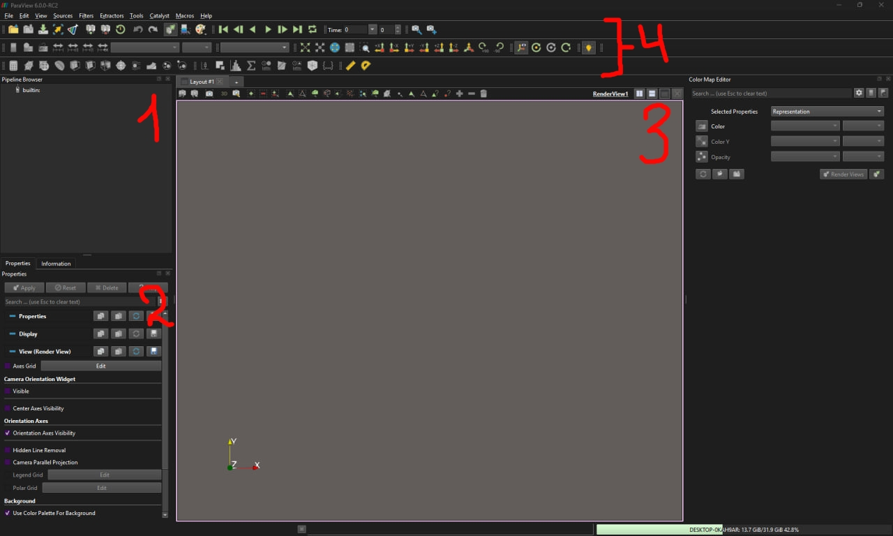
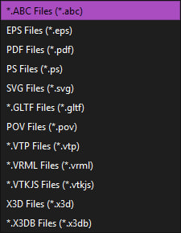
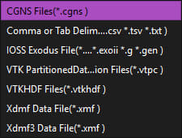
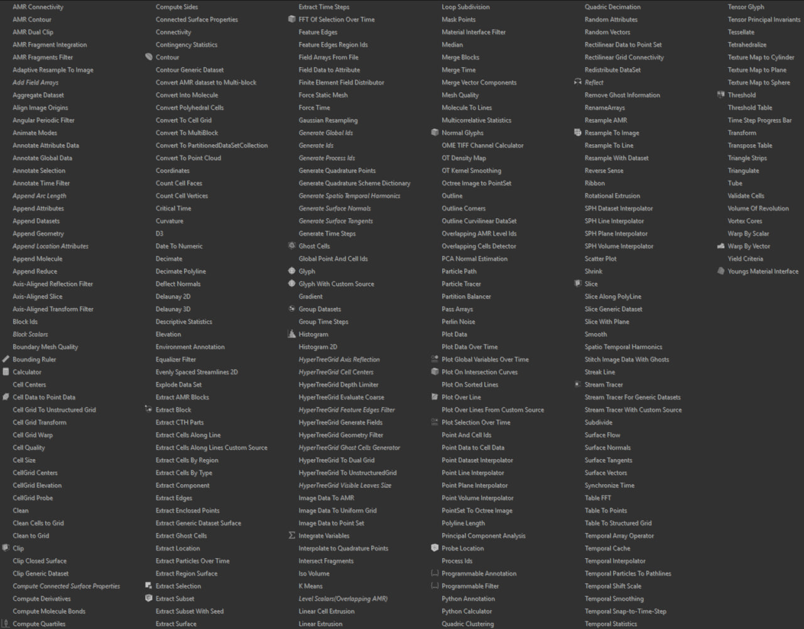
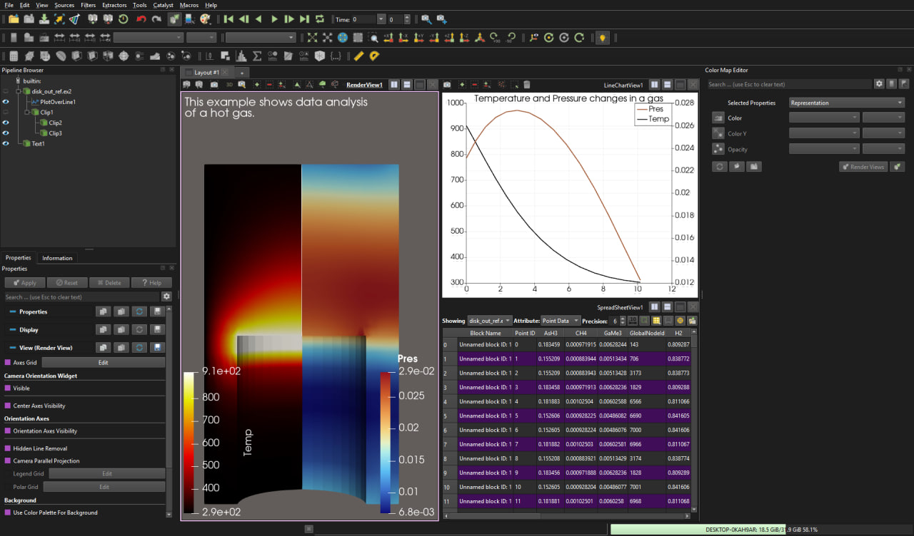

- [Paraview](#paraview)  
    - [1. Interface](#1-interface)
    - [2. Files](#2-files)
    - [3. Filters](#3-filters)

## [Paraview](https://www.paraview.org/)

It is an open source tool for data visualization. It is build on top of [VTK] (Visualization toolkit) graphics library. Paraview has a visual pipeline that uses filters to process data. Each stage of the pipeline takes data as input, applies filter to the data, and return some new visual representation of the data.   

The paraview can be useful as post-processing tool. Using filter you can transform your mesh and then export it as gltf file. You can also export the scientific data from the mesh for your own use. The rendered scene can be exported as an image.

- [Documentation](https://docs.paraview.org/en/latest/)  
- [Repository](https://gitlab.kitware.com/paraview/paraview)
- [C++ API](https://www.paraview.org/paraview-docs/nightly/cxx/)

### 1. Interface

    

The main 4 panels are:  
1. Pipeline browser - display the visual pipeline( a sequance of filters applied to meshes/datasets ).
2. Properties - displays properties related to the currently selected object in the pipeline browser.
3. Render view - renders the resulting image
4. Quick access panel - contain shortcuts for the most used functionality( Color maps, animation controls, camera controls and filters )

### 2. Files

Paraview supports more then 200 different file formats, and allows for Reader intergration for you desired filetype.

You can export your scene in one of the formats shown below:

    

For example, you can save your work as gltf file and use it somewhere in your project.

You can export the point data in your mesh in the following formats:

    

Paraview also allows to same the rendered scene as an image.

### 3. Filters

Filters are the most important part and Paraview has over 100 available filters for a wide variaty of technical tasks:

    

Here is an example of visualizaion with paraview:

    

[VTK]: https://docs.vtk.org/en/latest/getting_started/index.html