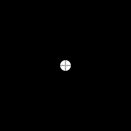

# aa_step

Antialiased step via `fwidth`: a screen-space smoothed threshold
(fragment-stage only). Replaces `step( edge, x )` and hand-tuned
`smoothstep( edge - 0.01, edge + 0.01, x )` epsilons with a transition
band that is always about one pixel wide, at any resolution or zoom.

## Visualization

Rendered via the chunk-preview harness's synthesized grayscale
field: `1.0 - aa_step( 0.3, length( p ) )`'s value is written
straight to `vec3f( value )`, clamped to `[0, 1]`, at
`preview_scale = 8` — a white radius-`0.3` disk on black, the edge
a single-pixel antialiased gradient. Directly previewable via
`sch preview aa_step`.

## Parameters

| Field | Value |
|---|---|
| `name` | `aa_step` |
| `description` | Antialiased step via fwidth: a screen-space smoothed threshold (fragment-stage only). |
| `tags` | `category:antialiasing` |
| `stage` | — (plain callable function, not an entry point) |
| `depends_on` | — (no dependencies; leaf chunk) |
| `export` | `fn aa_step(edge: f32, x: f32) -> f32`, `fn aa_step_preview(p: vec2f, edge: f32) -> f32` |

## Nuances

- **Fragment stage only.** `fwidth` is a derivative builtin — composing
  this chunk into a vertex or compute entry point fails WGSL validation.
  The manifest still carries no `stage` field because `stage` marks
  *entry-point* chunks; this restriction is about where the function may
  be *called from*, and lives in the description instead.
- The transition band is `edge ± fwidth( x )` — proportional to how fast
  `x` changes per pixel, which is what makes it resolution- and
  zoom-independent where a fixed epsilon is not.
- If `x` is uniform across a 2×2 pixel quad, `fwidth` is 0 and the result
  degenerates to a hard step — correct, since no pixel actually straddles
  the edge.
- Threshold an sdf at 0 (`aa_step( 0.0, d )`) for an antialiased
  outside-mask; `1.0 - ...` for the fill, as the preview does.

## Relatives

- **Depends on:** none — leaf primitive.
- **Depended on by:** none yet.
- **Collection index:** [shader/](../readme.md)
- **Bundled by:** [`shader_chunks_core`](../../module/shader/shader_chunks_core/readme.md)
- **Inspect/compose via CLI:** [`shader_chunks`](../../module/shader/shader_chunks/readme.md)
  (`sch get aa_step`, `sch tree aa_step`)
- **Consumers:** none yet — the orrery scene's hardcoded smoothstep
  epsilons are the intended adoption site.
