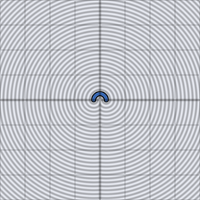

# d2_sdf_arc

Unsigned distance from a 2D point to a ring arc: a partial `d2_sdf_ring`
spanning only the aperture given by `sc` (sin/cos of the half-angle),
with stroke half-thickness `rb`. The arc opens along `+y` and is mirrored
across `x`.

## Visualization

Rendered via the chunk-preview harness's synthesized grayscale field:
`d2_sdf_arc( p, vec2f( 1.0, 0.0 ), 0.28, 0.05 )`'s raw (unsigned) value
— a half-aperture of `sc = ( 1.0, 0.0 )` (a semicircle opening along
`+y`), radius `0.28`, stroke half-thickness `0.05` — is written straight
to each pixel as `vec3f( value )`, clamped to `[0, 1]`, at
`preview_scale = 8`. A dark valley traces the stroked arc; past its two
open ends the darkest point shifts to distance-to-endpoint instead,
giving the caps a rounded rather than flat silhouette.

This demo is now wired in as a permanent `d2_sdf_arc_preview` export,
so the chunk is directly previewable via `sch preview d2_sdf_arc` — no
wrapper file needed.

## Parameters

| Field | Value |
|---|---|
| `name` | `d2_sdf_arc` |
| `description` | Unsigned distance from a 2D point to a ring arc given by sin/cos of its half-aperture. |
| `tags` | `category:sdf, dim:2d` |
| `stage` | — (plain callable function, not an entry point) |
| `depends_on` | — (no dependencies; leaf chunk) |
| `export` | `fn d2_sdf_arc(p: vec2f, sc: vec2f, ra: f32, rb: f32) -> f32`, `fn d2_sdf_arc_preview(p: vec2f, half_aperture: f32, arc_radius: f32, stroke_half_thickness: f32) -> f32` |

## Nuances

- `sc` is `vec2f( sin( half_angle ), cos( half_angle ) )`, not the angle
  itself — precompute once per draw call rather than per pixel.
- End caps are automatically round (distance-to-endpoint falloff), same
  visual result as capping a `d2_sdf_segment` — no separate flat-cap mode.
- `rb == 0` degenerates to an infinitely thin arc line (zero everywhere
  on the arc, useful only as an input to further `aa_step`/`glow` work).

## Relatives

- **Depends on:** none — leaf primitive.
- **Depended on by:** none yet.
- **Collection index:** [shader/](../readme.md)
- **Bundled by:** [`shader_chunks_core`](../../module/shader/shader_chunks_core/readme.md)
- **Inspect/compose via CLI:** [`shader_chunks`](../../module/shader/shader_chunks/readme.md)
  (`sch get d2_sdf_arc`, `sch tree d2_sdf_arc`)
- **Consumers:** none yet.
