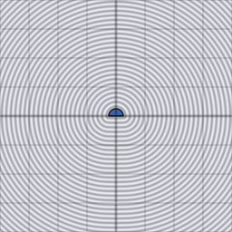

# d2_sdf_pie

Signed distance from a 2D point to a filled pie/wedge slice of radius `r`
and half-aperture given by `sc` (sin/cos). The solid-fill counterpart to
`d2_sdf_arc`'s stroked ring segment — think a pizza slice or a radial
progress indicator.

## Visualization

Rendered via the chunk-preview harness's synthesized grayscale field:
`d2_sdf_pie( p, vec2f( 0.7071, 0.7071 ), 0.3 )`'s raw signed-distance
value — a half-aperture of 45° (`sc = ( sin 45°, cos 45° )`, a 90°-wide
wedge opening along `+y`), radius `0.3` — is written straight to each
pixel as `vec3f( value )`, clamped to `[0, 1]`, at `preview_scale = 8`.
Solid black fills the wedge; brightness grows outward from its two
straight edges and curved cap alike.

This demo is now wired in as a permanent `d2_sdf_pie_preview` export, so the chunk is directly previewable via `sch preview d2_sdf_pie` — no wrapper file needed.

## Parameters

| Field | Value |
|---|---|
| `name` | `d2_sdf_pie` |
| `description` | Signed distance from a 2D point to a pie/wedge slice given by sin/cos of its half-aperture. |
| `tags` | `category:sdf, dim:2d` |
| `stage` | — (plain callable function, not an entry point) |
| `depends_on` | — (no dependencies; leaf chunk) |
| `export` | `fn d2_sdf_pie(p: vec2f, sc: vec2f, r: f32) -> f32`, `fn d2_sdf_pie_preview(p: vec2f, half_aperture: f32, radius: f32) -> f32` |

## Nuances

- `sc` is `vec2f( sin( half_angle ), cos( half_angle ) )`, same convention
  as `d2_sdf_arc` — the two chunks share a parameterization on purpose.
- Signed, unlike `d2_sdf_arc`: negative inside the wedge, so it thresholds
  directly with `aa_step` for a filled radial-progress fill.
- `half_angle = pi` degenerates to a full disk, matching `d2_sdf_circle`.

## Relatives

- **Depends on:** none — leaf primitive.
- **Depended on by:** none yet.
- **Collection index:** [shader/](../readme.md)
- **Bundled by:** [`shader_chunks_core`](../../module/shader/shader_chunks_core/readme.md)
- **Inspect/compose via CLI:** [`shader_chunks`](../../module/shader/shader_chunks/readme.md)
  (`sch get d2_sdf_pie`, `sch tree d2_sdf_pie`)
- **Consumers:** none yet.
