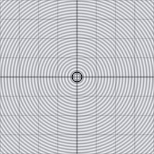

# d2_sdf_ring

Unsigned distance from a 2D point to a circle *line* of the given radius —
the annulus centerline, not the disk. Orbit rings, stroked circles, radar
sweeps: anywhere the visible thing is the outline itself.

## Visualization

Rendered via the chunk-preview harness's synthesized grayscale field:
`d2_sdf_ring( p, 0.30 )`'s raw (unsigned) value is written straight to
each pixel as `vec3f( value )`, clamped to `[0, 1]`, at `preview_scale
= 8`. A dark ring-shaped valley traces the true zero level-set at
radius `0.3` — black there, brightening on both sides: outward to white,
and inward to a medium gray at the very center (value `0.3`, never
black), since the field carries no sign to distinguish "inside."

This demo is now wired in as a permanent `d2_sdf_ring_preview` export, so the chunk is directly previewable via `sch preview d2_sdf_ring` — no wrapper file needed.

## Parameters

| Field | Value |
|---|---|
| `name` | `d2_sdf_ring` |
| `description` | Unsigned distance from a 2D point to a circle line of the given radius. |
| `tags` | `category:sdf, dim:2d` |
| `stage` | — (plain callable function, not an entry point) |
| `depends_on` | — (no dependencies; leaf chunk) |
| `export` | `fn d2_sdf_ring(p: vec2f, radius: f32) -> f32`, `fn d2_sdf_ring_preview(p: vec2f, radius: f32) -> f32` |

## Nuances

- Mathematically the `abs` of the signed circle distance — which is
  exactly why it is *unsigned*: inside and outside of the original circle
  are indistinguishable, only distance to the line remains.
- A stroked circle of half-width `w` is `aa_step`-thresholding this value
  at `w`; a soft orbit ring is `glow` fed with it directly.
- Like the circle chunk, centered at the origin — subtract the center
  from `p` first.
- Part of the `d2_sdf_*` / `d3_sdf_*` / `sdf_op_*` family — see
  [shader/](../readme.md) for the full SDF catalog and naming rationale.

## Relatives

- **Depends on:** none — leaf primitive.
- **Depended on by:** none yet.
- **Collection index:** [shader/](../readme.md)
- **Bundled by:** [`shader_chunks_core`](../../module/shader/shader_chunks_core/readme.md)
- **Inspect/compose via CLI:** [`shader_chunks`](../../module/shader/shader_chunks/readme.md)
  (`sch get d2_sdf_ring`, `sch tree d2_sdf_ring`)
- **Consumers:** none yet.
