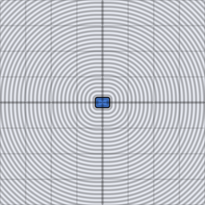

# d2_sdf_round_box

Signed distance from a 2D point to a box with rounded corners of radius
`r`. Built directly on `d2_sdf_box` — shrinks the box by `r` and offsets
the result outward by `r`, which is exactly equivalent to the closed-form
rounded-box distance.

## Visualization

Rendered via the chunk-preview harness's synthesized grayscale field:
`d2_sdf_round_box( p, vec2f( 0.28, 0.18 ), 0.06 )`'s raw value is written
straight to each pixel as `vec3f( value )`, clamped to `[0, 1]`, at
`preview_scale = 8`. Identical black-interior/brightening-outward field
to `d2_sdf_box` everywhere except the four corners, now smooth fillets
instead of sharp miters.

This demo is now wired in as a permanent `d2_sdf_round_box_preview` export, so the chunk is directly previewable via `sch preview d2_sdf_round_box` — no wrapper file needed.

## Parameters

| Field | Value |
|---|---|
| `name` | `d2_sdf_round_box` |
| `description` | Signed distance from a 2D point to a box with rounded corners of radius r. |
| `tags` | `category:sdf, dim:2d` |
| `stage` | — (plain callable function, not an entry point) |
| `depends_on` | `d2_sdf_box` |
| `export` | `fn d2_sdf_round_box(p: vec2f, half_extents: vec2f, r: f32) -> f32`, `fn d2_sdf_round_box_preview(p: vec2f, half_extent_x: f32, half_extent_y: f32, round_radius: f32) -> f32` |

## Nuances

- `r` must not exceed `min(half_extents.x, half_extents.y)` — a larger
  radius shrinks the inner box past zero and the shape degenerates.
- The `depends_on: d2_sdf_box` is a real function-call dependency, not
  just a naming relation — `sch tree d2_sdf_round_box` shows it.
- Same trick generalizes to 3D: see `d3_sdf_round_box`.

## Relatives

- **Depends on:** [`d2_sdf_box`](../d2_sdf_box/readme.md)
- **Depended on by:** none yet.
- **Collection index:** [shader/](../readme.md)
- **Bundled by:** [`shader_chunks_core`](../../module/shader/shader_chunks_core/readme.md)
- **Inspect/compose via CLI:** [`shader_chunks`](../../module/shader/shader_chunks/readme.md)
  (`sch get d2_sdf_round_box`, `sch tree d2_sdf_round_box`)
- **Consumers:** none yet.
