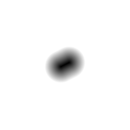

# d2_sdf_segment

Unsigned distance from a 2D point to the line segment between two
endpoints `a` and `b`. The base building block for strokes, capsules,
and skeletal/medial-axis shapes — there is no "inside," only distance to
the nearest point on the segment.

## Visualization

Rendered via the chunk-preview harness's synthesized grayscale field:
`d2_sdf_segment( p, vec2f( -0.25, -0.1 ), vec2f( 0.25, 0.15 ) )`'s raw
(unsigned) value is written straight to each pixel as `vec3f( value )`,
clamped to `[0, 1]`, at `preview_scale = 8`. A dark stadium-shaped valley
traces the segment itself (black exactly on it), brightening outward on
every side — rounded at both ends, since the field is distance to the
nearest point on the segment, not to an infinite line.

This demo is now wired in as a permanent `d2_sdf_segment_preview` export, so the chunk is directly previewable via `sch preview d2_sdf_segment` — no wrapper file needed.

## Parameters

| Field | Value |
|---|---|
| `name` | `d2_sdf_segment` |
| `description` | Unsigned distance from a 2D point to the line segment between two endpoints. |
| `tags` | `category:sdf, dim:2d` |
| `stage` | — (plain callable function, not an entry point) |
| `depends_on` | — (no dependencies; leaf chunk) |
| `export` | `fn d2_sdf_segment(p: vec2f, a: vec2f, b: vec2f) -> f32`, `fn d2_sdf_segment_preview(p: vec2f) -> f32` |

## Nuances

- Projects `p` onto the segment, clamped to `[0, 1]` along `a -> b` — the
  clamp is what turns an infinite-line projection into a finite segment.
- Threshold with `aa_step` at a half-width to get a stroked line/capsule
  outline; the 3D analog is `d3_sdf_capsule`.
- Unsigned like `d2_sdf_ring` — always `>= 0`, never carries a sign.

## Relatives

- **Depends on:** none — leaf primitive.
- **Depended on by:** none yet.
- **Collection index:** [shader/](../readme.md)
- **Bundled by:** [`shader_chunks_core`](../../module/shader/shader_chunks_core/readme.md)
- **Inspect/compose via CLI:** [`shader_chunks`](../../module/shader/shader_chunks/readme.md)
  (`sch get d2_sdf_segment`, `sch tree d2_sdf_segment`)
- **Consumers:** none yet.
