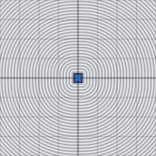

# d3_sdf_capped_cylinder

Signed distance from a 3D point to a flat-capped cylinder of half-height
`h` and radius `r`, axis along y. Unlike `d3_sdf_capsule`, the caps are
flat disks, not hemispheres.

## Visualization

Rendered via the chunk-preview harness's synthesized grayscale field —
no raymarcher or camera. The wrapper lifts each pixel into 3D as
`vec3f( p.x, p.y, 0.0 )` before calling `d3_sdf_capped_cylinder( ·,
0.22, 0.16 )`; since the cylinder's axis runs along y with `p.xz` as
the radial plane, this `z = 0` slice is the *axial* profile — the
classic side-view rectangle — not a face-on circular cap. Raw value
written straight to `vec3f( value )`, clamped to `[0, 1]`, at
`preview_scale = 8`. Solid black rectangle `[-0.16, 0.16] × [-0.22,
0.22]`, sharp corners where the flat cap meets the curved side.

This demo is now wired in as a permanent `d3_sdf_capped_cylinder_preview` export, so the chunk is directly previewable via `sch preview d3_sdf_capped_cylinder` — no wrapper file needed.

## Parameters

| Field | Value |
|---|---|
| `name` | `d3_sdf_capped_cylinder` |
| `description` | Signed distance from a 3D point to a flat-capped cylinder of half-height h and radius r, axis along y. |
| `tags` | `category:sdf, dim:3d` |
| `stage` | — (plain callable function, not an entry point) |
| `depends_on` | — (no dependencies; leaf chunk) |
| `export` | `fn d3_sdf_capped_cylinder(p: vec3f, h: f32, r: f32) -> f32`, `fn d3_sdf_capped_cylinder_preview(p: vec2f, half_height: f32, radius: f32, z_slice: f32) -> f32` |

## Nuances

- Reduces to `d2_sdf_box`'s exact-box logic in the `( radial, y )` plane —
  `length(p.xz)` collapses the circular cross-section to one coordinate.
- Fixed axis (y) and centered — rotate/translate `p` for any other pose.
- Pairs naturally with `d3_sdf_capped_cone` for barrel/pillar/tower
  silhouettes built from a handful of primitives.

## Relatives

- **Depends on:** none — leaf primitive.
- **Depended on by:** none yet.
- **Collection index:** [shader/](../readme.md)
- **Bundled by:** [`shader_chunks_core`](../../module/shader/shader_chunks_core/readme.md)
- **Inspect/compose via CLI:** [`shader_chunks`](../../module/shader/shader_chunks/readme.md)
  (`sch get d3_sdf_capped_cylinder`, `sch tree d3_sdf_capped_cylinder`)
- **Consumers:** none yet.
