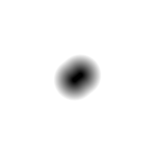

# d3_sdf_capsule

Signed distance from a 3D point to a capsule (a sphere swept along a
segment) between endpoints `a` and `b`, radius `r`. The 3D counterpart of
`d2_sdf_segment`, pre-thickened.

## Visualization

Rendered via the chunk-preview harness's synthesized grayscale field —
no raymarcher or camera. The wrapper lifts each pixel into 3D as
`vec3f( p, 0.0 )` before calling `d3_sdf_capsule( ·, vec3f( -0.15,
-0.12, 0.0 ), vec3f( 0.15, 0.12, 0.0 ), 0.09 )` — both endpoints already
lie on `z = 0`, so this slice captures the capsule's full extent, not a
partial cross-section. Raw value written straight to `vec3f( value )`,
clamped to `[0, 1]`, at `preview_scale = 8`. A diagonal stadium/pill
shape, solid black interior, rounded at both ends — no seam at either
join, since the underlying field is a single smooth function.

This demo is now wired in as a permanent `d3_sdf_capsule_preview` export, so the chunk is directly previewable via `sch preview d3_sdf_capsule` — no wrapper file needed.

## Parameters

| Field | Value |
|---|---|
| `name` | `d3_sdf_capsule` |
| `description` | Signed distance from a 3D point to a capsule (swept sphere) between two endpoints of radius r. |
| `tags` | `category:sdf, dim:3d` |
| `stage` | — (plain callable function, not an entry point) |
| `depends_on` | — (no dependencies; leaf chunk) |
| `export` | `fn d3_sdf_capsule(p: vec3f, a: vec3f, b: vec3f, r: f32) -> f32`, `fn d3_sdf_capsule_preview(p: vec2f) -> f32` |

## Nuances

- Identical projection-and-clamp math to `d2_sdf_segment`, plus a
  constant `- r` offset — a capsule is exactly "distance to segment,
  offset by radius," same relationship as sphere-to-point in 3D.
- The standard character/ragdoll collision-volume primitive — chains of
  capsules approximate limbs cheaply.
- `a == b` degenerates cleanly to `d3_sdf_sphere` at that point.

## Relatives

- **Depends on:** none — leaf primitive.
- **Depended on by:** none yet.
- **Collection index:** [shader/](../readme.md)
- **Bundled by:** [`shader_chunks_core`](../../module/shader/shader_chunks_core/readme.md)
- **Inspect/compose via CLI:** [`shader_chunks`](../../module/shader/shader_chunks/readme.md)
  (`sch get d3_sdf_capsule`, `sch tree d3_sdf_capsule`)
- **Consumers:** none yet.
