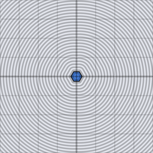

# d3_sdf_hex_prism

Signed distance from a 3D point to a hexagonal prism of circumradius
`h.x` and half-depth `h.y`, axis along z. The extruded 3D form of
`d2_sdf_hexagon`.

## Visualization

Rendered via the chunk-preview harness's synthesized grayscale field —
no raymarcher or camera. The wrapper lifts each pixel into 3D as
`vec3f( p, 0.0 )` before calling `d3_sdf_hex_prism( ·, vec2f( 0.26,
0.2 ) )`; since this prism extrudes along z, a `z = 0` slice cuts through
its mid-depth and shows the full hexagonal cap face-on, not a side
profile. Raw value written straight to `vec3f( value )`, clamped to
`[0, 1]`, at `preview_scale = 8`. Solid black hexagon, brightening
outward from each of its six edges — visually close to `d2_sdf_hexagon`.

This demo is now wired in as a permanent `d3_sdf_hex_prism_preview` export, so the chunk is directly previewable via `sch preview d3_sdf_hex_prism` — no wrapper file needed.

## Parameters

| Field | Value |
|---|---|
| `name` | `d3_sdf_hex_prism` |
| `description` | Signed distance from a 3D point to a hexagonal prism of circumradius h.x and half-depth h.y, axis along z. |
| `tags` | `category:sdf, dim:3d` |
| `stage` | — (plain callable function, not an entry point) |
| `depends_on` | — (no dependencies; leaf chunk) |
| `export` | `fn d3_sdf_hex_prism(p: vec3f, h: vec2f) -> f32`, `fn d3_sdf_hex_prism_preview(p: vec2f, circumradius: f32, half_depth: f32, z_slice: f32) -> f32` |

## Nuances

- The xy-plane cross-section reuses `d2_sdf_hexagon`'s fold-and-clamp
  math inline (not a real `depends_on` call — the z-extrusion combine
  step needs both the hex distance and the cap distance together, which
  doesn't cleanly factor through a shared function call the way
  `d2_sdf_round_box` does).
- Standard nut/bolt-head and hex-tile-block primitive.
- Axis fixed to z, unlike most other prisms/cylinders in this collection
  which run along y — matches IQ's reference convention for this one shape.

## Relatives

- **Depends on:** none — leaf primitive (hexagon math is inlined, not a call).
- **Depended on by:** none yet.
- **Collection index:** [shader/](../readme.md)
- **Bundled by:** [`shader_chunks_core`](../../module/shader/shader_chunks_core/readme.md)
- **Inspect/compose via CLI:** [`shader_chunks`](../../module/shader/shader_chunks/readme.md)
  (`sch get d3_sdf_hex_prism`, `sch tree d3_sdf_hex_prism`)
- **Consumers:** none yet.
