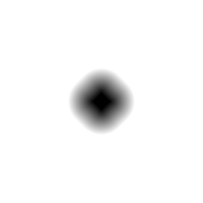

# d3_sdf_octahedron

Signed distance from a 3D point to an octahedron of the given size `s`,
exact (not a bound). Eight symmetric triangular faces, folded into a
single-face test via the point's absolute value plus a 3-way branch.

## Visualization

Rendered via the chunk-preview harness's synthesized grayscale field —
no raymarcher or camera. The wrapper lifts each pixel into 3D as
`vec3f( p, 0.0 )` (a slice through the octahedron's center on `z = 0`)
before calling `d3_sdf_octahedron( ·, 0.32 )`, raw value written
straight to `vec3f( value )`, clamped to `[0, 1]`, at `preview_scale =
8`. The octahedron's ±x/±y vertices both lie on this slice, so the
cross-section is a diamond (a square rotated 45°) with sharp corners —
no curvature anywhere, since the field is exact.

This demo is now wired in as a permanent `d3_sdf_octahedron_preview` export, so the chunk is directly previewable via `sch preview d3_sdf_octahedron` — no wrapper file needed.

## Parameters

| Field | Value |
|---|---|
| `name` | `d3_sdf_octahedron` |
| `description` | Signed distance from a 3D point to an octahedron of the given size, exact (not bound). |
| `tags` | `category:sdf, dim:3d` |
| `stage` | — (plain callable function, not an entry point) |
| `depends_on` | — (no dependencies; leaf chunk) |
| `export` | `fn d3_sdf_octahedron(p: vec3f, s: f32) -> f32`, `fn d3_sdf_octahedron_preview(p: vec2f) -> f32` |

## Nuances

- The 3-way `if`/`else if`/`else` picks which axis-permutation puts the
  point in the canonical face region; the final `else` branch handles the
  point already being inside that region (cheap early return).
- `s` is measured vertex-to-center along an axis, matching the box
  `half_extents` convention's "distance from center to boundary" spirit.
- One of the few *exact* (non-bound) polyhedron SDFs in common use —
  most sharp-faceted solids only have bound approximations.

## Relatives

- **Depends on:** none — leaf primitive.
- **Depended on by:** none yet.
- **Collection index:** [shader/](../readme.md)
- **Bundled by:** [`shader_chunks_core`](../../module/shader/shader_chunks_core/readme.md)
- **Inspect/compose via CLI:** [`shader_chunks`](../../module/shader/shader_chunks/readme.md)
  (`sch get d3_sdf_octahedron`, `sch tree d3_sdf_octahedron`)
- **Consumers:** none yet.
