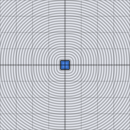

# d3_sdf_round_box

Signed distance from a 3D point to a box with rounded edges/corners of
radius `r`. Built directly on `d3_sdf_box`, same shrink-and-offset trick
as `d2_sdf_round_box`.

## Visualization

Rendered via the chunk-preview harness's synthesized grayscale field —
no raymarcher or camera. The wrapper lifts each pixel into 3D as
`vec3f( p, 0.0 )` (a `z = 0` center slice) before calling
`d3_sdf_round_box( ·, vec3f( 0.28, 0.18, 0.22 ), 0.06 )`, raw value
written straight to `vec3f( value )`, clamped to `[0, 1]`, at
`preview_scale = 8`. Identical field to `d3_sdf_box`'s slice except the
four xy corners, now smooth fillets instead of sharp miters.

This demo is now wired in as a permanent `d3_sdf_round_box_preview` export, so the chunk is directly previewable via `sch preview d3_sdf_round_box` — no wrapper file needed.

## Parameters

| Field | Value |
|---|---|
| `name` | `d3_sdf_round_box` |
| `description` | Signed distance from a 3D point to a box with rounded edges of radius r. |
| `tags` | `category:sdf, dim:3d` |
| `stage` | — (plain callable function, not an entry point) |
| `depends_on` | `d3_sdf_box` |
| `export` | `fn d3_sdf_round_box(p: vec3f, half_extents: vec3f, r: f32) -> f32`, `fn d3_sdf_round_box_preview(p: vec2f, half_extent_x: f32, half_extent_y: f32, half_extent_z: f32, round_radius: f32, z_slice: f32) -> f32` |

## Nuances

- `r` must not exceed the smallest half-extent component, same
  degeneracy caveat as `d2_sdf_round_box`.
- Real function-call dependency on `d3_sdf_box` — `sch tree
  d3_sdf_round_box` shows it.
- Common material-look primitive: soft-edged crates/panels read as
  manufactured rather than procedurally generated.

## Relatives

- **Depends on:** [`d3_sdf_box`](../d3_sdf_box/readme.md)
- **Depended on by:** none yet.
- **Collection index:** [shader/](../readme.md)
- **Bundled by:** [`shader_chunks_core`](../../module/shader/shader_chunks_core/readme.md)
- **Inspect/compose via CLI:** [`shader_chunks`](../../module/shader/shader_chunks/readme.md)
  (`sch get d3_sdf_round_box`, `sch tree d3_sdf_round_box`)
- **Consumers:** none yet.
